# A Programming Framework for Systematic Analysis of Complex Systems

## Abstract

We present a systematic computational methodology—the Programming Framework—for analyzing complex systems across multiple domains. Using Mermaid Markdown syntax and large language model (LLM) processing, we demonstrate the framework's applicability to 297 biological processes (110 yeast, 125 E. coli, and 62 advanced systems) and extend it to physical chemistry systems. The methodology leverages text-based process descriptions to generate standardized flowchart representations, enabling systematic comparison and pattern recognition across traditionally separate disciplines. This approach reveals universal computational patterns that bridge biological and chemical systems, providing a unified language for complex system analysis. The complete dataset is publicly available through the Genome Logic Modeling Project (GLMP) Hugging Face Space, serving as the primary evidence base for this methodology.

## Introduction

Complex systems across biology, chemistry, and physics exhibit remarkable similarities in their organizational principles despite operating at vastly different scales and domains. Traditional analysis methods often remain siloed within specific disciplines, limiting our ability to identify universal patterns and computational logic that govern system behavior. Here, we present the Programming Framework, a systematic methodology that translates complex system dynamics into standardized computational representations using Mermaid Markdown syntax and LLM processing.

The framework builds upon three decades of computational biology research, beginning with early explorations of the genome-as-program metaphor in the 1990s. The author's 1995 work on the β-galactosidase regulation system represented one of the first attempts to model genetic regulation using computational logic constructs, creating flowcharts that depicted biological processes as decision trees with conditional branches, feedback loops, and termination conditions. This early work, discussed on the bionet.genome.chromosome newsgroup with computational biologists including Robert Robbins of Johns Hopkins University, established foundational concepts that continue to influence modern computational biology.

The framework employs a visual programming language based on flowchart logic, where system components are categorized into five functional classes: triggers (red), catalysts/enzymes (teal), intermediates/metabolites (blue), products (green), and byproducts/waste (yellow). This color-coded system enables rapid identification of system architecture and computational logic patterns. The classification system bridges biological and chemical domains: biological catalysts include enzymes and regulatory proteins, while chemical catalysts include industrial catalysts and recovery systems; biological intermediates include metabolites and signaling molecules, while chemical intermediates include reaction species and process streams. Canvas automatically derives these color categories from the MMD file syntax, enabling consistent visual representation across different platforms and systems.

## Methods

### Technical Foundation: Mermaid Markdown

The Programming Framework builds upon Mermaid Markdown (MMD), a text-based diagram generation syntax developed by Knut Sveidqvist in 2014. MMD enables the creation of complex flowcharts and diagrams from simple text descriptions, similar to how Markdown simplifies text formatting. This technical innovation was critical for our methodology, as it allows for:

1. **Text-to-Diagram Conversion**: Process descriptions from scientific literature can be directly converted into visual representations
2. **Standardized Syntax**: Consistent formatting across different systems and domains
3. **Automated Generation**: LLMs can rapidly process text descriptions and generate MMD code
4. **Cross-Platform Compatibility**: MMD integrates with documentation platforms and can be rendered in multiple formats
5. **Automatic Color Coding**: Canvas automatically derives color categories from MMD syntax, ensuring consistent visual representation across biological and chemical systems

### Historical Evolution: From 1995 to 2025

The Programming Framework represents the culmination of a 30-year evolution in computational biology visualization. The author's 1995 β-galactosidase flowchart, created using manual tools and requiring months of research, represented one of the first attempts to model genetic regulation using computational logic constructs. This early work established the conceptual foundation for treating biological processes as executable programs with conditional logic, feedback loops, and decision points.

The transformation from 1995 to 2025 demonstrates the democratization of computational biology through technological convergence. What once required months of manual research and specialized tools can now be accomplished in hours through the combination of Mermaid Markdown syntax, LLM processing, and human biological insight. This evolution enables systematic analysis of hundreds of biological processes rather than individual case studies, representing a fundamental shift in the scale and scope of computational biology research.

### Framework Architecture

The Programming Framework consists of three core components:

1. **Standardized Node Classification**: All system components are classified into five functional categories based on their role in the process:
   - **Triggers** (red): External conditions or inputs that initiate processes (environmental signals, molecular recognition events, temporal cues)
   - **Catalysts/Enzymes** (teal): Components that facilitate reactions without being consumed (biological enzymes, regulatory proteins, industrial catalysts, recovery systems)
   - **Intermediates/Metabolites** (blue): Temporary species formed during the process (biological metabolites, signaling molecules, chemical reaction species, process streams)
   - **Products** (green): Final outputs of the system (biological products, chemical products, energy molecules)
   - **Byproducts/Waste** (yellow): Secondary outputs or waste streams (metabolic waste, chemical byproducts, process waste)

2. **LLM-Enhanced Process Translation**: Text-based process descriptions are processed by LLMs to generate MMD syntax, enabling:
   - Rapid conversion of scientific literature into standardized formats
   - Consistent application of the five-category classification system with domain-specific terminology
   - Automated identification of process logic and flow patterns
   - Automatic color coding through Canvas integration with MMD syntax

3. **Cross-Domain Validation**: The framework was tested on:
   - 110 biological processes from yeast metabolism and cellular systems
   - 125 E. coli processes including gene regulation and metabolism
   - 62 advanced biological systems (photosynthesis, circadian clocks, viral switches)
   - Industrial chemical processes (Solvay process)
   - Theoretical extension to physical systems

### Dataset and Analysis

We analyzed a comprehensive dataset of biological processes spanning multiple organisms and systems: 110 processes from *Saccharomyces cerevisiae* (yeast) covering DNA replication, cell cycle control, signal transduction, energy metabolism, and stress responses; multiple processes from *Escherichia coli* including DNA replication, gene regulation, central metabolism, motility, and specialized systems like the lac operon; and advanced systems including photosynthesis, bacterial sporulation, circadian clocks, and viral decision switches. Each process was translated into the Programming Framework format using LLM processing of published scientific descriptions, enabling systematic pattern identification and computational logic analysis across diverse biological systems.

**Public Repository and Evidence Base**: The complete dataset comprising 297 total processes across 36 individual collections is publicly available through the Genome Logic Modeling Project (GLMP) Hugging Face Space ([https://huggingface.co/spaces/garywelz/glmp](https://huggingface.co/spaces/garywelz/glmp)). This repository serves as the primary evidence base for the Programming Framework methodology, containing comprehensive collections of yeast cellular processes (110 processes in 15 modular batch files), E. coli cellular processes (125 processes in 15 systematic batch files), and advanced biological computing systems (62 processes across 6 specialized computational systems). The repository demonstrates the universal computational nature of biological systems through interactive Mermaid flowcharts with consistent color-coding and computational logic analysis.

## Results

### Biological System Analysis

Analysis of the 297 yeast processes revealed consistent computational patterns that mirror programming functions:

1. **Trigger Diversity**: Biological systems employ diverse trigger mechanisms including:
   - Environmental signals (temperature, pH, nutrient availability)
   - Molecular recognition events (ligand-receptor binding)
   - Temporal cues (cell cycle progression)

2. **Catalytic Logic**: Catalysts in biological systems often function as:
   - Enzymes with specific substrate recognition
   - Regulatory proteins that modify target activity
   - Scaffolding molecules that bring components together

3. **Feedback Architecture**: 78% of analyzed processes contained feedback loops, with common patterns including:
   - Product inhibition of early pathway steps
   - Positive feedback amplification of signals
   - Cross-pathway regulatory interactions

### Biological Process Examples

**Yeast Fermentation Process:**

The alcoholic fermentation pathway in *S. cerevisiae* demonstrates classic programming logic:

- **Trigger**: Glucose availability and anaerobic conditions
- **Catalyst**: Glycolytic enzymes (hexokinase, phosphofructokinase, pyruvate kinase)
- **Intermediates**: Glucose-6-phosphate, fructose-1,6-bisphosphate, pyruvate
- **Products**: Ethanol, CO₂, ATP
- **Feedback**: ATP inhibition of phosphofructokinase (product inhibition)

This process exhibits conditional branching (aerobic vs. anaerobic), resource management (ATP generation), and feedback regulation—all hallmarks of computational logic.

**E. coli Beta-Galactosidase System:**

The lac operon system in *Escherichia coli* represents a sophisticated programming construct that served as the foundation for early computational biology research. The author's 1995 β-galactosidase flowchart was among the first attempts to model genetic regulation using computational logic constructs, establishing the conceptual framework for the Programming Framework methodology.

- **Trigger**: Lactose presence and glucose absence
- **Catalyst**: Beta-galactosidase enzyme
- **Intermediates**: Allolactose (inducer), mRNA, beta-galactosidase protein
- **Products**: Glucose, galactose
- **Regulation**: Repressor protein binding and inducer exclusion

This system demonstrates Boolean logic (lactose AND NOT glucose), conditional expression, and feedback loops—programming concepts implemented at the molecular level. The 1995 analysis revealed how the presence or absence of lactose and glucose created logical pathways leading to different outcomes for β-galactosidase production, using programming-style logic gates to represent biological regulatory mechanisms.

### Case Study: Evolution of Computational Biology Visualization (1995-2025)

**The β-Galactosidase Revolution: From Manual Creation to AI-Assisted Analysis**

The evolution from the author's original 1995 β-galactosidase flowchart to today's sophisticated Mermaid-based visualizations represents not just a technological advancement, but a fundamental transformation in how we create and share biological knowledge. This transformation exemplifies the democratization of computational biology through the convergence of human insight, AI assistance, and modern visualization tools.

**1995 β-Galactosidase Flowchart (Original Manual Creation):**

The author's 1995 β-galactosidase flowchart (Figure 3) was created using manual tools and required months of research, reading, and community discussion. This groundbreaking visualization was among the first to model genetic regulation using computational logic constructs, establishing the foundation for computational biology visualization.

*Figure 3: 1995 β-Galactosidase Regulation Flowchart - The Original*

The author's original 1995 computational flowchart created with Inspiration after a month of research, reading, and community discussion. This groundbreaking visualization was among the first to model genetic regulation using computational logic constructs, establishing the foundation for computational biology visualization.

**Key Features of the 1995 Analysis:**
- **Manual Research Process**: Extensive literature review and community collaboration
- **Decision Tree Structure**: Conditional branches for lactose and glucose presence
- **Programming Logic**: IF-THEN constructs and feedback loops
- **Limited Scope**: Single process analysis requiring significant time investment

**2025 β-Galactosidase Analysis (AI-Assisted Systematic Approach):**

Using modern tools and AI assistance, we can now create far more sophisticated and detailed visualizations that demonstrate the full computational complexity of the lac operon system:

```mermaid
flowchart TD
    %% =====================
    %% INPUT CONDITIONS
    %% =====================
    LactoseEnv{Lactose in Environment?}
    GlucoseEnv{Glucose in Environment?}
    EnergyStatus{Low Energy Status?}
    
    %% =====================
    %% TRANSPORT SYSTEMS
    %% =====================
    LactoseTransport[Lactose Permease LacY]
    GlucoseTransport[Glucose Transporters]
    
    %% =====================
    %% INTRACELLULAR CONDITIONS
    %% =====================
    LactoseInside{Lactose Inside Cell?}
    GlucoseInside{Glucose Inside Cell?}
    EnergyStress{Energy Stress Signal?}
    
    %% =====================
    %% REGULATORY PROTEINS
    %% =====================
    LacRepressor[Lac Repressor Protein]
    CAP[cAMP-CAP Complex]
    
    %% =====================
    %% REGULATORY STATES
    %% =====================
    RepressorActive[Repressor Active]
    RepressorInactive[Repressor Inactive]
    CAPBound{CAP Bound?}
    OperatorFree{Operator Free?}
    
    %% =====================
    %% TRANSCRIPTION CONTROL
    %% =====================
    RNAPolymerase[RNA Polymerase Binding]
    TranscriptionBlocked[Transcription Blocked]
    WeakTranscription[Weak Transcription]
    StrongTranscription[Strong Transcription]
    
    %% =====================
    %% GENE EXPRESSION
    %% =====================
    LacZ[lacZ mRNA Synthesis]
    LacY[lacY mRNA Synthesis]
    LacA[lacA mRNA Synthesis]
    
    %% =====================
    %% PROTEIN SYNTHESIS
    %% =====================
    BetaGal[Beta-Galactosidase Enzyme]
    Permease[Lactose Permease]
    Acetyltransferase[Galactoside Acetyltransferase]
    
    %% =====================
    %% METABOLIC FUNCTIONS
    %% =====================
    LactoseHydrolysis[Lactose Hydrolysis]
    EnhancedUptake[Enhanced Uptake]
    CellProtection[Cell Protection]
    EnergyProduction[Energy Production]
    
    %% =====================
    %% FEEDBACK LOOPS
    %% =====================
    PositiveFeedback[Positive Feedback]
    SystemEfficiency[System Efficiency]
    
    %% =====================
    %% FLOW LOGIC
    %% =====================
    LactoseEnv -->|Yes| LactoseTransport
    LactoseEnv -->|No| RepressorActive
    LactoseTransport --> LactoseInside
    LactoseInside -->|Yes| RepressorInactive
    LactoseInside -->|No| RepressorActive
    
    GlucoseEnv -->|Yes| GlucoseTransport
    GlucoseEnv -->|No| EnergyStatus
    GlucoseTransport --> GlucoseInside
    GlucoseInside -->|Yes| EnergyStatus
    EnergyStatus -->|Yes| EnergyStress
    EnergyStress --> CAP
    
    RepressorActive --> RepressorInactive
    RepressorInactive --> OperatorFree
    CAP --> CAPBound
    CAPBound -->|Yes| OperatorFree
    CAPBound -->|No| WeakTranscription
    
    OperatorFree -->|Yes| RNAPolymerase
    OperatorFree -->|No| TranscriptionBlocked
    RNAPolymerase --> StrongTranscription
    WeakTranscription --> LacZ
    StrongTranscription --> LacZ
    StrongTranscription --> LacY
    StrongTranscription --> LacA
    
    LacZ --> BetaGal
    LacY --> Permease
    LacA --> Acetyltransferase
    
    BetaGal --> LactoseHydrolysis
    Permease --> EnhancedUptake
    Acetyltransferase --> CellProtection
    LactoseHydrolysis --> EnergyProduction
    
    EnergyProduction --> PositiveFeedback
    EnhancedUptake --> PositiveFeedback
    CellProtection --> SystemEfficiency
    PositiveFeedback --> SystemEfficiency
    
    %% =====================
    %% COLOR CODING
    %% =====================
    classDef trigger fill:#ffcccc,stroke:#a00,stroke-width:2px,color:#000;
    classDef catalyst fill:#a3d2ca,stroke:#2b7a78,stroke-width:2px,color:#000;
    classDef intermediate fill:#bbdefb,stroke:#0d47a1,stroke-width:2px,color:#000;
    classDef product fill:#c8e6c9,stroke:#2e7d32,stroke-width:2px,color:#000;
    classDef regulation fill:#f0e68c,stroke:#b59d00,stroke-width:2px,color:#000;
    
    class LactoseEnv,GlucoseEnv,EnergyStatus trigger;
    class LactoseTransport,GlucoseTransport,BetaGal,Permease,Acetyltransferase catalyst;
    class LactoseInside,GlucoseInside,EnergyStress,LacRepressor,CAP,RepressorActive,RepressorInactive,CAPBound,OperatorFree,RNAPolymerase intermediate;
    class LactoseHydrolysis,EnhancedUptake,CellProtection,EnergyProduction product;
    class TranscriptionBlocked,WeakTranscription,StrongTranscription,LacZ,LacY,LacA,PositiveFeedback,SystemEfficiency regulation;
```

*Figure 4: 2025 β-Galactosidase Programming Framework Analysis*

A modern computational analysis of the lac operon using Mermaid syntax and Programming Framework methodology. This visualization demonstrates how AI assistance and modern tools enable the creation of sophisticated biological flowcharts with detailed computational logic, color-coded analysis, and comprehensive pathway representation—all achievable in hours rather than months.

**Key Features of the 2025 Analysis:**
- **Comprehensive Logic**: Multiple decision points including energy status, transport systems, and regulatory proteins
- **Detailed Molecular Interactions**: Specific enzyme activities, transport mechanisms, and feedback loops
- **System Integration**: Connection to broader cellular processes and energy metabolism
- **Rapid Generation**: AI-assisted creation enabling systematic analysis of hundreds of processes

**Technological Transformation:**
- **1995**: Manual research and synthesis, limited by available tools and time
- **2025**: AI-assisted knowledge extraction and synthesis, rapid iteration and refinement

**Impact on Scientific Practice:**
The transformation from 1995 to 2025 demonstrates the democratization of computational biology. What once required months of dedicated work by a trained biologist can now be accomplished in days, with far greater detail and sophistication. This evolution enables systematic analysis of hundreds of biological processes rather than individual case studies, representing a fundamental shift in the scale and scope of computational biology research.

The remarkable achievement is that this transformation was only possible through the convergence of human biological understanding (rooted in solid educational foundations), innovative visualization tools (Mermaid), and AI assistance (LLMs). The author's journey from manually creating single flowcharts to generating hundreds of detailed biological process diagrams exemplifies how AI can amplify human expertise rather than replace it.

### Cross-Domain Application: The Solvay Process

To demonstrate the framework's universal applicability, we applied it to the Solvay process for sodium carbonate production—a complex industrial chemical system with multiple steps, temperature-dependent reactions, and material recycling.

**Process Architecture Analysis:**

The Solvay process exhibits computational logic strikingly similar to biological systems:

1. **Trigger Logic**: 
   - Calcination trigger (900°C) initiates limestone decomposition
   - Secondary heat trigger (160°C) drives sodium bicarbonate decomposition
   - Pressure conditions control reaction equilibria

2. **Catalytic Recovery Systems**:
   - Ammonia recovery tower functions as a catalytic recycling unit
   - CO₂ recycling maintains process efficiency
   - Material recovery mimics biological metabolic recycling

3. **Intermediate Management**:
   - Multiple intermediate species (CaO, CO₂, NH₄HCO₃, NaHCO₃)
   - Sequential transformation steps with clear logic flow
   - Byproduct management (CaCl₂ waste stream)

4. **Feedback Architecture**:
   - Closed-loop ammonia recovery
   - CO₂ recycling to maintain process continuity
   - Temperature-dependent reaction equilibria

### Universal Computational Patterns

Analysis across biological and chemical systems revealed five universal computational patterns:

1. **Trigger-Cascade Logic**: External conditions initiate cascading transformations
2. **Catalytic Amplification**: Small inputs generate large outputs through catalytic mechanisms
3. **Feedback Regulation**: Output signals modulate input processing
4. **Resource Management**: Efficient use and recycling of system components
5. **Conditional Branching**: System behavior depends on environmental conditions

### Programming Function Correlations

The framework reveals striking correlations between biological/chemical processes and programming functions:

**Biological Systems (Nature as Programmer):**
- **Conditional Statements**: IF glucose available THEN activate glycolysis
- **Loops**: Feedback inhibition creates regulatory cycles
- **Functions**: Enzymes as reusable catalytic subroutines
- **Variables**: Metabolite concentrations as dynamic state variables
- **Error Handling**: DNA repair mechanisms and protein quality control

**Chemical Systems (Human as Programmer):**
- **Process Control**: Temperature and pressure as control variables
- **Resource Management**: Material recycling and efficiency optimization
- **Sequential Logic**: Step-by-step reaction sequences
- **Feedback Systems**: Process monitoring and adjustment
- **Error Recovery**: Byproduct management and waste treatment

## Discussion

### Framework Universality

The successful application of the Programming Framework to both biological and chemical systems demonstrates its potential as a universal language for complex system analysis. The framework's strength lies in its ability to:

1. **Standardize Representation**: Different systems become comparable through common representation
2. **Reveal Hidden Patterns**: Universal computational logic becomes apparent across domains
3. **Enable Systematic Analysis**: Large-scale comparison of system architectures becomes feasible
4. **Facilitate Cross-Disciplinary Communication**: Common language bridges traditional disciplinary boundaries

### The Role of LLMs in Process Translation

The integration of LLMs with Mermaid Markdown represents a novel approach to scientific visualization:

1. **Rapid Processing**: LLMs can quickly extract process logic from text descriptions
2. **Consistent Application**: Automated application of the five-category classification system
3. **Cross-Validation**: Generated diagrams can be compared against published documentation
4. **Iterative Refinement**: Visual representations enable human review and correction

### Public Availability and Reproducibility

The Programming Framework methodology is fully reproducible through the publicly available Genome Logic Modeling Project (GLMP) Hugging Face Space ([https://huggingface.co/spaces/garywelz/glmp](https://huggingface.co/spaces/garywelz/glmp)). This repository contains:

1. **Complete Dataset**: 297 biological processes across 36 individual collections
2. **Interactive Visualizations**: Mermaid flowcharts with consistent color-coding
3. **Modular Architecture**: 30 batch files organized by biological system type
4. **Cross-Kingdom Analysis**: Comparative computational architecture studies
5. **Methodology Documentation**: Complete framework implementation details

The public availability of this comprehensive dataset enables independent validation of the Programming Framework methodology and provides researchers with immediate access to the evidence base supporting our findings. This transparency enhances the scientific rigor of the approach and facilitates further development and application of the methodology across additional domains.

### Implications for Systems Biology

The Programming Framework provides new tools for systems biology research:

1. **Process Classification**: Systematic categorization of biological processes by computational logic
2. **Comparative Analysis**: Identification of conserved computational patterns across species
3. **Synthetic Biology Design**: Framework-guided design of artificial biological systems
4. **Drug Target Identification**: Systematic analysis of pathway logic for therapeutic intervention

### Implications for Synthetic Biology and AI

The genome-as-program metaphor has profound implications for both synthetic biology and artificial intelligence. Viewing the genome as a program enables engineered cells to be written, debugged, and optimized using computational logic tools. The Programming Framework provides the conceptual foundation for this engineering approach, demonstrating how biological regulatory circuits can be understood and potentially redesigned using computational logic.

The genomic computational paradigm also offers lessons for AI design: massive parallelism with simple components, probabilistic operations with emergent determinism, self-modifying code and execution environment, and integration of digital and analog processing. The scale of parallelism identified in biological systems—exceeding 10^18 processes—suggests computational architectures fundamentally different from current designs.

### Theoretical Foundations: The Genome as a Computational System

The Programming Framework builds upon theoretical insights from early computational biology research. As noted in the 1995 bionet.genome.chromosome discussions, the genome functions as a specialized mass storage device with associative addressing rather than physical addressing, using characteristic patterns recognized by cellular machinery rather than absolute positions. The genome operates as a self-defining virtual machine where programs execute on a virtual machine defined by other genomic programs, creating a circular dependency between hardware and software.

This theoretical foundation explains why biological computation operates at unprecedented scales of parallelism with probabilistic rather than deterministic operations. The cell functions as a virtual machine that can modify its own execution environment, enabling biological systems to achieve levels of integration and optimization impossible in conventional computing.

## Conclusion

The Programming Framework represents a novel approach to complex system analysis that transcends traditional disciplinary boundaries. By leveraging Mermaid Markdown syntax and LLM processing, the framework provides a standardized language for describing system dynamics, enabling systematic comparison and pattern recognition across diverse domains.

The successful application to both biological networks and industrial chemical processes demonstrates the framework's universal applicability. The correlation between biological/chemical processes and programming functions suggests that complex systems across all domains may share fundamental computational principles.

This methodology builds upon three decades of computational biology research, from early explorations of the genome-as-program metaphor in the 1990s to modern AI-assisted biological modeling. The transformation from manual flowchart creation in 1995 to systematic analysis of hundreds of processes in 2025 demonstrates the democratization of computational biology through technological convergence.

Future work will extend the framework to additional domains, develop automated analysis tools, and explore applications in synthetic biology and systems engineering. This methodology provides a foundation for a unified science of complex systems, where universal computational principles can be identified and applied across traditionally separate disciplines. The framework's visual nature and systematic approach make it accessible to researchers across multiple fields, potentially catalyzing new interdisciplinary collaborations and discoveries.

The Programming Framework represents not just a methodological advance, but a conceptual evolution in how we understand complex systems. By treating biological and chemical processes as computational programs, we gain insights into fundamental principles that govern system behavior across all domains of science and engineering.

## Methods Supplement

### Technical Implementation

The Programming Framework is implemented using Mermaid Markdown syntax, enabling:
- Standardized flowchart generation from text descriptions
- Automated color coding based on functional classification
- Interactive visualization through web browsers
- Export to multiple formats (PNG, SVG, PDF)

### Validation Approach

Framework accuracy is validated through:
- Comparison of generated diagrams with published process descriptions
- Cross-checking with established pathway databases
- Visual review of generated flowcharts for logical consistency
- Iterative refinement based on human feedback

### Statistical Analysis

Pattern recognition employed:
- Network analysis algorithms for process topology
- Graph theory metrics for complexity assessment
- Statistical clustering methods for pattern identification
- Cross-domain similarity measures

## Acknowledgments

We acknowledge the open-source Mermaid Markdown community and the scientific literature that provided the process descriptions for this analysis.

## References

[References would include key papers in systems biology, chemical engineering, complex systems theory, and computational methods, as well as the original Mermaid Markdown documentation]

---

**Keywords**: Complex systems, Programming Framework, Systems biology, Chemical engineering, Computational methodology, Cross-disciplinary analysis, Process visualization, Universal patterns, Mermaid Markdown, Large language models
