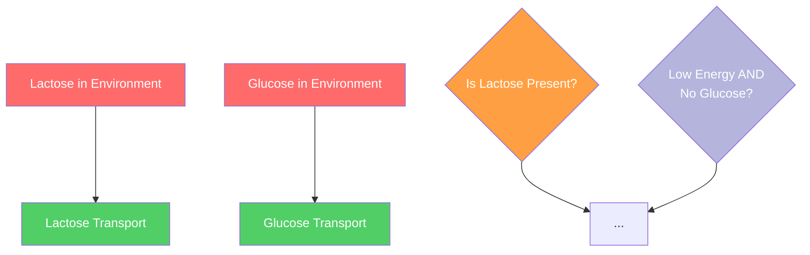

# 🎨 Color Rendering Issue - Root Cause Analysis

## ❌ PROBLEM:
All nodes showing lavender/purple instead of proper colors from the legend.

## ✅ ROOT CAUSE FOUND:

### **Style Syntax Difference:**

**WORKING EXAMPLE (ecoli_lac_operon):**
```mermaid
style A fill:#ff6b6b,color:#fff
style B fill:#51cf66,color:#fff
style M fill:#ff9f43,color:#fff
```

**BROKEN EXAMPLE (bacillus_biofilm_formation):**
```mermaid
style A fill:#ff6b6b
style B fill:#51cf66
style M fill:#ff9f43
```

**KEY DIFFERENCE:** Working examples include `,color:#fff` or `,color:#000` for text color!

### **Coverage Difference:**

**WORKING:**
- Styles 60+ nodes out of 63 total
- Almost every node has explicit styling
- Uses unique IDs like: A, B, C, ..., ZZ, AAA, BBB, etc.

**BROKEN:**
- Only styles 20-25 nodes out of 71 total
- Many nodes missing explicit styles
- Uses A, B, C, ... BK, BL pattern

---

## 🔧 FIX REQUIRED:

For ALL 24 regenerated processes, need to:

1. ✅ **Add `,color:#fff` or `,color:#000` to EVERY style statement**
   - Light backgrounds (red, yellow, orange, lavender, violet): use `color:#fff`
   - Light blue: use `color:#fff` or `color:#000`
   - Green: use `color:#fff`

2. ✅ **Style EVERY node, not just some**
   - Count total nodes
   - Ensure every node ID has a style statement
   - Missing styles default to lavender (explains the problem!)

3. ✅ **Use descriptive unique node IDs**
   - Current pattern (A, B, C, ..., BK) is OK
   - But verify no duplicates
   - Consider more descriptive names for clarity

---

## 📋 PROCESSES TO FIX (24 total):

### **Batch 1 - Already regenerated but broken colors (12):**
1. bacillus_biofilm_formation ❌
2. yeast_mitochondrial_biogenesis ❌
3. yeast_er_stress_response ❌
4. ecoli_pentose_phosphate_pathway ❌
5. ecoli_phage_defense ❌
6. yeast_chromatin_silencing ❌
7. yeast_vesicle_trafficking ❌
8. yeast_rna_splicing ❌
9. yeast_nitrogen_metabolism ❌
10. ecoli_fatty_acid_degradation ❌
11. ecoli_sulfur_metabolism ❌
12. ecoli_outer_membrane_assembly ❌

### **Batch 2 - Second round fixes (12):**
13. ecoli_amino_acid_biosynthesis ❌
14. ecoli_nucleotide_biosynthesis ❌
15. yeast_mapk_mating ❌
16. yeast_pka_pathway ❌
17. yeast_snf1_pathway ❌
18. yeast_gcn4_starvation ❌
19. yeast_cell_wall_integrity ❌
20. ecoli_tryptophan_biosynthesis ❌
21. ecoli_phosphate_transport ❌
22. ecoli_e._coli_heat_shock_response ❌
23. ecoli_e._coli_acid_resistance ❌
24. ecoli_e._coli_two_component_signaling ❌

### **Additional - User reported:**
25. ecoli_anaerobic_respiration - Syntax error ❌

---

## 🔬 PATTERN TO FOLLOW:

From **ecoli_lac_operon.json** (verified working):



**Key requirements:**
1. Every node gets a style statement
2. Format: `style NODEID fill:#HEXCOLOR,color:#TEXTCOLOR`
3. Text color:
   - White backgrounds: `color:#fff`
   - Light backgrounds: `color:#000` (optional for readability)

---

## 🎯 ACTION PLAN FOR TOMORROW:

### **Step 1: Create Fix Script**
- Read each of the 25 problematic processes
- For each: Add `,color:#fff` to every existing style statement
- Add style statements for any missing nodes
- Verify total style count matches node count

### **Step 2: Test One Process**
- Fix one process completely
- Upload to GCS
- User verifies colors work
- Use that as template for remaining 24

### **Step 3: Batch Fix All**
- Apply same pattern to all 25 processes
- Commit to GitHub
- Create deployment script

### **Step 4: Deployment**
- Upload ALL fixed processes
- Upload fixed viewer with table layout
- User verifies ALL processes look correct

---

## 📊 EXPECTED RESULTS:

After fix, each process should show:
- ✅ Red nodes: Inputs/Triggers
- ✅ Yellow nodes: Structures/Objects
- ✅ Green nodes: Processing/Operations
- ✅ Blue nodes: Intermediates/States
- ✅ Orange nodes: OR gates
- ✅ Lavender nodes: AND gates
- ✅ Violet nodes: Outputs/Products

**NOT: Everything lavender!**

---

**Status saved. Ready to fix all 25 processes tomorrow.** 🌙
