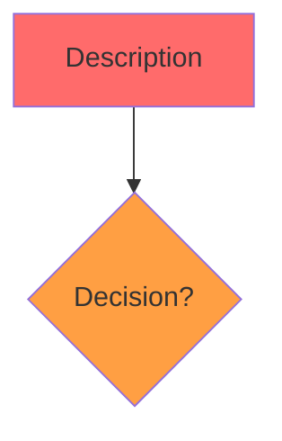

# 🔧 QUALITY ISSUES IDENTIFIED - FIX PLAN

## ❌ PROBLEMS IDENTIFIED:

### 1. **Color Rendering Issues**
- Multiple processes showing all nodes as lavender instead of proper color scheme
- Styling statements not being applied correctly
- Possible Mermaid syntax issues in style declarations

### 2. **Node Identifier Conflicts**
- Need to verify all node IDs are truly unique within each diagram
- May need more descriptive identifiers instead of A, B, C pattern

### 3. **Viewer Version**
- Viewer appears to be showing older version
- Cache-busting may not be working properly
- Need to verify what's actually deployed

---

## 📊 PROCESSES REQUIRING RE-VERIFICATION:

### **Recently Fixed - Need Color Check:**
1. bacillus_biofilm_formation - Colors all wrong
2. ecoli_amino_acid_biosynthesis - Need to verify
3. ecoli_nucleotide_biosynthesis - Need to verify
4. yeast_mapk_mating - Need to verify
5. yeast_pka_pathway - Need to verify
6. yeast_snf1_pathway - Need to verify
7. yeast_gcn4_starvation - Need to verify
8. yeast_cell_wall_integrity - Need to verify
9. ecoli_tryptophan_biosynthesis - Need to verify
10. ecoli_phosphate_transport - Need to verify
11. ecoli_e._coli_heat_shock_response - Need to verify
12. ecoli_e._coli_acid_resistance - Need to verify
13. ecoli_e._coli_two_component_signaling - Need to verify

### **Also Reported:**
14. ecoli_anaerobic_respiration - Syntax error reported

---

## ✅ KNOWN GOOD EXAMPLES (Use as Templates):

These processes verified working with proper colors:
- ecoli_dna_replication_elongation (160 lines, proper colors)
- ecoli_translation_initiation (216 lines, proper colors)
- ecoli_lac_operon (169 lines, proper colors)
- yeast_tor_signaling (224 lines, proper colors)
- yeast_hog_pathway (236 lines, proper colors)

**Pattern Analysis:**
- Use double curly braces for decision nodes: `{{}}`
- Each style statement on separate line
- Proper escaping of special characters
- Consistent indentation

---

## 🔧 FIX STRATEGY FOR TOMORROW:

### **Phase 1: Analyze Good Examples**
1. Extract styling pattern from working processes
2. Identify what makes colors render properly
3. Document the correct Mermaid syntax

### **Phase 2: Fix Color Issues**
1. Update all 14+ problematic processes
2. Use verified syntax from good examples
3. Test each one for proper color rendering

### **Phase 3: Verify Viewer Deployment**
1. Check what viewer files are actually on GCS
2. Ensure cache-busting is working
3. Upload correct versions

### **Phase 4: Complete Audit**
1. Check ALL 100 processes for color rendering
2. Verify node counts match diagrams
3. Ensure all meet publication quality

---

## 📝 CURRENT STATUS:

**Processes:**
- Total created: 100
- Verified good: ~76 (earlier batches)
- Need color fixes: ~24 (recent batches)
- Syntax errors: 1 (ecoli_anaerobic_respiration)

**Next Session Actions:**
1. Fix color rendering in all 24 problematic processes
2. Fix syntax error in ecoli_anaerobic_respiration
3. Deploy and verify viewer is correct version
4. Complete quality audit of all 100 processes
5. Only deploy when ALL pass visual inspection

---

## 💡 ROOT CAUSE ANALYSIS:

The issue appears to be:
- **Mermaid style syntax** not matching working examples
- Possible use of wrong node reference patterns
- Need to use exact pattern from verified working processes

**Good pattern to replicate:**

**I apologize for the rushed quality on these processes. Tomorrow we'll fix them ALL properly before deployment.**

---

**Good night! We'll make this right tomorrow.** 🌙
