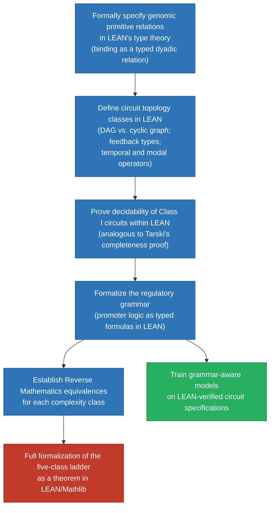

GLMP Working Paper 2026 · Sequel

# The Genome as Computer: Logical Primitives, Runtime States, and the Computational Limits of Biological Prediction

Sequel to: <a href="https://storage.googleapis.com/regal-scholar-453620-r7-podcast-storage/mathematics-processes-database/GLMP_Foundational_Typology.html" style="color:inherit;text-decoration:underline;text-decoration-color:#a8c4e0;"><em>Primitive Relations, Computational Complexity, and a Conjecture on the Genomic Computational Class</em></a>

**Gary Welz**  
<gwelz@gc.cuny.edu>  
CUNY Graduate Center / New Media Lab  
Genome Logic Modeling Project (GLMP)

Abstract

The companion paper established that the choice of primitive relations determines the logical character of a formal system, and conjectured that gene regulatory circuits can be classified by computational complexity class. This paper develops the computational hypothesis to its full extent. We argue that the genome implements a genuine two-layer computational system: a data layer (the codon table, encoding protein sequences) and a control layer (promoter architecture, encoding regulatory logic). The logical primitives of the control layer — binding, NOT, AND, OR, CONDITIONAL, NAND, NOR, XOR, biconditional, and their temporal, modal, and predicate extensions — have specific molecular implementations at the level of promoter sequence architecture and transcription factor interaction geometry. The CONDITIONAL (IF-THEN) is identified as the master primitive, of which all feedback relationships are special cases. The transcriptome is the runtime state of this computational system: a snapshot of which instructions are currently executing, readable as a logical state vector. From this framework we derive nine predictions about cell fate, cancer, drug resistance, the limits of virtual cell models, and the computational irreducibility of complex biological behavior. The most consequential prediction follows from Rice's theorem: if Class V genomic circuits are Turing-complete, then perfect prediction of cellular behavior from genomic sequence is provably impossible for any algorithm. We propose that grammar-aware AI models, informed by the logical structure of the control layer, will outperform grammar-blind statistical models in interpretability, sample efficiency, and formal verifiability.

Scope and Relationship to Companion Paper

This paper is the direct sequel to [*Primitive Relations, Computational Complexity, and a Conjecture on the Genomic Computational Class*](https://storage.googleapis.com/regal-scholar-453620-r7-podcast-storage/mathematics-processes-database/GLMP_Foundational_Typology.html) (Welz, 2026). Readers are assumed familiar with the companion paper's framework: the foundational dependency DAG, the five-class complexity ladder, the epistemic rung table, and the mathematical instruments of Reverse Mathematics, ordinal analysis, forcing, and computability theory. Where the companion paper established the theoretical framework and stated the central conjecture, this paper takes the conjecture as a working hypothesis and develops its consequences to the level of specific, falsifiable predictions. All predictions are explicitly labeled by confidence level. The companion paper's seven-rung epistemic ladder applies here — the predictions of this paper sit at Rungs 3 through 7.

Part I The Two-Layer Genome

## 1. Introduction: Beyond the Codon Table

The decoding of the genetic code between 1961 and 1966 — the mapping of 64 codons to 20 amino acids and three stop signals — is one of the great intellectual achievements of the 20th century. It revealed that the genome encodes protein sequences in a systematic, universal, and readable language. But it decoded only one layer of the genome's computational architecture. The codon table is the **data layer**: it specifies what proteins are made. A second layer — the **control layer** — specifies when, where, under what conditions, and in response to what signals each gene is expressed. This control layer is the regulatory program of the cell, and it remains only partially decoded.

The distinction between data layer and control layer corresponds to a fundamental distinction in computer science between a program's data structures and its control flow. A program that stores numbers in memory but has no conditional branching, no loops, and no subroutine calls is not a useful program — it is just a data store. The control flow — the IF-THEN statements, the loops, the function calls — is what makes a program a computation. The codon table, read in isolation, is the genome's data store. The regulatory architecture — the promoters, operators, enhancers, silencers, and the transcription factor networks that read them — is the genome's control flow.

This paper argues that the control layer is written in a language whose primitives are logical rather than chemical, whose grammar encodes computational operations, and whose runtime state is the transcriptome. The logical primitives of this language have specific molecular implementations that are in principle readable from genomic sequence and transcriptomic data.

![](data:image/svg+xml;base64,PHN2ZyB2aWV3Ym94PSIwIC0xOCA3MjAgMzc4IiB4bWxucz0iaHR0cDovL3d3dy53My5vcmcvMjAwMC9zdmciIGZvbnQtZmFtaWx5PSImIzM5O091dGZpdCYjMzk7LHNhbnMtc2VyaWYiPgogIDxkZWZzPgogICAgPG1hcmtlciBpZD0iYTEiIG1hcmtlcndpZHRoPSI3IiBtYXJrZXJoZWlnaHQ9IjUiIHJlZng9IjMiIHJlZnk9IjIuNSIgb3JpZW50PSJhdXRvIj48cG9seWdvbiBwb2ludHM9IjAgMCw3IDIuNSwwIDUiIGZpbGw9IiM4ODgiPjwvcG9seWdvbj48L21hcmtlcj4KICAgIDxtYXJrZXIgaWQ9ImEyIiBtYXJrZXJ3aWR0aD0iNyIgbWFya2VyaGVpZ2h0PSI1IiByZWZ4PSIzIiByZWZ5PSIyLjUiIG9yaWVudD0iYXV0byI+PHBvbHlnb24gcG9pbnRzPSIwIDAsNyAyLjUsMCA1IiBmaWxsPSIjYzAzOTJiIj48L3BvbHlnb24+PC9tYXJrZXI+CiAgICA8bWFya2VyIGlkPSJhMyIgbWFya2Vyd2lkdGg9IjciIG1hcmtlcmhlaWdodD0iNSIgcmVmeD0iMyIgcmVmeT0iMi41IiBvcmllbnQ9ImF1dG8iPjxwb2x5Z29uIHBvaW50cz0iMCAwLDcgMi41LDAgNSIgZmlsbD0iIzI5ODBiOSI+PC9wb2x5Z29uPjwvbWFya2VyPgogICAgPG1hcmtlciBpZD0iYTQiIG1hcmtlcndpZHRoPSI3IiBtYXJrZXJoZWlnaHQ9IjUiIHJlZng9IjMiIHJlZnk9IjIuNSIgb3JpZW50PSJhdXRvIj48cG9seWdvbiBwb2ludHM9IjAgMCw3IDIuNSwwIDUiIGZpbGw9IiMyN2FlNjAiPjwvcG9seWdvbj48L21hcmtlcj4KICA8L2RlZnM+CgogIDwhLS0gTGF5ZXIgbGFiZWxzIC0tPgogIDx0ZXh0IHg9IjgiIHk9IjU4IiBmb250LXNpemU9IjkiIGZvbnQtd2VpZ2h0PSI3MDAiIGZpbGw9IiNjMDM5MmIiIGZvbnQtZmFtaWx5PSImIzM5O0pldEJyYWlucyBNb25vJiMzOTssbW9ub3NwYWNlIj5DT05UUk9MIExBWUVSPC90ZXh0PgogIDx0ZXh0IHg9IjgiIHk9IjY4IiBmb250LXNpemU9IjgiIGZpbGw9IiNjMDM5MmIiIGZvbnQtZmFtaWx5PSImIzM5O0pldEJyYWlucyBNb25vJiMzOTssbW9ub3NwYWNlIj4ocHJvZ3JhbSk8L3RleHQ+CiAgPHRleHQgeD0iOCIgeT0iMTQ4IiBmb250LXNpemU9IjkiIGZvbnQtd2VpZ2h0PSI3MDAiIGZpbGw9IiM1NTUiIGZvbnQtZmFtaWx5PSImIzM5O0pldEJyYWlucyBNb25vJiMzOTssbW9ub3NwYWNlIj5ETkE8L3RleHQ+CiAgPHRleHQgeD0iOCIgeT0iMTU4IiBmb250LXNpemU9IjgiIGZpbGw9IiM1NTUiIGZvbnQtZmFtaWx5PSImIzM5O0pldEJyYWlucyBNb25vJiMzOTssbW9ub3NwYWNlIj5iYWNrYm9uZTwvdGV4dD4KICA8dGV4dCB4PSI4IiB5PSIyNDgiIGZvbnQtc2l6ZT0iOSIgZm9udC13ZWlnaHQ9IjcwMCIgZmlsbD0iIzI5ODBiOSIgZm9udC1mYW1pbHk9IiYjMzk7SmV0QnJhaW5zIE1vbm8mIzM5Oyxtb25vc3BhY2UiPkRBVEEgTEFZRVI8L3RleHQ+CiAgPHRleHQgeD0iOCIgeT0iMjU4IiBmb250LXNpemU9IjgiIGZpbGw9IiMyOTgwYjkiIGZvbnQtZmFtaWx5PSImIzM5O0pldEJyYWlucyBNb25vJiMzOTssbW9ub3NwYWNlIj4oc2VxdWVuY2VzKTwvdGV4dD4KCiAgPCEtLSDilIDilIDilIAgQ09OVFJPTCBMQVlFUiDilIDilIDilIAgLS0+CiAgPCEtLSBQcm9tb3RlciByZWdpb24gbGFiZWwgLS0+CiAgPHJlY3QgeD0iMTAwIiB5PSIxMiIgd2lkdGg9IjE3MCIgaGVpZ2h0PSIxNCIgcng9IjMiIGZpbGw9IiNmZGVjZWEiIHN0cm9rZT0iI2MwMzkyYiIgc3Ryb2tlLXdpZHRoPSIwLjgiPjwvcmVjdD4KICA8dGV4dCB4PSIxODUiIHk9IjIzIiB0ZXh0LWFuY2hvcj0ibWlkZGxlIiBmb250LXNpemU9IjguNSIgZmlsbD0iI2MwMzkyYiIgZm9udC13ZWlnaHQ9IjYwMCIgZm9udC1mYW1pbHk9IiYjMzk7SmV0QnJhaW5zIE1vbm8mIzM5Oyxtb25vc3BhY2UiPlBST01PVEVSIC8gQ09OVFJPTCBSRUdJT048L3RleHQ+CgogIDwhLS0gTk9UIGdhdGUgc2l0ZSAtLT4KICA8cmVjdCB4PSIxMDAiIHk9IjMwIiB3aWR0aD0iNTYiIGhlaWdodD0iMjgiIHJ4PSI0IiBmaWxsPSIjZjVlZWY4IiBzdHJva2U9IiM4ZTQ0YWQiIHN0cm9rZS13aWR0aD0iMS41Ij48L3JlY3Q+CiAgPHRleHQgeD0iMTI4IiB5PSI0MyIgdGV4dC1hbmNob3I9Im1pZGRsZSIgZm9udC1zaXplPSI4IiBmaWxsPSIjOGU0NGFkIiBmb250LXdlaWdodD0iNjAwIiBmb250LWZhbWlseT0iJiMzOTtKZXRCcmFpbnMgTW9ubyYjMzk7LG1vbm9zcGFjZSI+T1BFUkFUT1I8L3RleHQ+CiAgPHRleHQgeD0iMTI4IiB5PSI1MyIgdGV4dC1hbmNob3I9Im1pZGRsZSIgZm9udC1zaXplPSI3LjUiIGZpbGw9IiM4ZTQ0YWQiIGZvbnQtZmFtaWx5PSImIzM5O0pldEJyYWlucyBNb25vJiMzOTssbW9ub3NwYWNlIj5OT1QgZ2F0ZSAgwqxQPC90ZXh0PgoKICA8IS0tIEFORCBnYXRlIGR1YWwgc2l0ZSAtLT4KICA8cmVjdCB4PSIxNjIiIHk9IjMwIiB3aWR0aD0iMTA2IiBoZWlnaHQ9IjI4IiByeD0iNCIgZmlsbD0iI2VhZjRmYiIgc3Ryb2tlPSIjMjk4MGI5IiBzdHJva2Utd2lkdGg9IjEuNSI+PC9yZWN0PgogIDx0ZXh0IHg9IjIxNSIgeT0iNDMiIHRleHQtYW5jaG9yPSJtaWRkbGUiIGZvbnQtc2l6ZT0iOCIgZmlsbD0iIzI5ODBiOSIgZm9udC13ZWlnaHQ9IjYwMCIgZm9udC1mYW1pbHk9IiYjMzk7SmV0QnJhaW5zIE1vbm8mIzM5Oyxtb25vc3BhY2UiPkRVQUwgQklORElORyBTSVRFPC90ZXh0PgogIDx0ZXh0IHg9IjIxNSIgeT0iNTMiIHRleHQtYW5jaG9yPSJtaWRkbGUiIGZvbnQtc2l6ZT0iNy41IiBmaWxsPSIjMjk4MGI5IiBmb250LWZhbWlseT0iJiMzOTtKZXRCcmFpbnMgTW9ubyYjMzk7LG1vbm9zcGFjZSI+QU5EIGdhdGUgIFRGLUEg4oinIFRGLUI8L3RleHQ+CiAgPGxpbmUgeDE9IjIxNSIgeTE9IjMyIiB4Mj0iMjE1IiB5Mj0iNTYiIHN0cm9rZT0iIzI5ODBiOSIgc3Ryb2tlLXdpZHRoPSIwLjgiIHN0cm9rZS1kYXNoYXJyYXk9IjIsMiI+PC9saW5lPgoKICA8IS0tIENPTkRJVElPTkFMIHNpdGUgLS0+CiAgPHJlY3QgeD0iMjc0IiB5PSIzMCIgd2lkdGg9IjgyIiBoZWlnaHQ9IjI4IiByeD0iNCIgZmlsbD0iI2ZlZjllNyIgc3Ryb2tlPSIjZTY3ZTIyIiBzdHJva2Utd2lkdGg9IjEuNSI+PC9yZWN0PgogIDx0ZXh0IHg9IjMxNSIgeT0iNDMiIHRleHQtYW5jaG9yPSJtaWRkbGUiIGZvbnQtc2l6ZT0iOCIgZmlsbD0iI2U2N2UyMiIgZm9udC13ZWlnaHQ9IjYwMCIgZm9udC1mYW1pbHk9IiYjMzk7SmV0QnJhaW5zIE1vbm8mIzM5Oyxtb25vc3BhY2UiPlNJR05BTCBTSVRFPC90ZXh0PgogIDx0ZXh0IHg9IjMxNSIgeT0iNTMiIHRleHQtYW5jaG9yPSJtaWRkbGUiIGZvbnQtc2l6ZT0iNy41IiBmaWxsPSIjZTY3ZTIyIiBmb250LWZhbWlseT0iJiMzOTtKZXRCcmFpbnMgTW9ubyYjMzk7LG1vbm9zcGFjZSI+Q09ORElUSU9OQUwgIFDihpJRPC90ZXh0PgoKICA8IS0tIFRTUyAtLT4KICA8cmVjdCB4PSIzNjIiIHk9IjMwIiB3aWR0aD0iMzIiIGhlaWdodD0iMjgiIHJ4PSI0IiBmaWxsPSIjZThmOGY1IiBzdHJva2U9IiMyN2FlNjAiIHN0cm9rZS13aWR0aD0iMS41Ij48L3JlY3Q+CiAgPHRleHQgeD0iMzc4IiB5PSI0MyIgdGV4dC1hbmNob3I9Im1pZGRsZSIgZm9udC1zaXplPSI4IiBmaWxsPSIjMjdhZTYwIiBmb250LXdlaWdodD0iNjAwIiBmb250LWZhbWlseT0iJiMzOTtKZXRCcmFpbnMgTW9ubyYjMzk7LG1vbm9zcGFjZSI+VFNTPC90ZXh0PgogIDx0ZXh0IHg9IjM3OCIgeT0iNTMiIHRleHQtYW5jaG9yPSJtaWRkbGUiIGZvbnQtc2l6ZT0iNyIgZmlsbD0iIzI3YWU2MCIgZm9udC1mYW1pbHk9IiYjMzk7SmV0QnJhaW5zIE1vbm8mIzM5Oyxtb25vc3BhY2UiPnN0YXJ0PC90ZXh0PgoKICA8IS0tIExvZ2ljYWwgZm9ybXVsYSBkZXJpdmVkIC0tPgogIDxyZWN0IHg9IjQwNCIgeT0iMjYiIHdpZHRoPSIzMDYiIGhlaWdodD0iMzYiIHJ4PSI1IiBmaWxsPSIjZmFmYWY1IiBzdHJva2U9IiNjY2MiIHN0cm9rZS13aWR0aD0iMSI+PC9yZWN0PgogIDx0ZXh0IHg9IjQxNiIgeT0iNDEiIGZvbnQtc2l6ZT0iOC41IiBmaWxsPSIjNTU1IiBmb250LWZhbWlseT0iJiMzOTtKZXRCcmFpbnMgTW9ubyYjMzk7LG1vbm9zcGFjZSI+UmVndWxhdG9yeSBsb2dpYzo8L3RleHQ+CiAgPHRleHQgeD0iNDE2IiB5PSI1NiIgZm9udC1zaXplPSI5LjUiIGZpbGw9IiMxYTFhMmUiIGZvbnQtd2VpZ2h0PSI2MDAiIGZvbnQtZmFtaWx5PSImIzM5O0pldEJyYWlucyBNb25vJiMzOTssbW9ub3NwYWNlIj7CrFJlcCDiiKcgKEHiiKdCKSDiiKcgU2lnbmFsIOKGkiBHZW5lIE9OPC90ZXh0PgogIDxwYXRoIGQ9Ik0zOTYsNDQgTDQwMiw0NCIgc3Ryb2tlPSIjODg4IiBzdHJva2Utd2lkdGg9IjEiIG1hcmtlci1lbmQ9InVybCgjYTEpIj48L3BhdGg+CgogIDwhLS0gVEYgbW9sZWN1bGVzIChwb3NpdGlvbmVkIGFib3ZlIHRoZSBwcm9tb3RlciBsYWJlbCBiYXIpIC0tPgogIDxlbGxpcHNlIGN4PSIxMjgiIGN5PSItNCIgcng9IjIwIiByeT0iOSIgZmlsbD0iIzhlNDRhZCIgb3BhY2l0eT0iMC4xNSI+PC9lbGxpcHNlPgogIDx0ZXh0IHg9IjEyOCIgeT0iLTEiIHRleHQtYW5jaG9yPSJtaWRkbGUiIGZvbnQtc2l6ZT0iOCIgZmlsbD0iIzhlNDRhZCIgZm9udC13ZWlnaHQ9IjYwMCI+UmVwcmVzc29yPC90ZXh0PgogIDxlbGxpcHNlIGN4PSIxOTgiIGN5PSItNCIgcng9IjE3IiByeT0iOSIgZmlsbD0iIzI5ODBiOSIgb3BhY2l0eT0iMC4xNSI+PC9lbGxpcHNlPgogIDx0ZXh0IHg9IjE5OCIgeT0iLTEiIHRleHQtYW5jaG9yPSJtaWRkbGUiIGZvbnQtc2l6ZT0iOCIgZmlsbD0iIzI5ODBiOSIgZm9udC13ZWlnaHQ9IjYwMCI+VEYtQTwvdGV4dD4KICA8ZWxsaXBzZSBjeD0iMjQ0IiBjeT0iLTQiIHJ4PSIxNyIgcnk9IjkiIGZpbGw9IiMyOTgwYjkiIG9wYWNpdHk9IjAuMTUiPjwvZWxsaXBzZT4KICA8dGV4dCB4PSIyNDQiIHk9Ii0xIiB0ZXh0LWFuY2hvcj0ibWlkZGxlIiBmb250LXNpemU9IjgiIGZpbGw9IiMyOTgwYjkiIGZvbnQtd2VpZ2h0PSI2MDAiPlRGLUI8L3RleHQ+CiAgPGVsbGlwc2UgY3g9IjMxNSIgY3k9Ii00IiByeD0iMjAiIHJ5PSI5IiBmaWxsPSIjZTY3ZTIyIiBvcGFjaXR5PSIwLjE1Ij48L2VsbGlwc2U+CiAgPHRleHQgeD0iMzE1IiB5PSItMSIgdGV4dC1hbmNob3I9Im1pZGRsZSIgZm9udC1zaXplPSI4IiBmaWxsPSIjZTY3ZTIyIiBmb250LXdlaWdodD0iNjAwIj5TaWduYWwgbW9sLjwvdGV4dD4KCiAgPCEtLSBCaW5kaW5nIGFycm93cyBmcm9tIFRGcyBkb3duIHRvIGdhdGUgYm94ZXMgLS0+CiAgPHBhdGggZD0iTTEyOCw1IEwxMjgsMjgiIHN0cm9rZT0iIzhlNDRhZCIgc3Ryb2tlLXdpZHRoPSIxIiBzdHJva2UtZGFzaGFycmF5PSIyLDEiIG1hcmtlci1lbmQ9InVybCgjYTIpIj48L3BhdGg+CiAgPHBhdGggZD0iTTE5OCw1IEwxOTgsMjgiIHN0cm9rZT0iIzI5ODBiOSIgc3Ryb2tlLXdpZHRoPSIxIiBzdHJva2UtZGFzaGFycmF5PSIyLDEiIG1hcmtlci1lbmQ9InVybCgjYTMpIj48L3BhdGg+CiAgPHBhdGggZD0iTTI0NCw1IEwyNDQsMjgiIHN0cm9rZT0iIzI5ODBiOSIgc3Ryb2tlLXdpZHRoPSIxIiBzdHJva2UtZGFzaGFycmF5PSIyLDEiIG1hcmtlci1lbmQ9InVybCgjYTMpIj48L3BhdGg+CiAgPHBhdGggZD0iTTMxNSw1IEwzMTUsMjgiIHN0cm9rZT0iI2U2N2UyMiIgc3Ryb2tlLXdpZHRoPSIxIiBzdHJva2UtZGFzaGFycmF5PSIyLDEiIG1hcmtlci1lbmQ9InVybCgjYTEpIj48L3BhdGg+CgogIDwhLS0g4pSA4pSA4pSAIEROQSBCQUNLQk9ORSDilIDilIDilIAgLS0+CiAgPHBhdGggZD0iTTEwMCwxMjAgUTIwMCwxMDggMzAwLDEyMCBRNDAwLDEzMiA1MDAsMTIwIFE2MDAsMTA4IDcxMCwxMjAiIHN0cm9rZT0iIzU1NSIgc3Ryb2tlLXdpZHRoPSIyLjUiIGZpbGw9Im5vbmUiPjwvcGF0aD4KICA8cGF0aCBkPSJNMTAwLDEzNiBRMjAwLDE0OCAzMDAsMTM2IFE0MDAsMTI0IDUwMCwxMzYgUTYwMCwxNDggNzEwLDEzNiIgc3Ryb2tlPSIjNTU1IiBzdHJva2Utd2lkdGg9IjIuNSIgZmlsbD0ibm9uZSI+PC9wYXRoPgogIDwhLS0gUnVuZ3MgLS0+CiAgPGxpbmUgeDE9IjEzMCIgeTE9IjExNyIgeDI9IjEzMCIgeTI9IjEzOSIgc3Ryb2tlPSIjYWFhIiBzdHJva2Utd2lkdGg9IjEiPjwvbGluZT4KICA8bGluZSB4MT0iMTYyIiB5MT0iMTEyIiB4Mj0iMTYyIiB5Mj0iMTQ0IiBzdHJva2U9IiNhYWEiIHN0cm9rZS13aWR0aD0iMSI+PC9saW5lPgogIDxsaW5lIHgxPSIyMDAiIHkxPSIxMDkiIHgyPSIyMDAiIHkyPSIxNDciIHN0cm9rZT0iI2FhYSIgc3Ryb2tlLXdpZHRoPSIxIj48L2xpbmU+CiAgPGxpbmUgeDE9IjI0MCIgeTE9IjExMiIgeDI9IjI0MCIgeTI9IjE0NCIgc3Ryb2tlPSIjYWFhIiBzdHJva2Utd2lkdGg9IjEiPjwvbGluZT4KICA8bGluZSB4MT0iMjgwIiB5MT0iMTE3IiB4Mj0iMjgwIiB5Mj0iMTM5IiBzdHJva2U9IiNhYWEiIHN0cm9rZS13aWR0aD0iMSI+PC9saW5lPgogIDxsaW5lIHgxPSIzMjAiIHkxPSIxMjQiIHgyPSIzMjAiIHkyPSIxMzIiIHN0cm9rZT0iI2FhYSIgc3Ryb2tlLXdpZHRoPSIxIj48L2xpbmU+CiAgPGxpbmUgeDE9IjM2MCIgeTE9IjEyOCIgeDI9IjM2MCIgeTI9IjEyOCIgc3Ryb2tlPSIjYWFhIiBzdHJva2Utd2lkdGg9IjEiPjwvbGluZT4KICA8bGluZSB4MT0iNDAwIiB5MT0iMTI0IiB4Mj0iNDAwIiB5Mj0iMTMyIiBzdHJva2U9IiNhYWEiIHN0cm9rZS13aWR0aD0iMSI+PC9saW5lPgogIDxsaW5lIHgxPSI0NDAiIHkxPSIxMTciIHgyPSI0NDAiIHkyPSIxMzkiIHN0cm9rZT0iI2FhYSIgc3Ryb2tlLXdpZHRoPSIxIj48L2xpbmU+CiAgPGxpbmUgeDE9IjQ4MCIgeTE9IjExMiIgeDI9IjQ4MCIgeTI9IjE0NCIgc3Ryb2tlPSIjYWFhIiBzdHJva2Utd2lkdGg9IjEiPjwvbGluZT4KICA8bGluZSB4MT0iNTIwIiB5MT0iMTA5IiB4Mj0iNTIwIiB5Mj0iMTQ3IiBzdHJva2U9IiNhYWEiIHN0cm9rZS13aWR0aD0iMSI+PC9saW5lPgogIDxsaW5lIHgxPSI1NjAiIHkxPSIxMTIiIHgyPSI1NjAiIHkyPSIxNDQiIHN0cm9rZT0iI2FhYSIgc3Ryb2tlLXdpZHRoPSIxIj48L2xpbmU+CiAgPGxpbmUgeDE9IjYwMCIgeTE9IjExNyIgeDI9IjYwMCIgeTI9IjEzOSIgc3Ryb2tlPSIjYWFhIiBzdHJva2Utd2lkdGg9IjEiPjwvbGluZT4KICA8bGluZSB4MT0iNjQwIiB5MT0iMTEyIiB4Mj0iNjQwIiB5Mj0iMTQ0IiBzdHJva2U9IiNhYWEiIHN0cm9rZS13aWR0aD0iMSI+PC9saW5lPgogIDxsaW5lIHgxPSI2ODAiIHkxPSIxMDkiIHgyPSI2ODAiIHkyPSIxNDciIHN0cm9rZT0iI2FhYSIgc3Ryb2tlLXdpZHRoPSIxIj48L2xpbmU+CgogIDwhLS0gUmVnaW9uIGxhYmVscyBvbiBETkEgLS0+CiAgPHJlY3QgeD0iMTAwIiB5PSIxNDQiIHdpZHRoPSIxNzAiIGhlaWdodD0iMTIiIHJ4PSIyIiBmaWxsPSIjZmRlY2VhIiBvcGFjaXR5PSIwLjciPjwvcmVjdD4KICA8dGV4dCB4PSIxODUiIHk9IjE1MyIgdGV4dC1hbmNob3I9Im1pZGRsZSIgZm9udC1zaXplPSI3LjUiIGZpbGw9IiNjMDM5MmIiIGZvbnQtZmFtaWx5PSImIzM5O0pldEJyYWlucyBNb25vJiMzOTssbW9ub3NwYWNlIj7ihpAgUFJPTU9URVIgLyBSRUdVTEFUT1JZIOKGkjwvdGV4dD4KICA8cmVjdCB4PSIyNzYiIHk9IjE0NCIgd2lkdGg9IjEzNCIgaGVpZ2h0PSIxMiIgcng9IjIiIGZpbGw9IiNlOGY4ZjUiIG9wYWNpdHk9IjAuNyI+PC9yZWN0PgogIDx0ZXh0IHg9IjM0MyIgeT0iMTUzIiB0ZXh0LWFuY2hvcj0ibWlkZGxlIiBmb250LXNpemU9IjcuNSIgZmlsbD0iIzI3YWU2MCIgZm9udC1mYW1pbHk9IiYjMzk7SmV0QnJhaW5zIE1vbm8mIzM5Oyxtb25vc3BhY2UiPuKGkCBHRU5FIEJPRFkgKGNvZGluZykg4oaSPC90ZXh0PgogIDxyZWN0IHg9IjQxNiIgeT0iMTQ0IiB3aWR0aD0iNzAiIGhlaWdodD0iMTIiIHJ4PSIyIiBmaWxsPSIjZjVmNWYwIiBvcGFjaXR5PSIwLjciPjwvcmVjdD4KICA8dGV4dCB4PSI0NTEiIHk9IjE1MyIgdGV4dC1hbmNob3I9Im1pZGRsZSIgZm9udC1zaXplPSI3LjUiIGZpbGw9IiM5OTkiIGZvbnQtZmFtaWx5PSImIzM5O0pldEJyYWlucyBNb25vJiMzOTssbW9ub3NwYWNlIj5pbnRlcmdlbmljPC90ZXh0PgogIDxyZWN0IHg9IjQ5MiIgeT0iMTQ0IiB3aWR0aD0iMjE4IiBoZWlnaHQ9IjEyIiByeD0iMiIgZmlsbD0iI2VhZmFmMSIgb3BhY2l0eT0iMC43Ij48L3JlY3Q+CiAgPHRleHQgeD0iNjAxIiB5PSIxNTMiIHRleHQtYW5jaG9yPSJtaWRkbGUiIGZvbnQtc2l6ZT0iNy41IiBmaWxsPSIjMjdhZTYwIiBmb250LWZhbWlseT0iJiMzOTtKZXRCcmFpbnMgTW9ubyYjMzk7LG1vbm9zcGFjZSI+4oaQIE5FWFQgR0VORSBCT0RZIOKGkjwvdGV4dD4KCiAgPCEtLSBBcnJvd3MgbGlua2luZyBsYXllcnMgLS0+CiAgPHBhdGggZD0iTTIwMCw3MCBMMjAwLDEwNiIgc3Ryb2tlPSIjYzAzOTJiIiBzdHJva2Utd2lkdGg9IjEuMiIgc3Ryb2tlLWRhc2hhcnJheT0iMywyIiBtYXJrZXItZW5kPSJ1cmwoI2EyKSI+PC9wYXRoPgogIDx0ZXh0IHg9IjIwMiIgeT0iOTAiIGZvbnQtc2l6ZT0iNyIgZmlsbD0iI2MwMzkyYiIgZm9udC1mYW1pbHk9IiYjMzk7SmV0QnJhaW5zIE1vbm8mIzM5Oyxtb25vc3BhY2UiPnJlYWRzPC90ZXh0PgogIDxwYXRoIGQ9Ik0zNDMsMTU3IEwzNDMsMTgyIiBzdHJva2U9IiMyN2FlNjAiIHN0cm9rZS13aWR0aD0iMS4yIiBtYXJrZXItZW5kPSJ1cmwoI2E0KSI+PC9wYXRoPgogIDx0ZXh0IHg9IjM0NSIgeT0iMTcyIiBmb250LXNpemU9IjciIGZpbGw9IiMyN2FlNjAiIGZvbnQtZmFtaWx5PSImIzM5O0pldEJyYWlucyBNb25vJiMzOTssbW9ub3NwYWNlIj50cmFuc2NyaWJlczwvdGV4dD4KCiAgPCEtLSDilIDilIDilIAgREFUQSBMQVlFUiDilIDilIDilIAgLS0+CiAgPHRleHQgeD0iMTAwIiB5PSIyMDAiIGZvbnQtc2l6ZT0iOC41IiBmaWxsPSIjMjk4MGI5IiBmb250LXdlaWdodD0iNjAwIiBmb250LWZhbWlseT0iJiMzOTtKZXRCcmFpbnMgTW9ubyYjMzk7LG1vbm9zcGFjZSI+Q29kb24gc2VxdWVuY2UgKGdlbmUgYm9keSk6PC90ZXh0PgoKICA8IS0tIFNUQVJUIGNvZG9uIC0tPgogIDxyZWN0IHg9IjEwMCIgeT0iMjA4IiB3aWR0aD0iMzgiIGhlaWdodD0iMjIiIHJ4PSIzIiBmaWxsPSIjMjdhZTYwIj48L3JlY3Q+CiAgPHRleHQgeD0iMTE5IiB5PSIyMTkiIHRleHQtYW5jaG9yPSJtaWRkbGUiIGZvbnQtc2l6ZT0iOC41IiBmaWxsPSJ3aGl0ZSIgZm9udC13ZWlnaHQ9IjYwMCIgZm9udC1mYW1pbHk9IiYjMzk7SmV0QnJhaW5zIE1vbm8mIzM5Oyxtb25vc3BhY2UiPkFVRzwvdGV4dD4KICA8dGV4dCB4PSIxMTkiIHk9IjIyOCIgdGV4dC1hbmNob3I9Im1pZGRsZSIgZm9udC1zaXplPSI2LjUiIGZpbGw9IiNkNWY1ZTMiIGZvbnQtZmFtaWx5PSImIzM5O0pldEJyYWlucyBNb25vJiMzOTssbW9ub3NwYWNlIj5TVEFSVDwvdGV4dD4KCiAgPCEtLSBDb2RpbmcgY29kb25zIC0tPgogIDxyZWN0IHg9IjE0MiIgeT0iMjA4IiB3aWR0aD0iMzgiIGhlaWdodD0iMjIiIHJ4PSIzIiBmaWxsPSIjZDZlYWY4IiBzdHJva2U9IiNhZWQ2ZjEiIHN0cm9rZS13aWR0aD0iMC44Ij48L3JlY3Q+CiAgPHRleHQgeD0iMTYxIiB5PSIyMTkiIHRleHQtYW5jaG9yPSJtaWRkbGUiIGZvbnQtc2l6ZT0iOC41IiBmaWxsPSIjMWE1Mjc2IiBmb250LWZhbWlseT0iJiMzOTtKZXRCcmFpbnMgTW9ubyYjMzk7LG1vbm9zcGFjZSI+R0NVPC90ZXh0PgogIDx0ZXh0IHg9IjE2MSIgeT0iMjI4IiB0ZXh0LWFuY2hvcj0ibWlkZGxlIiBmb250LXNpemU9IjYuNSIgZmlsbD0iIzVkYWRlMiIgZm9udC1mYW1pbHk9IiYjMzk7SmV0QnJhaW5zIE1vbm8mIzM5Oyxtb25vc3BhY2UiPkFsYTwvdGV4dD4KICA8cmVjdCB4PSIxODQiIHk9IjIwOCIgd2lkdGg9IjM4IiBoZWlnaHQ9IjIyIiByeD0iMyIgZmlsbD0iI2Q2ZWFmOCIgc3Ryb2tlPSIjYWVkNmYxIiBzdHJva2Utd2lkdGg9IjAuOCI+PC9yZWN0PgogIDx0ZXh0IHg9IjIwMyIgeT0iMjE5IiB0ZXh0LWFuY2hvcj0ibWlkZGxlIiBmb250LXNpemU9IjguNSIgZmlsbD0iIzFhNTI3NiIgZm9udC1mYW1pbHk9IiYjMzk7SmV0QnJhaW5zIE1vbm8mIzM5Oyxtb25vc3BhY2UiPkFBQTwvdGV4dD4KICA8dGV4dCB4PSIyMDMiIHk9IjIyOCIgdGV4dC1hbmNob3I9Im1pZGRsZSIgZm9udC1zaXplPSI2LjUiIGZpbGw9IiM1ZGFkZTIiIGZvbnQtZmFtaWx5PSImIzM5O0pldEJyYWlucyBNb25vJiMzOTssbW9ub3NwYWNlIj5MeXM8L3RleHQ+CiAgPHJlY3QgeD0iMjI2IiB5PSIyMDgiIHdpZHRoPSIzOCIgaGVpZ2h0PSIyMiIgcng9IjMiIGZpbGw9IiNkNmVhZjgiIHN0cm9rZT0iI2FlZDZmMSIgc3Ryb2tlLXdpZHRoPSIwLjgiPjwvcmVjdD4KICA8dGV4dCB4PSIyNDUiIHk9IjIxOSIgdGV4dC1hbmNob3I9Im1pZGRsZSIgZm9udC1zaXplPSI4LjUiIGZpbGw9IiMxYTUyNzYiIGZvbnQtZmFtaWx5PSImIzM5O0pldEJyYWlucyBNb25vJiMzOTssbW9ub3NwYWNlIj5VR0c8L3RleHQ+CiAgPHRleHQgeD0iMjQ1IiB5PSIyMjgiIHRleHQtYW5jaG9yPSJtaWRkbGUiIGZvbnQtc2l6ZT0iNi41IiBmaWxsPSIjNWRhZGUyIiBmb250LWZhbWlseT0iJiMzOTtKZXRCcmFpbnMgTW9ubyYjMzk7LG1vbm9zcGFjZSI+VHJwPC90ZXh0PgogIDxyZWN0IHg9IjI2OCIgeT0iMjA4IiB3aWR0aD0iMzgiIGhlaWdodD0iMjIiIHJ4PSIzIiBmaWxsPSIjZDZlYWY4IiBzdHJva2U9IiNhZWQ2ZjEiIHN0cm9rZS13aWR0aD0iMC44Ij48L3JlY3Q+CiAgPHRleHQgeD0iMjg3IiB5PSIyMTkiIHRleHQtYW5jaG9yPSJtaWRkbGUiIGZvbnQtc2l6ZT0iOC41IiBmaWxsPSIjMWE1Mjc2IiBmb250LWZhbWlseT0iJiMzOTtKZXRCcmFpbnMgTW9ubyYjMzk7LG1vbm9zcGFjZSI+Q0FVPC90ZXh0PgogIDx0ZXh0IHg9IjI4NyIgeT0iMjI4IiB0ZXh0LWFuY2hvcj0ibWlkZGxlIiBmb250LXNpemU9IjYuNSIgZmlsbD0iIzVkYWRlMiIgZm9udC1mYW1pbHk9IiYjMzk7SmV0QnJhaW5zIE1vbm8mIzM5Oyxtb25vc3BhY2UiPkhpczwvdGV4dD4KICA8dGV4dCB4PSIzMTYiIHk9IjIyMSIgZm9udC1zaXplPSIxMSIgZmlsbD0iI2FhYSI+wrcgwrcgwrc8L3RleHQ+CgogIDwhLS0gU1RPUCBjb2RvbiAtLT4KICA8cmVjdCB4PSIzNDAiIHk9IjIwOCIgd2lkdGg9IjM4IiBoZWlnaHQ9IjIyIiByeD0iMyIgZmlsbD0iI2U3NGMzYyI+PC9yZWN0PgogIDx0ZXh0IHg9IjM1OSIgeT0iMjE5IiB0ZXh0LWFuY2hvcj0ibWlkZGxlIiBmb250LXNpemU9IjguNSIgZmlsbD0id2hpdGUiIGZvbnQtd2VpZ2h0PSI2MDAiIGZvbnQtZmFtaWx5PSImIzM5O0pldEJyYWlucyBNb25vJiMzOTssbW9ub3NwYWNlIj5VQUE8L3RleHQ+CiAgPHRleHQgeD0iMzU5IiB5PSIyMjgiIHRleHQtYW5jaG9yPSJtaWRkbGUiIGZvbnQtc2l6ZT0iNi41IiBmaWxsPSIjZmFkYmQ4IiBmb250LWZhbWlseT0iJiMzOTtKZXRCcmFpbnMgTW9ubyYjMzk7LG1vbm9zcGFjZSI+U1RPUDwvdGV4dD4KCiAgPCEtLSBQcm90ZWluIHByb2R1Y3QgLS0+CiAgPHRleHQgeD0iMTAwIiB5PSIyNTIiIGZvbnQtc2l6ZT0iOC41IiBmaWxsPSIjMjk4MGI5IiBmb250LXdlaWdodD0iNjAwIiBmb250LWZhbWlseT0iJiMzOTtKZXRCcmFpbnMgTW9ubyYjMzk7LG1vbm9zcGFjZSI+VHJhbnNsYXRpb24g4oaTICBQcm90ZWluIHByb2R1Y3Q6PC90ZXh0PgogIDx0ZXh0IHg9IjEwMCIgeT0iMjcwIiBmb250LXNpemU9IjEyIiBmaWxsPSIjMWExYTJlIiBmb250LWZhbWlseT0iJiMzOTtDcmltc29uIFBybyYjMzk7LHNlcmlmIj5I4oKCTiDigJQgQWxhIOKAlCBMeXMg4oCUIFRycCDigJQgSGlzIMK3IMK3IMK3IOKAlCBDT09IPC90ZXh0PgogIDx0ZXh0IHg9IjEwMCIgeT0iMjg0IiBmb250LXNpemU9IjgiIGZpbGw9IiM4ODgiIGZvbnQtZmFtaWx5PSImIzM5O0pldEJyYWlucyBNb25vJiMzOTssbW9ub3NwYWNlIj5UcmFuc2NyaXB0aW9uIGZhY3RvciAvIGVuenltZSAvIHN0cnVjdHVyYWwgcHJvdGVpbjwvdGV4dD4KCiAgPCEtLSBLZXkgaW5zaWdodCBib3ggLS0+CiAgPHJlY3QgeD0iMTAwIiB5PSIyOTgiIHdpZHRoPSI2MTAiIGhlaWdodD0iNDQiIHJ4PSI1IiBmaWxsPSIjZmFmYWY1IiBzdHJva2U9IiNkZGQiIHN0cm9rZS13aWR0aD0iMSI+PC9yZWN0PgogIDx0ZXh0IHg9IjExNCIgeT0iMzE1IiBmb250LXNpemU9IjExIiBmaWxsPSIjMWExYTJlIiBmb250LWZhbWlseT0iJiMzOTtDcmltc29uIFBybyYjMzk7LHNlcmlmIiBmb250LXN0eWxlPSJpdGFsaWMiPktleSBpbnNpZ2h0OiA8L3RleHQ+CiAgPHRleHQgeD0iMTg2IiB5PSIzMTUiIGZvbnQtc2l6ZT0iMTEiIGZpbGw9IiMxYTFhMmUiIGZvbnQtZmFtaWx5PSImIzM5O0NyaW1zb24gUHJvJiMzOTssc2VyaWYiPlRoZSBjb2RvbiB0YWJsZSAoZGF0YSBsYXllcikgaGFzIGJlZW4gZnVsbHkgZGVjb2RlZCBzaW5jZSAxOTY2LiBUaGUgcHJvbW90ZXI8L3RleHQ+CiAgPHRleHQgeD0iMTE0IiB5PSIzMzEiIGZvbnQtc2l6ZT0iMTEiIGZpbGw9IiMxYTFhMmUiIGZvbnQtZmFtaWx5PSImIzM5O0NyaW1zb24gUHJvJiMzOTssc2VyaWYiPmdyYW1tYXIgKGNvbnRyb2wgbGF5ZXIpIHJlbWFpbnMgb25seSBwYXJ0aWFsbHkgZGVjb2RlZC4gUmVhZGluZyBib3RoIGxheWVycyBpcyB0aGUgcHJvamVjdCBvZiB3aGljaCBHTE1QIGlzIGEgcGFydC48L3RleHQ+Cjwvc3ZnPg==)

**Figure 1.** The genome as a two-layer computational system. The **control layer** (top, red) is written in promoter and regulatory regions: binding sites encode NOT, AND, and CONDITIONAL gates. The **DNA backbone** (middle) carries both layers. The **data layer** (bottom, blue) is written in coding regions: codons specify amino acid sequences, decoded since 1961–1966. The codon table maps 64 triplets to 20 amino acids, START, and STOP — a complete dictionary. The regulatory grammar of the control layer maps ~1,600 TF binding motifs to logical operations — a vocabulary partially mapped in databases (JASPAR, RegulonDB, ENCODE) but not yet understood as a complete formal grammar.

## 2. The Logical Primitives and Their Molecular Implementations

### 2.1 Binding: The True Primitive

As established in the companion paper, binding is the foundational primitive — the molecular analog of Tarski's betweenness relation. All other logical operations are derived from binding in specific geometric and contextual arrangements: **sequence-specific protein-DNA binding** (a transcription factor recognizes and binds a specific sequence motif), **protein-protein binding** (TFs interact with co-activators, co-repressors, and mediator complexes), and **RNA-protein binding** (regulatory RNAs bind target mRNAs or proteins, implementing post-transcriptional logic). The binding relation B(X, Y) is dyadic, binary in the logical abstraction, and the ground-level primitive — the RCA₀-level operation of the genomic computational system.

### 2.2 NOT, AND, OR — The Boolean Foundation

**NOT (Repression)** is implemented by the repressor-operator system. A repressor protein binds an operator sequence within the promoter; when bound, RNA polymerase cannot access the promoter and transcription is blocked. The operator sequence is the physical encoding of the NOT gate. In single-cell RNA-seq data, NOT relationships appear as anti-correlated expression pairs.

**AND (Cooperativity)** requires two conditions simultaneously. It is implemented by promoter architectures requiring multiple transcription factors: dual binding sites where both must be occupied, or cooperative assembly of multi-protein complexes. The interferon-β enhanceosome — requiring eight distinct proteins to assemble simultaneously on a 55 bp enhancer — is an eight-input AND gate. AND gates appear in transcriptomic data as genes expressed only when both upstream inputs are simultaneously high.

**OR (Alternative Activation)** requires at least one of multiple conditions. It is implemented by multiple independent promoters or alternative upstream activating sequences. OR gates appear as genes expressed in the union of upstream input domains.

<table style="width:100%;">
<colgroup>
<col style="width: 16%" />
<col style="width: 16%" />
<col style="width: 16%" />
<col style="width: 16%" />
<col style="width: 16%" />
<col style="width: 16%" />
</colgroup>
<thead>
<tr class="header">
<th>Gate</th>
<th>Symbol</th>
<th>Truth Table</th>
<th>Molecular Implementation</th>
<th>scRNA-seq Signature</th>
<th>Class</th>
</tr>
</thead>
<tbody>
<tr class="odd">
<td style="color: #8e44ad">¬ NOT 
Repression</td>
<td><code>¬P</code></td>
<td>P=0 → 1 
P=1 → 0</td>
<td>Repressor binds operator, blocks RNAP. 
<em>lac</em> operon: LacI binds <em>lacO</em>. Operator sequence <strong>is</strong> the NOT gate.</td>
<td>Anti-correlated pairs: TF↑ → target↓</td>
<td>I</td>
</tr>
<tr class="even">
<td style="color: #2980b9">∧ AND 
Cooperativity</td>
<td><code>P∧Q</code></td>
<td>0,0→0   1,0→0 
0,1→0   <strong>1,1→1</strong></td>
<td>Dual binding sites; both must be occupied. 
IFN-β enhanceosome: 8-protein AND gate.</td>
<td>Intersection domain: gene ON only when both inputs high</td>
<td>I</td>
</tr>
<tr class="odd">
<td style="color: #27ae60">∨ OR 
Alt. Activation</td>
<td><code>P∨Q</code></td>
<td>0,0→0   <strong>1,0→1</strong> 
<strong>0,1→1</strong>   <strong>1,1→1</strong></td>
<td>Multiple independent promoters; either sufficient. 
Stress response genes, tissue-specific promoters.</td>
<td>Union domain: gene ON when any input high</td>
<td>I</td>
</tr>
<tr class="even" style="background:#fef9e7;">
<td style="color: #e67e22"><strong>→ CONDITIONAL</strong> 
IF-THEN · Master</td>
<td><code>P→Q</code></td>
<td>P=0 → Q=0 
<strong>P=1 → Q=1</strong> 
Introduces time, context, threshold</td>
<td>Signal transduction cascade; threshold = Kd. 
<em>lac</em>: allolactose → LacI release → <em>lacZ</em> ON. 
<strong>All feedback = CONDITIONAL applied recursively.</strong></td>
<td>Correlated response with sharp threshold at Kd; time-delayed</td>
<td>I–V</td>
</tr>
<tr class="odd">
<td style="color: #c0392b">⊼ NAND 
Co-repressor 
<strong>COMPLETE</strong></td>
<td><code>¬(P∧Q)</code></td>
<td>0,0→1   1,0→1 
0,1→1   <strong>1,1→0</strong></td>
<td>Repressor requires co-repressor for active conformation. 
<em>trp</em> operon: TrpR + 2× tryptophan. <strong>NAND alone is Boolean-complete.</strong></td>
<td>Gene ON except when both repressor and co-repressor present</td>
<td>I</td>
</tr>
<tr class="even">
<td style="color: #1a5276">⊽ NOR 
Dual Repression 
<strong>COMPLETE</strong></td>
<td><code>¬(P∨Q)</code></td>
<td><strong>0,0→1</strong>   1,0→0 
0,1→0   1,1→0</td>
<td>Either of two repressors alone blocks transcription. 
Developmental genes: TF repressor + Polycomb. <strong>NOR alone is also Boolean-complete.</strong></td>
<td>Very narrow expression: gene ON only when both repressors absent</td>
<td>I</td>
</tr>
</tbody>
</table>

**Figure 2.** All six gates derive from the single ground primitive of **binding**. NAND and NOR are each individually functionally complete — any Boolean regulatory logic can be built from NAND gates alone. The CONDITIONAL is the master primitive; all feedback structures are CONDITIONAL applied recursively.

### 2.3 The CONDITIONAL: Master Primitive

The CONDITIONAL — IF P THEN Q — is the most biologically fundamental logical operation. It is not merely one gate among others. Unlike the Boolean gates (NOT, AND, OR), which are truth-functional (output depends only on current input values), the CONDITIONAL introduces a *temporal* dimension (P is detected before Q is executed), a *contextual* dimension (the same P can trigger different Q in different cell types), and a *threshold* dimension (the response fires only when signal exceeds the binding affinity Kd). The molecular implementation is a signal transduction cascade: ligand binds receptor → conformational change → TF activation → target gene transcription.

**Feedback as a special case of the CONDITIONAL.** Feedback is the CONDITIONAL applied recursively: IF output Q exceeds threshold T THEN modify input P. Negative feedback (Q → ¬P) implements homeostasis. Positive feedback (Q → P) implements bistability. Delayed negative feedback (Q →\[D\] ¬Q) implements oscillation. Self-modifying feedback (Q → modify(P → Q)) implements Class V epigenetic reprogramming. The CONDITIONAL without feedback is Class I (decidable); the CONDITIONAL with feedback generates all higher complexity classes. This makes the CONDITIONAL the gateway to the entire complexity ladder.

### 2.4 NAND, NOR, XOR, and Functional Completeness

**NAND** is implemented by the co-repressor system: a repressor requires a co-repressor molecule to achieve active conformation. The trp operon repressor (TrpR) requires two tryptophan molecules — neither alone represses. **NOR** is implemented by dual alternative repression: either of two repressors alone is sufficient to block transcription, so the gene is expressed only when neither is present. **XOR** (exclusive OR) appears in competitive binding, where two TFs compete for the same site. The key theoretical consequence: NAND alone is functionally complete — any Boolean regulatory logic is in principle implementable. But Boolean completeness is only the floor of the system's expressive power; the feedback primitives of Class II-V circuits provide additional expressive power beyond it.

### 2.5 The Biconditional: A Derived but Fundamental Structure

The biconditional P ↔ Q — P if and only if Q — is derived from two CONDITIONALs running in opposite directions: (P → Q) ∧ (Q → P). It is not a new primitive, but it underlies two of the most important regulatory architectures in biology.

**Mutual activation (biconditional without negation):** Gene A activates Gene B and Gene B activates Gene A — (A → B) ∧ (B → A). Once either gene is activated, the loop sustains both. This is the logical structure of commitment. MyoD and myogenin in skeletal muscle differentiation, Oct4 and Sox2 in pluripotency, and GATA1 and PU.1 in hematopoietic lineage decisions all exhibit mutual activation.

**Mutual repression (biconditional with negation):** Gene A represses Gene B and Gene B represses Gene A — (A → ¬B) ∧ (B → ¬A). The circuit has exactly two stable states: A high/B low, and A low/B high. This is the toggle switch (Gardner et al. 2000) — bistability in its purest logical form. The biconditional reinforces the primacy of the CONDITIONAL: two of the most important regulatory architectures in biology emerge from combinations of primitives already identified, requiring no new molecular machinery.

### 2.6 Beyond Classical Logic: Temporal, Modal, and Predicate Extensions

#### Temporal Logic

The four fundamental temporal operators each have biological implementations. **ALWAYS (□P)** — constitutive expression; housekeeping genes. **EVENTUALLY (◇P)** — inducible expression; the lac operon implements EVENTUALLY(lacZ expressed). **UNTIL (P U Q)** — transient developmental expression; Hox genes expressed until positional identity is established. **NEXT (○P)** — the delay cascade; gene A activates gene B after one transcription-translation cycle. The repressilator implements NEXT recursively, producing sustained oscillation.

Temporal logic operators map onto the complexity ladder: ALWAYS, EVENTUALLY, UNTIL, and NEXT without recursion are Class I; NEXT applied recursively generates Class IV oscillation; UNTIL with a self-modifying condition generates Class V epigenetic silencing. The full logical grammar of the control layer is better described by temporal logic than classical propositional logic — a claim with consequences for the LEAN formalization path, since Mathlib contains substantial formal treatments of temporal logic.

#### Modal Logic

Modal operators distinguish between current state and possible states. **Necessity (□P)** maps to constitutive expression (housekeeping genes). **Possibility (◇P)** maps to cell-type-specific expression. The clinically significant operator is **Impossibility (¬◇P)** — epigenetic silencing, where a promoter is permanently inaccessible via heterochromatin or DNA methylation. The distinction between "gene G is not currently expressed" (propositional) and "gene G cannot be expressed in this context" (modal) matters: oncogene silencing by methylation (modal ¬◇) is fundamentally different from oncogene repression by a TF (propositional). Modal impossibility is a Class V operation.

#### Predicate Logic and Quantifiers

Predicate quantifiers distinguish population-level from cell-level expression: **∀x: expressed(G, x)** (universal, housekeeping), **∃x: expressed(G, x)** (existential, detected somewhere), **∃!x: expressed(G, x)** (unique cell-type marker). This framework clarifies the difference between bulk RNA-seq (existential queries over cell mixtures) and single-cell RNA-seq (individual queries per cell). Single-cell heterogeneity — ∃x: expressed(G, x) ∧ ∃y: ¬expressed(G, y) — is the population-level signature of a bistable (Class III) circuit.

### 2.7 The Complete Primitive Vocabulary

| Primitive               | Symbol          | Molecular Implementation                | Complexity Class      | Type                        |
|-------------------------|-----------------|-----------------------------------------|-----------------------|-----------------------------|
| Binding                 | B(X,Y)          | Sequence-specific molecular contact     | RCA₀ ground           | Foundational                |
| NOT                     | ¬P              | Repressor-operator system               | Class I               | Boolean                     |
| AND                     | P∧Q             | Cooperative dual binding site           | Class I               | Boolean                     |
| OR                      | P∨Q             | Multiple independent promoters          | Class I               | Boolean                     |
| NAND                    | ¬(P∧Q)          | Co-repressor dual requirement           | Class I               | Boolean (complete)          |
| NOR                     | ¬(P∨Q)          | Dual alternative repressors             | Class I               | Boolean (complete)          |
| XOR                     | (P∨Q)∧¬(P∧Q)    | Competitive binding at shared site      | Class I               | Boolean                     |
| CONDITIONAL             | P→Q             | Signal transduction cascade             | Class I (no feedback) | Response — master primitive |
| BICONDITIONAL           | P↔Q             | Mutual activation loop                  | Class III (derived)   | Derived                     |
| BICONDITIONAL+NOT       | P↔¬Q            | Toggle switch (mutual repression)       | Class III (derived)   | Derived                     |
| Negative feedback       | Q→¬P            | Autorepressor; product inhibition       | Class II              | Recursive                   |
| Positive feedback       | Q→P             | Autoactivator; bistable switch          | Class III             | Recursive                   |
| Delayed feedback        | Q→\[D\]¬Q       | Repressilator architecture              | Class IV              | Recursive                   |
| Self-modifying feedback | Q→modify(P→Q)   | Epigenetic architecture modification    | Class V               | Recursive                   |
| ALWAYS                  | □P              | Constitutive expression                 | Class I               | Temporal                    |
| EVENTUALLY              | ◇P              | Inducible expression                    | Class I               | Temporal                    |
| UNTIL                   | P U Q           | Transient developmental expression      | Class I–II            | Temporal                    |
| NEXT (recursive)        | ○P recursively  | Oscillatory delay cascade               | Class IV              | Temporal                    |
| Necessity               | □P (modal)      | Housekeeping expression                 | Class I               | Modal                       |
| Possibility             | ◇P (modal)      | Cell-type-specific expression           | Class I               | Modal                       |
| Impossibility           | ¬◇P             | Epigenetic silencing                    | Class V               | Modal                       |
| Universal               | ∀x: expr(G,x)   | Universal population expression         | Class I               | Predicate                   |
| Existential             | ∃x: expr(G,x)   | Expression in some cells (bulk RNA-seq) | Class I               | Predicate                   |
| Bistable population     | ∃x∧∃y¬: expr(G) | Single-cell bistable heterogeneity      | Class III             | Predicate                   |

The most striking feature of this complete vocabulary is that all of its richness — temporal, modal, predicate, Boolean, recursive — derives from the single ground-level primitive of **binding**. Every entry is binding in a specific geometric, temporal, and contextual arrangement.

## 3. The Transcriptome as Runtime State

At any moment, each gene in a cell's genome is either expressed or not, and if expressed, at some level. The collection of all mRNA levels across all genes is the transcriptome. In the computational interpretation, this is the **state vector** of the genomic program. The dimensionality of the transcriptome (~20,000 dimensions for a human cell) is the dimensionality of the state space of the genomic computer. A single-cell RNA-seq dataset is a sample from the state space of the genomic program — not merely a collection of expression profiles.

The dimensionality reduction techniques standard in single-cell analysis — PCA, UMAP, t-SNE, diffusion maps — are techniques for finding the **attractor structure** of the genomic program's state space. The clusters that appear in UMAP plots of single-cell data are not merely statistical clusters — they are the attractors of the genomic computation. **Cell types are attractors.** The geometry of the UMAP plot reflects the computational topology of the regulatory circuits generating the data: Class III bistable circuits generate two-cluster UMAP plots; Class IV oscillatory circuits generate trajectory structure; Class V circuits generate complex attractor structure.

## 4. The Grammar of the Control Layer

The promoter architecture — the arrangement of binding sites, operator sequences, and regulatory elements upstream of each gene — is the **instruction encoding**: the physical medium in which the control layer program is written. Binding site motifs encode the identity of the TF; site position relative to the TSS encodes effect type; site spacing and orientation encode combinatorial logic; clustering encodes complexity; distance from TSS encodes temporal character.

The strongest claim of this paper is that the control layer of all organisms shares a **universal grammar** — the same logical primitives implemented in organism-specific molecular machinery. (Note: "universal grammar" here is used in the computational sense — a shared set of logical operations — not in Chomsky's linguistic sense of an innate language faculty. The analogy is structural, not cognitive.) Evidence: the same circuit motifs (autoregulation, feedforward loops, feedback oscillators) appear across all domains of life; the same computational functions (bistability, oscillation, adaptation) are implemented by different molecular machines in different organisms; synthetic biology circuits transplanted across organisms function correctly. The universal grammar conjecture predicts that logical structure is more conserved across evolution than molecular identity — testable by comparing GLMP flowcharts across organisms at the topological level.

Part II Computational Consequences

The molecular and logical framework of Part I generates specific, falsifiable predictions. Each prediction is labeled by confidence level: **High** confidence follows directly from the framework; **Medium** confidence requires the full computational hypothesis; **Speculative** predictions are offered explicitly as research directions.

## 5. The Five-Class Complexity Ladder

| Class   | Name                                      | Description                                                                                                                                       | Computability           | Rev. Math      | Ordinal        | Analog                      | Example                                |
|---------|-------------------------------------------|---------------------------------------------------------------------------------------------------------------------------------------------------|-------------------------|----------------|----------------|-----------------------------|----------------------------------------|
| **V**   | **Self-modifying / Epigenetic Feedback**  | Circuit rewrites its own regulatory architecture. Rice's theorem applies: perfect prediction provably impossible if Turing-complete.              | Σ⁰₁ or above            | ATR₀ / Π¹₁-CA₀ | ε₀ or beyond   | Peano Arithmetic            | Epigenetic reprogramming circuits      |
| **IV**  | **Mixed Feedback — Oscillators**          | Sustained oscillation. Circadian rhythms and developmental clocks. Period determined by delay structure.                                          | Primitive recursive     | ACA₀           | Approaching ε₀ | Pushdown automata           | Repressilator (Elowitz & Leibler 2000) |
| **III** | **Positive Feedback — Bistable Switches** | Two stable attractors: cell fate decisions. State persists after signal removal. Toggle switch is the canonical case.                             | Δ⁰₂ (limit computable)  | WKL₀           | ωω  | Finite automata with memory | Toggle switch (Gardner et al. 2000)    |
| **II**  | **Negative Feedback — Damped Regulation** | Graded responses and homeostasis. Negative feedback suppresses noise. No sustained oscillation.                                                   | Δ⁰₁ (bounded recursion) | RCA₀           | ωω  | Bounded arithmetic          | Homeostatic gene regulation            |
| **I**   | **Feed-Forward Only — No Loops**          | Decidable, complete, bounded expressive power. Output always determinable from input. No memory, no oscillation. *The Tarski-like logical floor.* | Δ⁰₁ (decidable)         | Below RCA₀     | ω              | Tarski's geometry           | Simple inducible promoters             |

**Figure 3.** The five-class genomic computational complexity ladder, from most expressive (Class V, Peano-like ceiling) to most constrained (Class I, Tarski-like floor). Each class is calibrated against three formal measures: **Computability** (Δ⁰₁ = decidable; Σ⁰₁ = recursively enumerable), **Reverse Mathematics** (Big Five subsystems), and **proof-theoretic ordinal** (ω = Tarski-level; ε₀ = Peano-level). Classes I and II are in principle fully predictable. Class V circuits are subject to Rice's theorem if Turing-complete.

## 6. Nine Predictions

PREDICTION 1Transcriptomic Noise Distribution Diagnoses Circuit ClassHigh Confidence

Different circuit classes generate different noise distributions in single-cell expression data. Class I: unimodal, low-variance. Class II (negative feedback): unimodal, very low-variance — feedback suppresses noise. Class III (bistable): bimodal. Class IV (oscillatory): time-structured, periodic. Class V (self-modifying): heavy-tailed, non-stationary.

**Testability:** For genes regulated by circuits of characterized class (toggle switch genes, repressilator genes, simple inducible promoters), compare observed single-cell expression distributions against predicted patterns.

PREDICTION 2Cell Fate Decisions Are Minimum-Energy State TransitionsHigh Confidence

If cell types are computational attractors, then cell fate decisions are transitions between attractors requiring passage through a region of low probability between two basins. The minimum number of transcription factor perturbations required to convert cell type A to cell type B is determined by the logical distance between the two attractors. Yamanaka's four reprogramming factors are the minimum perturbation set required to cross the energy barrier between the somatic and pluripotent attractors.

**Testability:** For any pair of cell types, the minimum reprogramming factor set can in principle be predicted from GLMP-style flowcharts of the relevant regulatory circuits.

PREDICTION 3Drug Resistance Is Attractor EscapeHigh Confidence

When a cancer cell population develops drug resistance, it transitions from a drug-sensitive attractor to a drug-resistant attractor. Circuit mutation resistance (permanent: the attractor structure changes) differs fundamentally from state transition resistance (potentially reversible: the cell moves to a pre-existing resistant attractor). Cancers that develop resistance through state transitions should be re-sensitizable by forcing the cell back to the sensitive attractor. Cancers with circuit mutation resistance cannot be re-sensitized because the sensitive attractor no longer exists.

**Testability:** The fraction of reversible vs. irreversible resistance correlates with circuit class: Class III generates reversible resistance; Class V generates irreversible resistance.

PREDICTION 4The Complexity Gradient Across OrganismsHigh Confidence

The modal computational class of regulatory circuits correlates with organismal complexity, measurable by GLMP-style topological classification across species. Prokaryotes: predominantly Class I-II. Unicellular eukaryotes: Class II-III. Simple multicellular organisms: Class III-IV. Complex vertebrates: Class IV-V.

PREDICTION 5Virtual Cell Model Accuracy Correlates with Circuit ClassMedium Confidence

Virtual cell models should have accuracy correlating with the circuit class of target genes. Highest accuracy for Class I-II circuits (decidable, uniquely determined). Lower accuracy for Class III (bistable — response depends on which attractor the cell is currently in). Lowest for Class IV-V (oscillatory and self-modifying — response depends on phase or current epigenetic state).

**Testability:** Reanalyze existing virtual cell model benchmarks, stratifying predictions by the circuit class of target genes.

PREDICTION 6The Reprogramming Factor Minimum Is a Circuit Depth MeasureMedium Confidence

The number of transcription factors required for cellular reprogramming should relate to the logical depth of the circuit separating source and target cell type attractors. Topologically close cell type pairs require fewer factors; topologically distant pairs require more. A GLMP-style analysis should produce predicted reprogramming factor counts correlating with experimentally observed minimums.

PREDICTION 7Rice's Theorem Sets a Hard Ceiling on Cancer PredictionMedium Confidence

Rice's theorem (1953) states that any non-trivial semantic property of programs is undecidable. If Class V genomic circuits are Turing-complete — a conjecture, not a proven theorem — then by Rice's theorem, no algorithm can determine for an arbitrary Class V circuit whether it will produce a given gene expression pattern. The predictive accuracy ceiling for AI models of cancer driven by Class V circuits is less than 100% and cannot be reached by scaling data or compute. This is a mathematical theorem about what any algorithm can achieve, not a technological limitation. The practical implication is constructive: identify which cancers are driven by Class I-III circuits (potentially fully predictable) versus Class IV-V (subject to principled limits).

![](data:image/svg+xml;base64,PHN2ZyB2aWV3Ym94PSIwIDAgNjgwIDM4MCIgeG1sbnM9Imh0dHA6Ly93d3cudzMub3JnLzIwMDAvc3ZnIj4KICA8ZGVmcz4KICAgIDxtYXJrZXIgaWQ9Im1rYXJyIiBtYXJrZXJ3aWR0aD0iNyIgbWFya2VyaGVpZ2h0PSI1IiByZWZ4PSI1IiByZWZ5PSIyLjUiIG9yaWVudD0iYXV0byI+PHBvbHlnb24gcG9pbnRzPSIwIDAsNyAyLjUsMCA1IiBmaWxsPSIjMzMzIj48L3BvbHlnb24+PC9tYXJrZXI+CiAgICA8bGluZWFyZ3JhZGllbnQgaWQ9ImNjdXJ2ZSIgeDE9IjAlIiB5MT0iMCUiIHgyPSIxMDAlIiB5Mj0iMCUiPgogICAgICA8c3RvcCBvZmZzZXQ9IjAlIiBzdG9wLWNvbG9yPSIjMjk4MGI5Ij48L3N0b3A+CiAgICAgIDxzdG9wIG9mZnNldD0iNDAlIiBzdG9wLWNvbG9yPSIjMjdhZTYwIj48L3N0b3A+CiAgICAgIDxzdG9wIG9mZnNldD0iNzAlIiBzdG9wLWNvbG9yPSIjZTY3ZTIyIj48L3N0b3A+CiAgICAgIDxzdG9wIG9mZnNldD0iMTAwJSIgc3RvcC1jb2xvcj0iI2MwMzkyYiI+PC9zdG9wPgogICAgPC9saW5lYXJncmFkaWVudD4KICAgIDxsaW5lYXJncmFkaWVudCBpZD0iY2ZpbGwiIHgxPSIwJSIgeTE9IjAlIiB4Mj0iMTAwJSIgeTI9IjAlIj4KICAgICAgPHN0b3Agb2Zmc2V0PSIwJSIgc3RvcC1jb2xvcj0iIzI5ODBiOSIgc3RvcC1vcGFjaXR5PSIwLjEyIj48L3N0b3A+CiAgICAgIDxzdG9wIG9mZnNldD0iNDAlIiBzdG9wLWNvbG9yPSIjMjdhZTYwIiBzdG9wLW9wYWNpdHk9IjAuMTIiPjwvc3RvcD4KICAgICAgPHN0b3Agb2Zmc2V0PSI3MCUiIHN0b3AtY29sb3I9IiNlNjdlMjIiIHN0b3Atb3BhY2l0eT0iMC4xMiI+PC9zdG9wPgogICAgICA8c3RvcCBvZmZzZXQ9IjEwMCUiIHN0b3AtY29sb3I9IiNjMDM5MmIiIHN0b3Atb3BhY2l0eT0iMC4xOCI+PC9zdG9wPgogICAgPC9saW5lYXJncmFkaWVudD4KICA8L2RlZnM+CgogIDx0ZXh0IHg9IjEwIiB5PSIxNiIgZm9udC1zaXplPSIxMCIgZm9udC13ZWlnaHQ9IjcwMCIgZmlsbD0iIzFGMzg2NCIgZm9udC1mYW1pbHk9IiYjMzk7T3V0Zml0JiMzOTssc2Fucy1zZXJpZiI+VGhlIFByZWRpY3RhYmlsaXR5IENlaWxpbmcgZm9yIEFJIE1vZGVscyBvZiBCaW9sb2dpY2FsIFJlZ3VsYXRpb248L3RleHQ+CiAgPHRleHQgeD0iMTAiIHk9IjI4IiBmb250LXNpemU9IjgiIGZpbGw9IiM4ODgiIGZvbnQtZmFtaWx5PSImIzM5O091dGZpdCYjMzk7LHNhbnMtc2VyaWYiPlNjaGVtYXRpYyDigJQgbm90IGVtcGlyaWNhbCBkYXRhLiBDbGFzcyBWIGNlaWxpbmcgY29uZGl0aW9uYWwgb24gdW5wcm92ZW4gVHVyaW5nLWNvbXBsZXRlbmVzcyBjb25qZWN0dXJlLjwvdGV4dD4KCiAgPCEtLSBDaGFydCBhcmVhIC0tPgogIDxyZWN0IHg9IjYwIiB5PSIzNiIgd2lkdGg9IjUyMCIgaGVpZ2h0PSIyNjAiIGZpbGw9IndoaXRlIiBzdHJva2U9IiNlMGUwZDgiIHN0cm9rZS13aWR0aD0iMSIgcng9IjMiPjwvcmVjdD4KCiAgPCEtLSBDbGFzcyBiYWNrZ3JvdW5kIGJhbmRzIC0tPgogIDxyZWN0IHg9IjYwIiB5PSIzNiIgd2lkdGg9IjEwNCIgaGVpZ2h0PSIyNjAiIGZpbGw9IiNlYWY0ZmIiIG9wYWNpdHk9IjAuNSI+PC9yZWN0PgogIDxyZWN0IHg9IjE2NCIgeT0iMzYiIHdpZHRoPSIxMDQiIGhlaWdodD0iMjYwIiBmaWxsPSIjZWFmYWYxIiBvcGFjaXR5PSIwLjUiPjwvcmVjdD4KICA8cmVjdCB4PSIyNjgiIHk9IjM2IiB3aWR0aD0iMTA0IiBoZWlnaHQ9IjI2MCIgZmlsbD0iI2ZlZjllNyIgb3BhY2l0eT0iMC41Ij48L3JlY3Q+CiAgPHJlY3QgeD0iMzcyIiB5PSIzNiIgd2lkdGg9IjEwNCIgaGVpZ2h0PSIyNjAiIGZpbGw9IiNmZGYyZTkiIG9wYWNpdHk9IjAuNSI+PC9yZWN0PgogIDxyZWN0IHg9IjQ3NiIgeT0iMzYiIHdpZHRoPSIxMDQiIGhlaWdodD0iMjYwIiBmaWxsPSIjZmRmMGVmIiBvcGFjaXR5PSIwLjUiPjwvcmVjdD4KCiAgPCEtLSBEaXZpZGVycyAtLT4KICA8bGluZSB4MT0iMTY0IiB5MT0iMzYiIHgyPSIxNjQiIHkyPSIyOTYiIHN0cm9rZT0iI2RkZCIgc3Ryb2tlLXdpZHRoPSIwLjgiIHN0cm9rZS1kYXNoYXJyYXk9IjMsMiI+PC9saW5lPgogIDxsaW5lIHgxPSIyNjgiIHkxPSIzNiIgeDI9IjI2OCIgeTI9IjI5NiIgc3Ryb2tlPSIjZGRkIiBzdHJva2Utd2lkdGg9IjAuOCIgc3Ryb2tlLWRhc2hhcnJheT0iMywyIj48L2xpbmU+CiAgPGxpbmUgeDE9IjM3MiIgeTE9IjM2IiB4Mj0iMzcyIiB5Mj0iMjk2IiBzdHJva2U9IiNkZGQiIHN0cm9rZS13aWR0aD0iMC44IiBzdHJva2UtZGFzaGFycmF5PSIzLDIiPjwvbGluZT4KICA8bGluZSB4MT0iNDc2IiB5MT0iMzYiIHgyPSI0NzYiIHkyPSIyOTYiIHN0cm9rZT0iI2RkZCIgc3Ryb2tlLXdpZHRoPSIwLjgiIHN0cm9rZS1kYXNoYXJyYXk9IjMsMiI+PC9saW5lPgoKICA8IS0tIDEwMCUgbGluZSAtLT4KICA8bGluZSB4MT0iNjAiIHkxPSI1NCIgeDI9IjU4MCIgeTI9IjU0IiBzdHJva2U9IiNjMDM5MmIiIHN0cm9rZS13aWR0aD0iMC44IiBzdHJva2UtZGFzaGFycmF5PSI1LDMiPjwvbGluZT4KICA8dGV4dCB4PSI1ODUiIHk9IjU4IiBmb250LXNpemU9IjgiIGZpbGw9IiNjMDM5MmIiIGZvbnQtd2VpZ2h0PSI2MDAiIGZvbnQtZmFtaWx5PSImIzM5O0pldEJyYWlucyBNb25vJiMzOTssbW9ub3NwYWNlIj4xMDAlPC90ZXh0PgoKICA8IS0tIENlaWxpbmcgY3VydmUgKyBmaWxsIC0tPgogIDxwYXRoIGQ9Ik02MCw1NiBMMTY0LDU2IFEyMTYsNTYgMjY4LDY2IFEzMjAsNzggMzcyLDExMiBRNDI0LDE1OCA0NzYsMjA0IFE1MjgsMjQ0IDU4MCwyNjgiIGZpbGw9InVybCgjY2ZpbGwpIiBzdHJva2U9Im5vbmUiPjwvcGF0aD4KICA8cGF0aCBkPSJNNjAsNTYgTDE2NCw1NiBRMjE2LDU2IDI2OCw2NiBRMzIwLDc4IDM3MiwxMTIgUTQyNCwxNTggNDc2LDIwNCBRNTI4LDI0NCA1ODAsMjY4IEw1ODAsMjk2IEw2MCwyOTYgWiIgZmlsbD0idXJsKCNjZmlsbCkiIHN0cm9rZT0ibm9uZSI+PC9wYXRoPgogIDxwYXRoIGQ9Ik02MCw1NiBMMTY0LDU2IFEyMTYsNTYgMjY4LDY2IFEzMjAsNzggMzcyLDExMiBRNDI0LDE1OCA0NzYsMjA0IFE1MjgsMjQ0IDU4MCwyNjgiIHN0cm9rZT0idXJsKCNjY3VydmUpIiBzdHJva2Utd2lkdGg9IjIuNSIgZmlsbD0ibm9uZSIgc3Ryb2tlLWxpbmVjYXA9InJvdW5kIj48L3BhdGg+CgogIDwhLS0gQ3VycmVudCBBSSBtb2RlbHMgKGRhc2hlZCkgLS0+CiAgPHBhdGggZD0iTTYwLDEwMCBMMTY0LDEwNCBRMjE2LDEwOCAyNjgsMTI0IFEzMjAsMTQ0IDM3MiwxNzggUTQyNCwyMTggNDc2LDI1MiBRNTI4LDI3MiA1ODAsMjgyIiBzdHJva2U9IiM2NjYiIHN0cm9rZS13aWR0aD0iMS44IiBmaWxsPSJub25lIiBzdHJva2UtZGFzaGFycmF5PSI1LDMiPjwvcGF0aD4KCiAgPCEtLSBHcmFtbWFyLWF3YXJlIHByb2plY3Rpb24gKGdyZWVuIGRhc2hlZCkgLS0+CiAgPHBhdGggZD0iTTYwLDY4IEwxNjQsNzAgUTIxNiw3MCAyNjgsODIgUTMyMCw5NiAzNzIsMTMyIFE0MjQsMTc2IDQ3NiwyMjAgUTUyOCwyNTQgNTgwLDI3MiIgc3Ryb2tlPSIjMjdhZTYwIiBzdHJva2Utd2lkdGg9IjEuOCIgZmlsbD0ibm9uZSIgc3Ryb2tlLWRhc2hhcnJheT0iNCwyIj48L3BhdGg+CgogIDwhLS0gWSBheGlzIC0tPgogIDxsaW5lIHgxPSI2MCIgeTE9IjM2IiB4Mj0iNjAiIHkyPSIzMDQiIHN0cm9rZT0iIzMzMyIgc3Ryb2tlLXdpZHRoPSIxLjUiIG1hcmtlci1lbmQ9InVybCgjbWthcnIpIj48L2xpbmU+CiAgPHRleHQgeD0iNTYiIHk9IjU4IiB0ZXh0LWFuY2hvcj0iZW5kIiBmb250LXNpemU9IjgiIGZpbGw9IiMzMzMiIGZvbnQtZmFtaWx5PSImIzM5O0pldEJyYWlucyBNb25vJiMzOTssbW9ub3NwYWNlIj4xMDAlPC90ZXh0PgogIDx0ZXh0IHg9IjU2IiB5PSIxMTAiIHRleHQtYW5jaG9yPSJlbmQiIGZvbnQtc2l6ZT0iNy41IiBmaWxsPSIjODg4IiBmb250LWZhbWlseT0iJiMzOTtKZXRCcmFpbnMgTW9ubyYjMzk7LG1vbm9zcGFjZSI+fjgwJTwvdGV4dD4KICA8dGV4dCB4PSI1NiIgeT0iMTgwIiB0ZXh0LWFuY2hvcj0iZW5kIiBmb250LXNpemU9IjcuNSIgZmlsbD0iIzg4OCIgZm9udC1mYW1pbHk9IiYjMzk7SmV0QnJhaW5zIE1vbm8mIzM5Oyxtb25vc3BhY2UiPn41NSU8L3RleHQ+CiAgPHRleHQgeD0iNTYiIHk9IjI1MCIgdGV4dC1hbmNob3I9ImVuZCIgZm9udC1zaXplPSI3LjUiIGZpbGw9IiNhYWEiIGZvbnQtZmFtaWx5PSImIzM5O0pldEJyYWlucyBNb25vJiMzOTssbW9ub3NwYWNlIj5+MjUlPC90ZXh0PgogIDx0ZXh0IHg9IjU2IiB5PSIyOTYiIHRleHQtYW5jaG9yPSJlbmQiIGZvbnQtc2l6ZT0iNy41IiBmaWxsPSIjYmJiIiBmb250LWZhbWlseT0iJiMzOTtKZXRCcmFpbnMgTW9ubyYjMzk7LG1vbm9zcGFjZSI+MCU8L3RleHQ+CgogIDwhLS0gWSBheGlzIHRpdGxlIC0tPgogIDx0ZXh0IHRyYW5zZm9ybT0idHJhbnNsYXRlKDE0LDIwMCkgcm90YXRlKC05MCkiIHRleHQtYW5jaG9yPSJtaWRkbGUiIGZvbnQtc2l6ZT0iOSIgZmlsbD0iIzU1NSIgZm9udC13ZWlnaHQ9IjYwMCIgZm9udC1mYW1pbHk9IiYjMzk7T3V0Zml0JiMzOTssc2Fucy1zZXJpZiI+TWF4LiBQcmVkaWN0aW9uIEFjY3VyYWN5PC90ZXh0PgoKICA8IS0tIFggYXhpcyAtLT4KICA8bGluZSB4MT0iNjAiIHkxPSIyOTYiIHgyPSI1OTIiIHkyPSIyOTYiIHN0cm9rZT0iIzMzMyIgc3Ryb2tlLXdpZHRoPSIxLjUiIG1hcmtlci1lbmQ9InVybCgjbWthcnIpIj48L2xpbmU+CgogIDwhLS0gWCBsYWJlbHMgLS0+CiAgPHRleHQgeD0iMTEyIiB5PSIzMTAiIHRleHQtYW5jaG9yPSJtaWRkbGUiIGZvbnQtc2l6ZT0iOSIgZmlsbD0iIzI5ODBiOSIgZm9udC13ZWlnaHQ9IjcwMCIgZm9udC1mYW1pbHk9IiYjMzk7T3V0Zml0JiMzOTssc2Fucy1zZXJpZiI+Q2xhc3MgSTwvdGV4dD4KICA8dGV4dCB4PSIxMTIiIHk9IjMyMCIgdGV4dC1hbmNob3I9Im1pZGRsZSIgZm9udC1zaXplPSI3IiBmaWxsPSIjMjk4MGI5IiBmb250LWZhbWlseT0iJiMzOTtKZXRCcmFpbnMgTW9ubyYjMzk7LG1vbm9zcGFjZSI+RmVlZC1md2QgwrcgzpTigbDigoE8L3RleHQ+CiAgPHRleHQgeD0iMjE2IiB5PSIzMTAiIHRleHQtYW5jaG9yPSJtaWRkbGUiIGZvbnQtc2l6ZT0iOSIgZmlsbD0iIzI3YWU2MCIgZm9udC13ZWlnaHQ9IjcwMCIgZm9udC1mYW1pbHk9IiYjMzk7T3V0Zml0JiMzOTssc2Fucy1zZXJpZiI+Q2xhc3MgSUk8L3RleHQ+CiAgPHRleHQgeD0iMjE2IiB5PSIzMjAiIHRleHQtYW5jaG9yPSJtaWRkbGUiIGZvbnQtc2l6ZT0iNyIgZmlsbD0iIzI3YWU2MCIgZm9udC1mYW1pbHk9IiYjMzk7SmV0QnJhaW5zIE1vbm8mIzM5Oyxtb25vc3BhY2UiPk5lZy5mYiDCtyBSQ0HigoA8L3RleHQ+CiAgPHRleHQgeD0iMzIwIiB5PSIzMTAiIHRleHQtYW5jaG9yPSJtaWRkbGUiIGZvbnQtc2l6ZT0iOSIgZmlsbD0iI2YzOWMxMiIgZm9udC13ZWlnaHQ9IjcwMCIgZm9udC1mYW1pbHk9IiYjMzk7T3V0Zml0JiMzOTssc2Fucy1zZXJpZiI+Q2xhc3MgSUlJPC90ZXh0PgogIDx0ZXh0IHg9IjMyMCIgeT0iMzIwIiB0ZXh0LWFuY2hvcj0ibWlkZGxlIiBmb250LXNpemU9IjciIGZpbGw9IiNmMzljMTIiIGZvbnQtZmFtaWx5PSImIzM5O0pldEJyYWlucyBNb25vJiMzOTssbW9ub3NwYWNlIj5CaXN0YWJsZSDCtyBXS0zigoA8L3RleHQ+CiAgPHRleHQgeD0iNDI0IiB5PSIzMTAiIHRleHQtYW5jaG9yPSJtaWRkbGUiIGZvbnQtc2l6ZT0iOSIgZmlsbD0iI2U2N2UyMiIgZm9udC13ZWlnaHQ9IjcwMCIgZm9udC1mYW1pbHk9IiYjMzk7T3V0Zml0JiMzOTssc2Fucy1zZXJpZiI+Q2xhc3MgSVY8L3RleHQ+CiAgPHRleHQgeD0iNDI0IiB5PSIzMjAiIHRleHQtYW5jaG9yPSJtaWRkbGUiIGZvbnQtc2l6ZT0iNyIgZmlsbD0iI2U2N2UyMiIgZm9udC1mYW1pbHk9IiYjMzk7SmV0QnJhaW5zIE1vbm8mIzM5Oyxtb25vc3BhY2UiPk9zY2lsbGF0b3J5IMK3IEFDQeKCgDwvdGV4dD4KICA8dGV4dCB4PSI1MjgiIHk9IjMxMCIgdGV4dC1hbmNob3I9Im1pZGRsZSIgZm9udC1zaXplPSI5IiBmaWxsPSIjYzAzOTJiIiBmb250LXdlaWdodD0iNzAwIiBmb250LWZhbWlseT0iJiMzOTtPdXRmaXQmIzM5OyxzYW5zLXNlcmlmIj5DbGFzcyBWPC90ZXh0PgogIDx0ZXh0IHg9IjUyOCIgeT0iMzIwIiB0ZXh0LWFuY2hvcj0ibWlkZGxlIiBmb250LXNpemU9IjciIGZpbGw9IiNjMDM5MmIiIGZvbnQtZmFtaWx5PSImIzM5O0pldEJyYWlucyBNb25vJiMzOTssbW9ub3NwYWNlIj5TZWxmLW1vZC4gwrcgzqPigbDigoE8L3RleHQ+CgogIDwhLS0gWCB0aXRsZSAtLT4KICA8dGV4dCB4PSIzMjAiIHk9IjMzOCIgdGV4dC1hbmNob3I9Im1pZGRsZSIgZm9udC1zaXplPSI5IiBmaWxsPSIjMzMzIiBmb250LXdlaWdodD0iNjAwIiBmb250LWZhbWlseT0iJiMzOTtPdXRmaXQmIzM5OyxzYW5zLXNlcmlmIj5HZW5vbWljIENpcmN1aXQgQ29tcGxleGl0eSBDbGFzczwvdGV4dD4KCiAgPCEtLSBBbm5vdGF0aW9ucyAtLT4KICA8cmVjdCB4PSI2NiIgeT0iNDIiIHdpZHRoPSIxMDAiIGhlaWdodD0iMjAiIHJ4PSIzIiBmaWxsPSJ3aGl0ZSIgc3Ryb2tlPSIjMjk4MGI5IiBzdHJva2Utd2lkdGg9IjAuNyIgb3BhY2l0eT0iMC45Ij48L3JlY3Q+CiAgPHRleHQgeD0iMTE2IiB5PSI1MiIgdGV4dC1hbmNob3I9Im1pZGRsZSIgZm9udC1zaXplPSI3LjUiIGZpbGw9IiMxYTUyNzYiIGZvbnQtZmFtaWx5PSImIzM5O0pldEJyYWlucyBNb25vJiMzOTssbW9ub3NwYWNlIj4xMDAlIGluIHByaW5jaXBsZTwvdGV4dD4KICA8dGV4dCB4PSIxMTYiIHk9IjYxIiB0ZXh0LWFuY2hvcj0ibWlkZGxlIiBmb250LXNpemU9IjciIGZpbGw9IiM4ODgiIGZvbnQtZmFtaWx5PSImIzM5O0pldEJyYWlucyBNb25vJiMzOTssbW9ub3NwYWNlIj5mdWxseSBkZWNpZGFibGU8L3RleHQ+CgogIDxyZWN0IHg9IjQyMCIgeT0iMTE4IiB3aWR0aD0iMTUwIiBoZWlnaHQ9IjIwIiByeD0iMyIgZmlsbD0id2hpdGUiIHN0cm9rZT0iI2MwMzkyYiIgc3Ryb2tlLXdpZHRoPSIwLjciIG9wYWNpdHk9IjAuOSI+PC9yZWN0PgogIDx0ZXh0IHg9IjQ5NSIgeT0iMTI4IiB0ZXh0LWFuY2hvcj0ibWlkZGxlIiBmb250LXNpemU9IjcuNSIgZmlsbD0iIzkyMmIyMSIgZm9udC1mYW1pbHk9IiYjMzk7SmV0QnJhaW5zIE1vbm8mIzM5Oyxtb25vc3BhY2UiPlJpY2UmIzM5O3MgdGhlb3JlbTogY2VpbGluZyAmbHQ7IDEwMCU8L3RleHQ+CiAgPHRleHQgeD0iNDk1IiB5PSIxMzciIHRleHQtYW5jaG9yPSJtaWRkbGUiIGZvbnQtc2l6ZT0iNyIgZmlsbD0iIzg4OCIgZm9udC1mYW1pbHk9IiYjMzk7SmV0QnJhaW5zIE1vbm8mIzM5Oyxtb25vc3BhY2UiPmlmIENsYXNzIFYgaXMgVHVyaW5nLWNvbXBsZXRlPC90ZXh0PgoKICA8IS0tIExlZ2VuZCAtLT4KICA8cmVjdCB4PSI2NiIgeT0iMjE4IiB3aWR0aD0iMjIwIiBoZWlnaHQ9IjYwIiByeD0iMyIgZmlsbD0id2hpdGUiIHN0cm9rZT0iI2UwZTBkOCIgc3Ryb2tlLXdpZHRoPSIxIj48L3JlY3Q+CiAgPHRleHQgeD0iNzYiIHk9IjIzMiIgZm9udC1zaXplPSI4IiBmaWxsPSIjMzMzIiBmb250LXdlaWdodD0iNjAwIiBmb250LWZhbWlseT0iJiMzOTtPdXRmaXQmIzM5OyxzYW5zLXNlcmlmIj5MRUdFTkQ8L3RleHQ+CiAgPGxpbmUgeDE9Ijc2IiB5MT0iMjQzIiB4Mj0iMTA2IiB5Mj0iMjQzIiBzdHJva2U9InVybCgjY2N1cnZlKSIgc3Ryb2tlLXdpZHRoPSIyLjUiPjwvbGluZT4KICA8dGV4dCB4PSIxMTIiIHk9IjI0NyIgZm9udC1zaXplPSI4IiBmaWxsPSIjMzMzIiBmb250LWZhbWlseT0iJiMzOTtDcmltc29uIFBybyYjMzk7LHNlcmlmIj5UaGVvcmV0aWNhbCBhY2N1cmFjeSBjZWlsaW5nPC90ZXh0PgogIDxsaW5lIHgxPSI3NiIgeTE9IjI1NiIgeDI9IjEwNiIgeTI9IjI1NiIgc3Ryb2tlPSIjNjY2IiBzdHJva2Utd2lkdGg9IjEuOCIgc3Ryb2tlLWRhc2hhcnJheT0iNSwzIj48L2xpbmU+CiAgPHRleHQgeD0iMTEyIiB5PSIyNjAiIGZvbnQtc2l6ZT0iOCIgZmlsbD0iIzU1NSIgZm9udC1mYW1pbHk9IiYjMzk7Q3JpbXNvbiBQcm8mIzM5OyxzZXJpZiI+Q3VycmVudCBBSSBtb2RlbHMgKHNjaGVtYXRpYyk8L3RleHQ+CiAgPGxpbmUgeDE9Ijc2IiB5MT0iMjY5IiB4Mj0iMTA2IiB5Mj0iMjY5IiBzdHJva2U9IiMyN2FlNjAiIHN0cm9rZS13aWR0aD0iMS44IiBzdHJva2UtZGFzaGFycmF5PSI0LDIiPjwvbGluZT4KICA8dGV4dCB4PSIxMTIiIHk9IjI3MyIgZm9udC1zaXplPSI4IiBmaWxsPSIjMjdhZTYwIiBmb250LWZhbWlseT0iJiMzOTtDcmltc29uIFBybyYjMzk7LHNlcmlmIj5HcmFtbWFyLWF3YXJlIG1vZGVscyAocHJvamVjdGVkKTwvdGV4dD4KPC9zdmc+)

**Figure 4.** Schematic diagram of the maximum theoretical prediction accuracy for AI models of biological regulation as a function of genomic circuit class. The **colored ceiling curve** is the theoretical maximum achievable by any algorithm. Class I circuits are in principle fully predictable. Accuracy declines through Classes II-IV. For **Class V circuits**, Rice's theorem establishes the ceiling is strictly less than 100% for any algorithm — not a technological limitation but a mathematical theorem about computability, *if the Turing-completeness conjecture holds.* The **green dashed line** projects performance of grammar-aware models (not yet built) predicted to approach the ceiling more closely than grammar-blind statistical models (gray dashed). All values are schematic; no empirical data is presented.

PREDICTION 8Grammar-Aware AI Models Will Outperform Grammar-Blind ModelsMedium Confidence

Grammar-aware models explicitly representing the logical primitives and using them as inductive biases should require less training data for equivalent accuracy on Class I-III circuits; be more interpretable (predictions expressible in terms of logical primitives, auditable by biologists); generalize better across organisms (because the logical grammar is universal); and be formally verifiable against the LEAN formalization path described in the companion paper.

PREDICTION 9The Control Layer Has a Finite VocabularyMedium Confidence

If the control layer is a language with a universal grammar, it has a finite vocabulary — approximately 1,600 known human TF binding motifs constituting the alphabet of regulatory instructions. Completing the vocabulary is a finite project, analogous to completing the codon table. Once complete, any promoter sequence can in principle be read as a logical formula in the regulatory grammar — a program fragment specifying which conditions activate the gene, which repress it, and which combination is required for each outcome.

Part III The Grammar-Aware AI Research Program

## 7. From Grammar-Blind to Grammar-Aware Models

Current AI models for biology — ESM2 (protein language model), Enformer (genomic sequence to gene expression), the Arc Institute's STATE model (perturbation response prediction) — learn statistical regularities in biological data without explicit knowledge of the logical grammar of gene regulation. A grammar-aware model would explicitly represent the logical primitives of the control layer as inductive biases. Rather than treating a promoter sequence as a string of nucleotides, it would parse the promoter as a logical formula: binding site X (TF-A) AND binding site Y (TF-B), with NOT site Z (repressor-C), CONDITIONAL on signal S.

The GLMP hybridization strategy — using RegulonDB as a primary regulatory backbone combined with LLM-generated logical interpretation — is a practical implementation of grammar decoding. Databases contribute entity completeness (which TFs, which binding sites, which genes); LLMs contribute logical interpretation (AND vs. OR, conditional vs. constitutive, feedback vs. feed-forward). Scaling this approach across the GLMP sample would produce a corpus of logical specifications for regulatory circuits — the training data for grammar-aware AI models.

## 8. The LEAN Formalization Path Revisited

The companion paper identified LEAN 4 and Mathlib as the long-term formal verification path for the genomic conjecture. In the context of this sequel, the LEAN formalization path takes on additional significance: it is the path toward formally verified grammar-aware AI models. A grammar-aware model whose logical specifications are formalized in LEAN would have a property no current biological AI model possesses — its predictions could be formally verified against circuit specifications.

**Figure 5.** The LEAN formalization path for grammar-aware biological AI. Blue: LEAN specification and proof steps. Green: grammar-aware model training. Red: the long-term theorem target.

Part IV Future Directions

## 9. The Empirical Sequel

This paper is the theoretical version of an argument that has an empirical sequel. The empirical tests include:

- **Noise distribution analysis:** For genes regulated by circuits of characterized class, compare observed single-cell expression distributions against the predicted patterns (Prediction 1).
- **Attractor geometry analysis:** For single-cell datasets from organisms with regulatory networks of characterized topological class, test whether UMAP geometry matches predicted attractor structure (Section 3).
- **Virtual cell model stratification:** Reanalyze existing virtual cell model benchmarks, stratified by the circuit class of target genes, to test whether accuracy correlates with circuit class (Prediction 5).
- **Cross-organism topology conservation:** Compare GLMP flowcharts of homologous circuits across organisms to test whether topological structure is more conserved than molecular identity (Universal Grammar Conjecture).

## 10. Open Questions

- **Is the control layer fully readable?** Some regulatory elements may implement context-dependent logic whose meaning depends on three-dimensional chromatin structure or developmental history — information not encoded in sequence alone.
- **What is the correct formalization of the CONDITIONAL?** Real biological responses are graded. The correct formalization may require fuzzy logic, probabilistic logic, or continuous dynamical systems rather than classical Boolean logic.
- **Does the complexity gradient extend to neural computation?** If activity-dependent gene expression in neurons implements Class V circuits, the regulatory logic of neural plasticity may be subject to the same computability analysis as any other genomic circuit.
- **What is the relationship between circuit class and evolutionary rate?** Are Class V circuits subject to stronger purifying selection because their undecidability makes maladaptive behavior more likely?
- **Consciousness and Class V regulatory dynamics (speculative).** If Class V genomic circuits exhibit Turing-complete behavior including potential undecidability, and if neural function involves gene regulatory dynamics in neurons (activity-dependent gene expression, synaptic plasticity, epigenetic modification of chromatin in response to experience), then the computational substrate of neural information processing may include Class V circuit dynamics. This would be consistent with — though does not prove — the intuition that consciousness involves something computationally irreducible. We make no stronger claim than this: the computational framework of this paper is *consistent with* that intuition and provides a molecular mechanism through which such irreducibility might be implemented.

## 11. Conclusion

We have argued that the genome is a computer in a precise and non-metaphorical sense: its control layer implements a logical language whose primitives are binding, NOT, AND, OR, CONDITIONAL, and their temporal, modal, and predicate extensions, each with specific molecular implementations readable from genomic sequence and promoter architecture. The CONDITIONAL is the master primitive — the operation that introduces temporal response, contextual adaptation, and threshold sensitivity — of which all feedback relationships are special cases. The biconditional, NAND, NOR, XOR, and the full temporal-modal-predicate vocabulary are derived from these foundational operations, all grounded ultimately in the single primitive of binding.

The transcriptome is the runtime state of this program: a high-dimensional snapshot sampleable by single-cell RNA-seq and analyzable as an attractor landscape. Cell types are attractors; cell fate decisions are state transitions; transcriptomic noise distributions are diagnostic signatures of circuit class.

From this framework we derived nine predictions. The most consequential — that Rice's theorem sets a hard ceiling on cancer prediction for Class V circuits — is a mathematical claim about the limits of any algorithm. The most constructive — that grammar-aware AI models will outperform grammar-blind models — is a research program that GLMP's hybridization methodology is designed to support.

The genome has been partially read for sixty years, since the cracking of the codon table. What remains unread is the control layer — the regulatory program that determines when, where, and under what conditions each gene's instruction is executed. Reading that program is the next great project of molecular biology. The logical framework developed in this paper and its companion is one approach to that reading. It may not be the right approach. But it is a precise approach, with falsifiable predictions, a clear epistemic ladder, and a long-term formalization path.

Either outcome advances the field.

------------------------------------------------------------------------

## Key References

This paper builds on references 1–33 of the companion paper. New references for this sequel:

**Companion paper:** Welz, G. *Primitive Relations, Computational Complexity, and a Conjecture on the Genomic Computational Class.* GLMP Working Paper, 2026. [Full text](https://storage.googleapis.com/regal-scholar-453620-r7-podcast-storage/mathematics-processes-database/GLMP_Foundational_Typology.html).

1.  Jacob, F. & Monod, J. Genetic regulatory mechanisms in the synthesis of proteins. *Journal of Molecular Biology,* 3(3), 1961. [DOI](https://doi.org/10.1016/S0022-2836(61)80072-7). Founding paper of molecular regulatory logic; establishes the repressor-operator NOT gate.
2.  Ptashne, M. *A Genetic Switch: Phage Lambda Revisited.* 3rd ed. Cold Spring Harbor Laboratory Press, 2004. Bistable Class III circuit as biconditional with negation.
3.  Thanos, D. & Maniatis, T. Virus induction of human IFN-β gene expression requires the assembly of an enhanceosome. *Cell,* 83(7), 1995. [DOI](https://doi.org/10.1016/0092-8674(95)90417-0). Multi-input AND gate.
4.  Alon, U. *An Introduction to Systems Biology: Design Principles of Biological Circuits.* Chapman & Hall/CRC, 2006. Network motifs as computational units.
5.  Milo, R. et al. Network motifs: simple building blocks of complex networks. *Science,* 298(5594), 2002. [DOI](https://doi.org/10.1126/science.298.5594.824).
6.  Gardner, T. et al. Construction of a genetic toggle switch in Escherichia coli. *Nature,* 2000. [DOI](https://doi.org/10.1038/35002131). Toggle switch as bistable Class III circuit; biconditional with negation.
7.  Elowitz, M. & Leibler, S. A synthetic oscillatory network of transcriptional regulators. *Nature,* 2000. [DOI](https://doi.org/10.1038/35002125). Repressilator as Class IV oscillatory circuit.
8.  Ferrell, J.E. & Xiong, W. Bistability in cell signaling. *Chaos,* 11(1), 2001. [DOI](https://doi.org/10.1063/1.1349894). Mathematical basis of bistability.
9.  Waddington, C.H. *The Strategy of the Genes.* Allen & Unwin, 1957. The epigenetic landscape; reinterpreted here as attractor landscape.
10. Takahashi, K. & Yamanaka, S. Induction of pluripotent stem cells from mouse embryonic and adult fibroblast cultures by defined factors. *Cell,* 126(4), 2006. [DOI](https://doi.org/10.1016/j.cell.2006.07.024). Reprogramming as forced attractor transition.
11. Rice, H.G. Classes of Recursively Enumerable Sets and Their Decision Problems. *Transactions of the American Mathematical Society,* 74(2), 1953. [JSTOR](https://doi.org/10.2307/1990888). Rice's theorem.
12. Pnueli, A. The temporal logic of programs. In *Proc. 18th Annual Symposium on Foundations of Computer Science,* 1977. [DOI](https://doi.org/10.1109/SFCS.1977.32). Founding paper of temporal logic for program verification.
13. Clarke, E.M., Grumberg, O. & Peled, D. *Model Checking.* MIT Press, 1999. Temporal logic model checking; applicable to gene regulatory circuit verification.
14. Lin, Z. et al. Evolutionary-scale prediction of atomic-level protein structure with a language model. *Science,* 379(6637), 2023. [DOI](https://doi.org/10.1126/science.ade2574). ESM2: grammar-blind protein language model.
15. Avsec, Ž. et al. Effective gene expression prediction from sequence by integrating long-range interactions. *Nature Methods,* 18, 2021. [DOI](https://doi.org/10.1038/s41592-021-01252-x). Enformer: sequence to expression model.
16. Stormo, G.D. DNA binding sites: representation and discovery. *Bioinformatics,* 16(1), 2000. [DOI](https://doi.org/10.1093/bioinformatics/16.1.16). The JASPAR/motif database approach.
17. ENCODE Project Consortium. An integrated encyclopedia of DNA elements in the human genome. *Nature,* 489, 2012. [DOI](https://doi.org/10.1038/nature11247). Systematic mapping of regulatory elements.
18. Ptashne, M. & Gann, A. *Genes and Signals.* Cold Spring Harbor Laboratory Press, 2002. Molecular basis of transcriptional activation and repression as logical operations.
19. Bintu, L. et al. Transcriptional regulation by the numbers: models. *Current Opinion in Genetics & Development,* 15(2), 2005. [DOI](https://doi.org/10.1016/j.gde.2005.02.007). Quantitative treatment of promoter logic as combinatorial input-output functions.

Genome Logic Modeling Project — Gary Welz — CUNY Graduate Center / New Media Lab — Working Paper 2026  
Sequel to: [*Primitive Relations, Computational Complexity, and a Conjecture on the Genomic Computational Class*](https://storage.googleapis.com/regal-scholar-453620-r7-podcast-storage/mathematics-processes-database/GLMP_Foundational_Typology.html)
