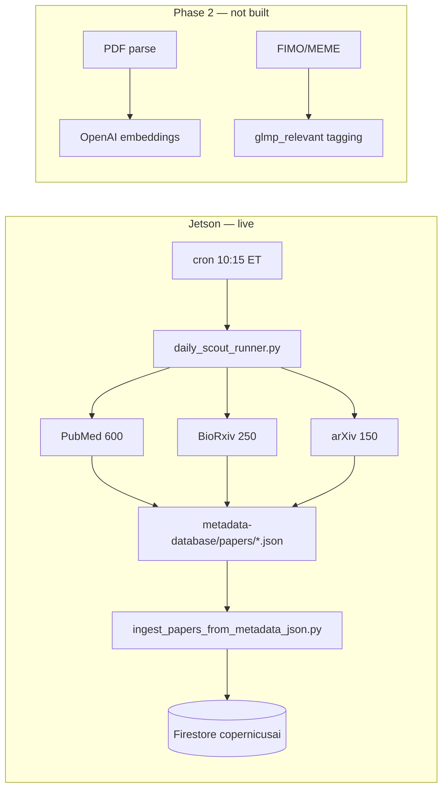

# CopernicusAI Jetson Ingest Worker — Setup Handoff

**Date:** 2026-06-16 (updated 2026-06-17)  
**Jetson:** `gary@192.168.1.222` (Seeed reComputer J1010, Ubuntu 18.04 LTS)  
**Yoga:** `C:\Users\garyw` (Windows 11 — Yoga 9i)  
**Prepared by:** Claude Code (SSH session)  
**For:** Cursor — Krampis collaboration / CopernicusAI metadata pipeline

**See also:** [`../YOGA_9I_HANDOFF_2026-06-17.md`](../YOGA_9I_HANDOFF_2026-06-17.md) (full three-machine handoff) · [`../three-machine-workflow-handoff.md`](../three-machine-workflow-handoff.md)

---

## Hardware recovery (June 15, prerequisite for worker setup)

Before ingest worker setup, the Jetson was recovered from an emergency boot loop:

- **Root cause:** full root disk (100%) + broken `/etc/fstab` SD card entry (`/dev/mmcblk1p1`) when card was unseated
- **Recovery:** removed broken fstab entry; freed disk (removed libreoffice, thunderbird, snapd, `.cursor-server`, caches); root now ~64% used (~4.8 GB free)
- **SD card:** physically reseated SanDisk Extreme 128GB; mounted at `/media/sdcard` (exFAT) with `nofail` in fstab
- **CUDA 10.2** (2.9 GB) and **TensorRT** (537 MB) moved to SD card with symlinks at `/usr/local/cuda-10.2` and `/usr/src/tensorrt`
- **`/etc/passwd` home dir corruption** fixed via SSH from Yoga 9i

---

## Executive summary

The Jetson is **operational as a daily CopernicusAI ingest worker**. Passwordless SSH from the Yoga works. GCP + OpenAI credentials are installed. `copernicus-web` is cloned, venvs are fixed, Firestore connectivity is verified, a 3-DOI smoke test passed, the full local corpus (~47K JSON files) was reconciled with Firestore, all three daily scout sources run successfully, and a **10:15 AM ET cron job** is installed.

**Not yet done (Phase 2):** local OpenAI embedding before Firestore push, PDF full-text extraction wired into acquisition, FIMO/MEME motif scanning, `glmp_relevant` auto-tagging at ingest time, full curated DOI ingest (192 GLMP priority DOIs).

---

## What was accomplished (2026-06-16)

### 1. Passwordless SSH from Yoga → Jetson

- Generated `~/.ssh/id_ed25519` on the Yoga
- Added public key to `~/.ssh/authorized_keys` on the Jetson
- All subsequent steps run non-interactively from the Yoga via Claude Code

### 2. GCP credentials

- Copied `adc.json` (service account: `copernicus-service@regal-scholar-453620-r7.iam.gserviceaccount.com`) to `~/.config/copernicus/gcp-sa.json` on the Jetson (`chmod 600`)
- Source on Yoga: `%APPDATA%\gcloud\legacy_credentials\copernicus-service@regal-scholar-453620-r7.iam.gserviceaccount.com\adc.json`

### 3. Environment file

- Fetched `OPENAI_API_KEY` from GCP Secret Manager (`openai-api-key`)
- Wrote `~/.config/copernicus/env` with:
  - `OPENAI_API_KEY`
  - `GOOGLE_CLOUD_PROJECT=regal-scholar-453620-r7`
  - `FIRESTORE_DATABASE=copernicusai`
- `chmod 600`

### 4. Python 3.8 + bootstrap

- Installed `python3.8`, `python3.8-venv`, `python3.8-dev` via deadsnakes PPA (Ubuntu 18.04 system Python is 3.6 — too old for current Google libraries)
- **SD card is exFAT — git cannot run there.** Worker files live on eMMC instead:
  - `COPERNICUS_SD_ROOT=/home/gary/copernicus-worker`
- Ran `bootstrap_ingest_worker.sh` (from this repo):
  - Cloned `copernicus-web` → `/home/gary/copernicus-worker/copernicus-web`
  - Created venv → `/home/gary/copernicus-worker/venv`
  - Installed: `biopython`, `google-cloud-firestore`, `google-auth`, `openai`, `requests`, `pdfplumber`, `PyPDF2`
- Legacy symlink: `/home/gdubs/copernicus-web-public` → repo (required by hardcoded paths in acquisition scripts)
- **Firestore connection verified:** `Firestore OK: regal-scholar-453620-r7`

### 5. Venv fixes for scout scripts

Two pre-existing but broken venvs in the repo needed fixing:

| Venv | Issue | Fix |
|------|-------|-----|
| `huggingface-space/paper_acquisition_venv` | Existed but had no pip (Python 3.12 venv, broken) | Deleted and recreated with Python 3.8; installed same package set plus `google-cloud-secret-manager` |
| `cloud-run-backend/venv` | Didn't exist; `ingest_metadata_to_firestore.sh` looks for it | Symlink: `cloud-run-backend/venv` → `/home/gary/copernicus-worker/venv` |

### 6. Smoke test

- Copied `curated-doi-ingest-priority.txt` from `glmp/collaborations/krampis-virtual-cell/`
- Acquired 3 priority DOIs via Crossref → saved to `metadata-database/papers/crossref/interdisciplinary/`
- **Passed**

### 7. Firestore push (full local corpus reconcile)

- Pushed all **47,331** local JSON papers to Firestore (`research_papers`, `copernicusai` DB)
- Result: **6 written** (net new), **47,325 skipped** (already existed), **0 failed**

### 8. Daily scout — all 3 sources working

| Source | Batch size | Status |
|--------|------------|--------|
| PubMed | 600 | OK |
| BioRxiv/MedRxiv | 250 | OK |
| arXiv | 150 | OK |

Post-scout ingest: **47,536** docs processed, **4 written**, **0 failed**

### 9. Cron job installed

```cron
CRON_TZ=America/New_York
10 10 * * *  remind_paper_scout_coffee.sh   → reminder_coffee.log
15 10 * * *  . ~/.config/copernicus/env && GOOGLE_APPLICATION_CREDENTIALS=~/.config/copernicus/gcp-sa.json run_daily_scout_with_ingest.sh >> cron.log
```

Fires daily at **10:15 AM ET**. Logs under `paper_acquisition_logs/daily_scout/`.

---

## Key paths on Jetson

| Item | Path |
|------|------|
| Repo | `/home/gary/copernicus-worker/copernicus-web` |
| Venv | `/home/gary/copernicus-worker/venv` |
| Legacy path | `/home/gdubs/copernicus-web-public` → repo |
| GCP key | `~/.config/copernicus/gcp-sa.json` |
| Env file | `~/.config/copernicus/env` |
| Cron log | `.../paper_acquisition_logs/daily_scout/cron.log` |
| Ingest log | `.../paper_acquisition_logs/daily_scout/ingest.log` |
| Paper JSON root | `.../huggingface-space/metadata-database/papers/` |
| SD card (exFAT) | `/media/sdcard` — CUDA 10.2, TensorRT, ~120 GB free; **not used for git/repo** |

---

## Architecture (current state)



**Ingest is metadata-only** — no embeddings generated on Jetson yet. New papers land in Firestore without `embedding` until a separate backfill runs (historically `backfill_embeddings.py` on Yoga; not in git).

---

## Known issues / operational notes

### exFAT SD card

Git cannot operate on exFAT. All worker files live on eMMC (~14 GB total, ~3 GB used after setup). If space becomes tight, create an **ext4 loop image** on the SD card (CUDA 10.2, TensorRT, and a `gary/` data dir already live on SD).

### Python 3.8 EOL

Google libraries emit deprecation warnings. Works today; upgrading to Python 3.10+ is worth doing before Google drops 3.8 support. Ubuntu 18.04 limits options (glibc 2.27 — Node 20+ and Cursor Remote-SSH also blocked).

### `paper_acquisition_venv` not in git

After any fresh clone or `git clean`, recreate:

```bash
python3.8 -m venv huggingface-space/paper_acquisition_venv
source huggingface-space/paper_acquisition_venv/bin/activate
pip install biopython google-cloud-firestore google-cloud-secret-manager \
  google-auth openai requests pdfplumber PyPDF2
```

### Bootstrap script default vs. actual

`bootstrap_ingest_worker.sh` defaults to `COPERNICUS_SD_ROOT=/media/sdcard/copernicus-worker`. On this hardware, override to eMMC:

```bash
COPERNICUS_SD_ROOT=/home/gary/copernicus-worker bash bootstrap_ingest_worker.sh
```

---

## GLMP / Krampis integration — next steps for Cursor

These tie the Jetson worker to Track #4 in `COPERNICUS_GLMP_INTEGRATION.md`:

| Priority | Task | Where |
|----------|------|-------|
| **P1** | Full curated DOI ingest (192 DOIs) | Jetson: `acquire_crossref_batch.py --doi-file ~/curated-doi-ingest-priority.txt` then `ingest_metadata_to_firestore.sh` |
| **P2** | Set `glmp_relevant: true` on ingest for curated DOIs + classifier rules | `copernicus-web`: extend `ingest_papers_from_metadata_json.py` or wrapper |
| **P3** | Local OpenAI embedding before Firestore push | Port/adapt `backfill_embeddings.py` from Yoga; use `text-embedding-3-small` (1536d) |
| **P4** | PDF full-text extraction in acquisition pipeline | Wire `pdfplumber` into Crossref/PubMed download path |
| **P5** | FIMO/MEME motif scan for `sequence_logic_content` | New Jetson step; see `sequence-annotation-schema.json` |
| **P6** | Firestore backfill for existing ~59K papers | Run classifier from `scripts/classify_glmp_relevant_preview.py` logic in production |

**GLMP repo assets ready to use:**

- `collaborations/krampis-virtual-cell/curated-doi-ingest-priority.txt` (192 DOIs)
- `collaborations/krampis-virtual-cell/flowchart-source-papers.tsv` (217 processes)
- `scripts/classify_glmp_relevant_preview.py` (dry-run classifier rules)

**GCP:** project `regal-scholar-453620-r7`, Firestore DB `copernicusai`, collection `research_papers`.

---

## Useful commands (SSH as gary@192.168.1.222)

```bash
# Activate worker environment
source /home/gary/copernicus-worker/venv/bin/activate
source ~/.config/copernicus/env
export GOOGLE_APPLICATION_CREDENTIALS=~/.config/copernicus/gcp-sa.json

# Manual daily scout + ingest
cd /home/gdubs/copernicus-web-public/huggingface-space
bash scripts/acquire_papers/run_daily_scout_with_ingest.sh

# Curated GLMP DOI ingest
cd huggingface-space/scripts/acquire_papers
python3 acquire_crossref_batch.py --doi-file ~/curated-doi-ingest-priority.txt
cd ../..
bash scripts/ingest_metadata_to_firestore.sh

# Check cron logs
tail -f paper_acquisition_logs/daily_scout/cron.log
tail -f paper_acquisition_logs/daily_scout/ingest.log
```

---

## Related files in this repo

| File | Purpose |
|------|---------|
| `jetson/bootstrap_ingest_worker.sh` | Initial Jetson setup script |
| `jetson/JETSON_SETUP_HANDOFF.md` | This document |
| `../COPERNICUS_GLMP_INTEGRATION.md` | GLMP ↔ CopernicusAI integration plan |
| `../curated-doi-ingest-priority.txt` | Priority DOI list for GLMP source papers |

---

*Gary Welz · GLMP · CopernicusAI ingest worker*
