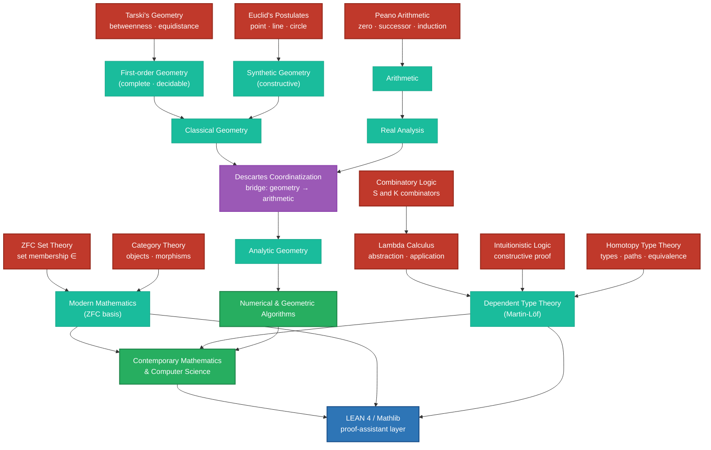
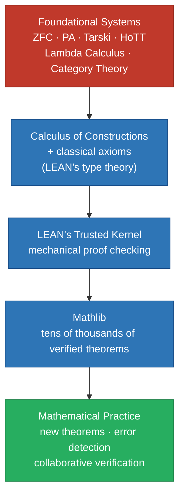
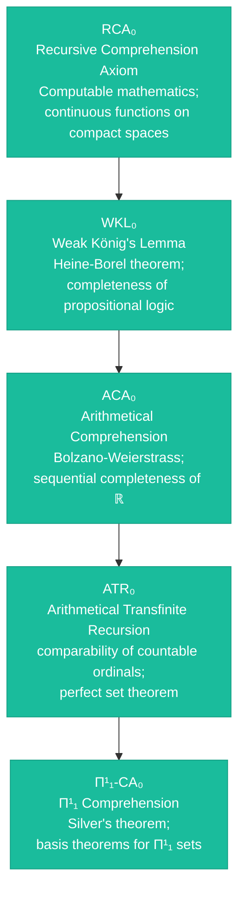
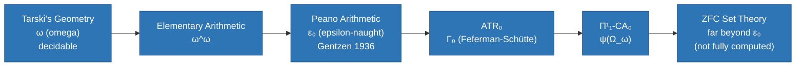
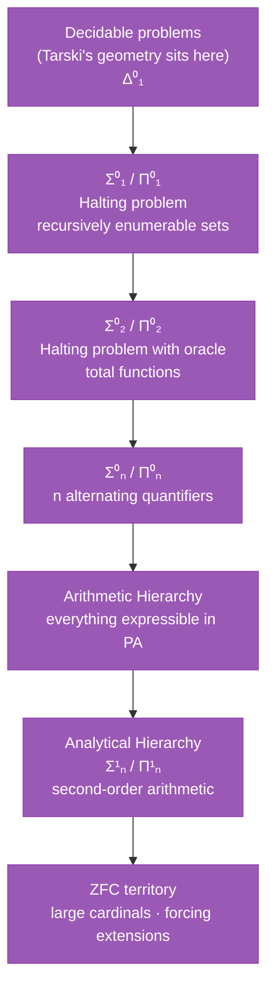
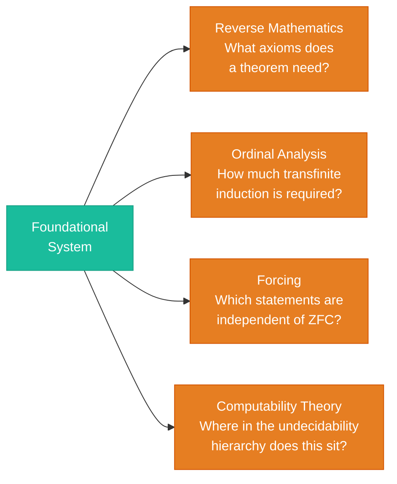
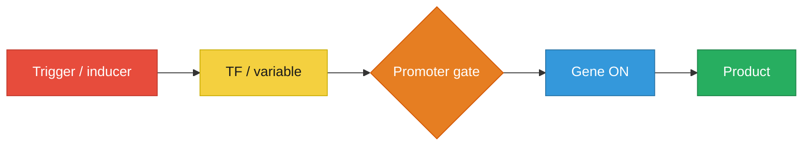
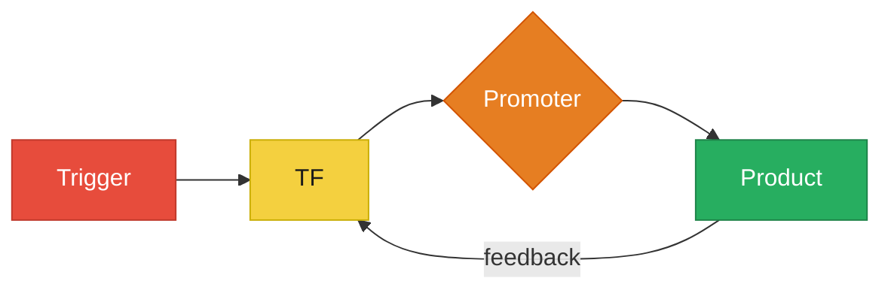
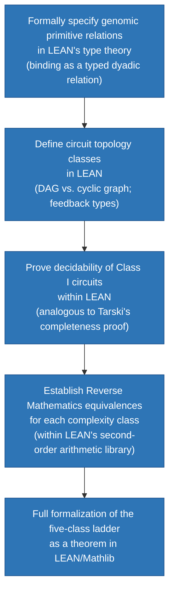

GLMP Working Paper — 2026

# Primitive Relations, Computational Complexity, and a Conjecture on the Genomic Computational Class

**Gary Welz**  
<gwelz@gc.cuny.edu>  
CUNY Graduate Center / New Media Lab  
Genome Logic Modeling Project (GLMP)

Abstract

The choice of primitive relations in an axiomatic system determines not merely what can be proven within it, but the logical character of the entire theory — its decidability, completeness, and computational complexity class. This paper examines three foundational axiomatic systems — Peano Arithmetic, Euclid’s Postulates, and Tarski’s geometry of betweenness and equidistance — as paradigm cases of how primitive relations shape computational power. We extend this analysis to a broader typology of foundational roots including Zermelo-Fraenkel Set Theory, Category Theory, Lambda Calculus, Intuitionistic Logic, Homotopy Type Theory, and LEAN 4, mapping their relationships as a directed acyclic graph (DAG). We further examine the **underlying logical substrate** assumed by each system — from the classical first-order predicate logic common to Peano, Tarski, and ZFC, to the constructive logic of Lambda Calculus and Homotopy Type Theory — arguing that this choice of underlying logic is itself a foundational decision with consequences for expressive power and decidability. We then survey the tools mathematicians have developed for measuring foundational strength: Reverse Mathematics, ordinal analysis, forcing, and computability theory, each of which provides a different metric on the foundational landscape.

In Part II we apply this framework to the genomic regulatory system as described in the Genome Logic Modeling Project (GLMP), a visualization project in its germinal stages that aspires to produce typed flowcharts of thousands of gene regulatory processes sourced from research literature and curated databases. We argue that the primitive relations of gene regulation — binding, activation, repression, cooperativity, and feedback — form a three-tier grounding hierarchy from molecular to network to logical levels. We conjecture that circuits without feedback occupy a decidable, Tarski-like logical floor, while circuits with feedback approach the expressive power associated with Peano Arithmetic, and propose three complementary empirical paths toward determining the actual computational class of genomic circuits. This conjecture is offered as a motivated hypothesis with a clearly articulated ladder of steps required for rigorous proof. LEAN 4 and its Mathlib library are identified as the long-term formal verification path by which the conjecture might one day become a theorem.

Scope and placement

**Sources of diagrammatic “data.”** The claims below about dependency structure and regulatory topology are backed, on the mathematics side, by the browsable <a href="https://storage.googleapis.com/regal-scholar-453620-r7-podcast-storage/mathematics-processes-database/mathematics-database-table.html?v=2" target="_blank" rel="noopener noreferrer">Algorithms and Axiomatic Theories database</a> (algorithms plus axiomatic theory charts). On the biology side, the companion index is the <a href="https://storage.googleapis.com/regal-scholar-453620-r7-podcast-storage/glmp-database-table.html" target="_blank" rel="noopener noreferrer">GLMP database table</a>. This working paper sits between them as a conceptual **bridge**: it does not merge GLMP into the mathematics taxonomy.

The genomic sections below are **interpretive**: mathematics may inform how we read regulatory logic, but we do not treat biology as a formal branch inside the mathematics catalog. **Biology may mirror mathematics in suggestive ways; mathematics does not thereby take on biological categories.** The association belongs in this document and in GLMP’s wider program, not in the formal organization of the mathematics database.

Part I The Mathematical Foundation

## 1. Introduction

One of the deepest insights in the foundations of mathematics is that the choice of primitives is not a notational convenience — it determines the computational and logical universe of discourse. Euclid chose points, lines, and circles as primitives and built classical plane geometry. Peano chose zero, the successor function, and induction and built arithmetic. Tarski chose betweenness and equidistance as primitives and built a geometry describing the same Euclidean plane as Euclid, yet with radically different logical properties: completeness and decidability where Euclid’s and Peano’s systems are not.

This observation motivates two parallel projects pursued in this paper. The first is a typology of axiomatic foundations — a DAG in which root nodes represent genuinely independent foundational systems, and edges represent dependency, translation, or subsumption relationships. The second is an application of this framework to biological computation: if the genome implements a computational system, what are its primitive relations, and what logical universe do they define?

Part I develops the mathematical foundation in full. It moves from the three paradigm cases through a broad typology of root systems, examines the underlying logic each system assumes, and surveys the mathematical tools — Reverse Mathematics, ordinal analysis, forcing, computability theory, and proof assistants — that give the foundational landscape its metric structure. Part II applies this foundation to the genomic regulatory system via the GLMP typed flowchart framework, stating the central conjecture and its epistemic status.

The conjecture advanced in Part II is offered as a motivated hypothesis, not a proven theorem. The ladder from molecular primitives to complexity class characterization has several rungs yet to be secured, which we identify explicitly. This is an invitation to formal investigation rather than a settled claim.

## 2. Three Paradigm Cases: Primitives and Their Logical Consequences

### 2.1 Peano Arithmetic: Induction as the Source of Power and Incompleteness

Peano Arithmetic (PA) is founded on five axioms with three primitive notions: zero (a distinguished constant), the successor function S (a unary operation), and mathematical induction (a schema allowing uniform reasoning about all natural numbers). From these, the full arithmetic of the natural numbers is derived. In practice, most **discrete numerical algorithms** — counting, iteration, indexing, modular arithmetic — presuppose the same number structure that PA codifies; machine implementations of algorithms therefore inherit PA’s logical strength, and indirectly its incompleteness horizon, even when programmers never write a formal axiom.

The logical character of PA is determined by the induction schema. It confers enormous expressive power — PA can simulate any Turing machine — but this same power renders the system necessarily incomplete by Gödel’s first incompleteness theorem: any consistent formal system strong enough to express PA contains true statements unprovable within it. PA is also undecidable; no algorithm can determine for an arbitrary PA statement whether it is provable. These are not defects of PA but consequences of its expressive strength. A system powerful enough to talk about all natural numbers is powerful enough to encode its own provability predicate, and Gödel showed this self-reference is the source of incompleteness.

**Primitives:** zero, successor, induction  •  **Logical character:** incomplete, undecidable  •  **Computational class:** Turing-complete

### 2.2 Euclid’s Postulates: Constructive Geometry and Its Gaps

Euclid’s Elements founds plane geometry on five postulates and five common notions. The primitives are constructive: drawing a straight line between two points, extending a line, drawing a circle with given center and radius, the equality of right angles, and the parallel postulate. They describe what can be done with compass and straightedge — a procedural rather than relational primitive basis.

Euclid’s system contains logical gaps made explicit only in the 19th century when Hilbert’s rigorous reformulation identified missing axioms about continuity of lines and circles. Hilbert required 20 axioms to fully capture the geometry Euclid had described with 10 postulates and common notions. Nevertheless, the dependency structure of the Elements is a clean DAG: each proposition cites its predecessors explicitly, postulates and common notions form root nodes, and no circularity exists. This makes Book I of the Elements an ideal pilot case for dependency DAG visualization — indeed, it is the historical origin of the axiomatic method itself.

Crucially, Euclid’s geometry does not contain induction and cannot express statements about all natural numbers. This limitation is also what prevents it from inheriting PA’s incompleteness. The system is bounded in expressive power in a way that PA is not — and this boundedness is a consequence of its primitive choices, not an accident.

**Primitives:** point, line, circle (constructive)  •  **Logical character:** incomplete (gaps), bounded  •  **Computational class:** compass-and-straightedge constructibility

### 2.3 Tarski’s Geometry: The Surprising Power of Betweenness

Alfred Tarski developed an axiom system for Euclidean geometry using only two primitive relations: *betweenness* (point b lies between points a and c) and *equidistance* (the distance from a to b equals the distance from c to d). From these purely relational primitives — no numbers, no set theory, no induction — Tarski derived all of elementary Euclidean geometry. The contrast with Euclid is instructive: Euclid’s primitives are operations (draw, extend, describe), while Tarski’s are relations (between, equidistant). The shift from operational to relational primitives has deep logical consequences.

The logical character of Tarski’s system is the key contrast case in this paper. Because betweenness and equidistance are purely geometric relations that cannot define the natural numbers, the system avoids the Gödel incompleteness theorems entirely. Tarski proved his geometry is both complete — every true statement in the language is provable — and decidable — an algorithm exists to determine whether any given statement is provable. This is a remarkable result: a rich mathematical theory that is nevertheless fully tractable. It stands as the clearest demonstration that the choice of primitives, not the subject matter, determines the logical character of a theory. Euclid and Tarski are describing the same geometric reality; their theories have different logical characters entirely because of their different primitive choices.

**Primitives:** betweenness, equidistance  •  **Logical character:** complete, decidable, first-order  •  **Computational class:** weaker than arithmetic; no induction possible

## 3. The Foundational Dependency DAG

Figure 1 and the tables in this section are not free-floating sketches: they summarize a body of **published dependency charts** indexed in the <a href="https://storage.googleapis.com/regal-scholar-453620-r7-podcast-storage/mathematics-processes-database/mathematics-database-table.html?v=2" target="_blank" rel="noopener noreferrer">Algorithms and Axiomatic Theories database</a> (ZFC, Peano, Euclid’s Elements, category theory, typed lambda calculus, etc.). Readers should treat that table as the primary mathematical evidence base for the foundational claims here; new charts continue to extend the same typology.

### 3.1 Root Nodes: Genuinely Independent Foundational Systems

A system qualifies as a root node in the foundational DAG if it cannot be derived from or reduced to another system without loss of generality or change of logical character. The following systems qualify. Note that LEAN 4 occupies a special position — it is not a foundational system in precisely the same sense as the others, but rather a proof-assistant layer that implements and verifies reasoning across them; it is included because it represents a genuinely new kind of foundational confidence, discussed in detail in Section 4.4.

| System                         | Primitives                                                       | Logical Character                                                                        | Key Figures                 |
|--------------------------------|------------------------------------------------------------------|------------------------------------------------------------------------------------------|-----------------------------|
| Peano Arithmetic (PA)          | zero, successor, induction                                       | Incomplete, undecidable, Turing-complete                                                 | Peano, Gödel                |
| Euclid’s Postulates            | point, line, circle (constructive)                               | Incomplete (gaps), bounded                                                               | Euclid, Hilbert             |
| Tarski’s Geometry              | betweenness, equidistance                                        | Complete, decidable, first-order                                                         | Tarski                      |
| ZFC Set Theory                 | set membership (∈)                                               | Incomplete, undecidable, subsumes PA                                                     | Zermelo, Fraenkel           |
| Category Theory                | objects, morphisms, composition                                  | Structurally foundational; set-independent                                               | Lawvere, Eilenberg          |
| Lambda Calculus                | abstraction, application, β-reduction                            | Turing-complete; foundation of computation                                               | Church                      |
| Intuitionistic Logic           | constructive proof; no excluded middle                           | Weaker than classical; different completeness                                            | Brouwer, Heyting            |
| Combinatory Logic              | S and K combinators                                              | Equivalent to lambda calculus; no variables                                              | Schönfinkel, Curry          |
| Homotopy Type Theory           | types, paths, homotopy equivalence                               | Emerging; unifies logic, topology, computation                                           | Voevodsky et al.            |
| LEAN 4 (proof-assistant layer) | Type, Term, inhabitation; dependent types; inductive definitions | Constructive core + classical axioms added; all proofs machine-checked by trusted kernel | de Moura, Mathlib community |

*Note on LEAN 4:* LEAN is not a foundational system in precisely the same sense as the others — it is a proof-assistant layer that implements dependent type theory with classical extensions and verifies reasoning mechanically via a trusted kernel. It is included here because it occupies a specific and novel position: the first practical system capable of mechanically verifying proofs across all the other systems in this table. See Section 4.4.

### 3.2 The Foundational Dependency DAG

The following diagram shows the primary dependency and convergence relationships among the foundational roots, tracing the path to numerical and geometric algorithms. Tarski and Euclid converge early at Classical Geometry before meeting Peano via Descartes’ coordinatization. ZFC subsumes the arithmetic tradition. Lambda Calculus and Intuitionistic Logic feed independently into Contemporary Computer Science via Dependent Type Theory. LEAN sits above the foundational systems as an implementation and verification layer.

Figure 1. Foundational dependency DAG. Red: root nodes (independent axiomatic systems). Teal: derived systems. Purple: bridge concept (Descartes’ coordinatization). Green: algorithmic and contemporary endpoints. Blue: LEAN 4 proof-assistant layer, sitting above the foundational systems as their implementation and verification environment.

### 3.3 Key Structural Observations

- **Tarski and Euclid as sibling roots:** Both describe Euclidean plane geometry but from different primitive bases. Their convergence at Classical Geometry precedes Descartes, distinguishing them from Peano and ZFC which meet the geometric tradition only via coordinatization.
- **Descartes as the critical bridge:** Coordinatization translates geometric primitives into arithmetic ones, making most modern computational geometry ultimately dependent on arithmetic foundations. This is why geometric algorithms run on machines implementing arithmetic rather than synthetic geometry.
- **ZFC as the dominant subsumer:** Modern mathematics is predominantly founded on ZFC, which can express PA, classical geometry, and much of category theory. Its power comes at the same cost as PA: incompleteness and undecidability.
- **Tarski as the logical floor:** Of all root nodes, Tarski’s geometry is the most restricted and most well-behaved: complete, decidable, expressively limited. It is the appropriate baseline for asking what computational class a given system occupies.
- **Lambda Calculus and PA are computationally equivalent:** Church’s thesis establishes that lambda calculus and Turing machines (which PA can simulate) compute the same functions. The computational root of programming languages and the arithmetic root of mathematics converge at Turing-completeness.
- **Dependent Type Theory as a convergence point:** Lambda Calculus, Intuitionistic Logic, and Homotopy Type Theory all flow into Dependent Type Theory (Martin-Löf), which is the shared ancestor of LEAN, Coq, and Agda. This convergence reflects the Curry-Howard correspondence: proofs and programs are the same thing when viewed through the right lens.
- **LEAN above the foundational systems:** LEAN 4 is not a peer of the root nodes but sits above them as their implementation environment. It can encode ZFC-style reasoning, constructive reasoning, and category-theoretic reasoning within a single framework, checking all of them against its trusted kernel. This is represented in the DAG by LEAN receiving edges from both MM (Modern Mathematics, the ZFC tradition) and DTT (Dependent Type Theory, the constructive tradition).

## 4. The Logical Substrates

Every axiomatic system rests on a layer of inference rules that are usually left implicit — the logical machinery that permits deriving conclusions from axioms. This layer is as foundational as the axioms themselves, yet it went largely unstated in mathematics until Russell and Whitehead undertook the monumental project of making it fully explicit in *Principia Mathematica* (1910–1913). Their work formalized both propositional logic — the logic of “and,” “or,” “not,” and “if-then” applied to whole statements — and predicate logic — extending this to statements involving variables, quantifiers, and relations — demonstrating that all of classical mathematics could in principle be derived from explicit logical rules plus a small set of axioms. The ambition of *Principia* was not merely to prove mathematical theorems but to show that the rules of inference themselves could be written down, inspected, and verified — a program that directly inspired Gödel’s incompleteness theorems, which showed that no such formal system could be both complete and consistent if strong enough to express arithmetic.

### 4.1 The Classical Substrate: First-Order Predicate Logic

The three paradigm cases of this paper — Peano Arithmetic, Tarski’s Geometry, and ZFC Set Theory — all assume classical first-order predicate logic (FOL) as their underlying inference system. FOL provides the quantifiers “for all” (∀) and “there exists” (∃), the classical law of excluded middle (every proposition is either true or false, with no third option), and the rule of modus ponens. It is important to recognize that Tarski’s geometry is decidable *precisely because* it is formulated in first-order logic — had it been formulated in second-order logic, where quantification over sets of points is permitted, decidability would be lost. The choice of underlying logic is not a neutral technical matter; it determines the expressive power and logical character of the entire system built on top of it.

Euclid’s Elements assumes classical logic informally — the inference rules are used throughout but never stated, which is precisely what Hilbert’s rigorous reformulation had to supply. The gap between Euclid and Hilbert is not in the geometry but in the logic: Euclid was doing FOL without knowing it, and Hilbert made the substrate explicit. Hilbert and Ackermann’s *Grundzüge der theoretischen Logik* (1928) was the first systematic textbook of first-order predicate logic, providing the explicit substrate that all three paradigm cases were implicitly using.

### 4.2 The Constructive Alternative: Intuitionistic and Type-Theoretic Logic

The most consequential divide in the logical substrate table is between systems assuming classical logic and those assuming constructive or intuitionistic logic. Classical logic permits the law of excluded middle: for any proposition P, either P is true or its negation is true. This allows non-constructive existence proofs — one can prove that something exists without exhibiting it. Intuitionistic logic, developed by L.E.J. Brouwer in his 1907 doctoral dissertation and formalized by Arend Heyting, rejects excluded middle: to prove existence you must produce a witness. Every proof is a construction.

Lambda Calculus sits on the constructive side of this divide not by design but by consequence — Church’s original calculus has no excluded middle because it has no logic; it is pure computation. The connection to logic emerges through the Curry-Howard correspondence: a proof in an intuitionistic system is literally a program that computes the thing being proved. A type is a proposition; a term inhabiting that type is a proof of that proposition; running a program is performing an inference. This correspondence, worked out by Haskell Curry and William Howard, means that the boundary between logic and computation dissolves in constructive systems. It is one of the most profound unifications in 20th century mathematics and directly underlies the design of all modern proof assistants.

### 4.3 Homotopy Type Theory: Where Logic, Computation, and Topology Converge

Homotopy Type Theory (HoTT) deserves special attention as the most recently developed entry in the foundational typology and the one that most radically departs from the classical picture. Developed by Vladimir Voevodsky and collaborators at the Institute for Advanced Study in the 2000s and formally presented in the 2013 collective volume *Homotopy Type Theory: Univalent Foundations of Mathematics,* HoTT replaces sets as the primitive notion with **types**, and replaces logical equality with **homotopy equivalence** — the notion from topology that two spaces are equivalent if one can be continuously deformed into the other. In HoTT, a proposition is a type, a proof of that proposition is an element of that type, and two proofs are considered identical if there is a path — in the topological sense — between them. This unification means that HoTT is simultaneously a foundation for mathematics, a type system for programming languages, and a framework for reasoning about topological spaces — the three domains do not merely connect, they are aspects of a single underlying structure.

The underlying logic of HoTT is Martin-Löf dependent type theory, which is constructive: the law of excluded middle does not hold by default, and existence requires construction. What makes HoTT novel even within the constructive tradition is the **Univalence Axiom**, which states that equivalent types are identical — a powerful principle that has no analog in classical or even standard intuitionistic logic. HoTT is the only foundational system in which topology is not a superstructure built on top of logic and set theory, but is woven into the logic itself at the primitive level.

### 4.4 LEAN 4 and the Proof-Assistant Layer: A New Kind of Foundational Confidence

The most significant recent development in mathematical foundations is not a new axiomatic system but a new *mode of confidence* about axiomatic systems. Interactive theorem provers — software environments in which mathematical proofs are written in a formal language and mechanically checked for correctness — have matured to the point where working mathematicians use them to verify original research. The leading system is **LEAN 4**, developed by Leonardo de Moura (originally at Microsoft Research, now at AWS), whose associated library **Mathlib** now contains tens of thousands of formalized theorems spanning undergraduate algebra, analysis, number theory, algebraic geometry, and category theory.

LEAN’s logical foundation is the **Calculus of Constructions with universes** — a dependent type theory in the tradition of Martin-Löf, the same ancestor as HoTT. Unlike HoTT, LEAN does not adopt the Univalence Axiom. Instead, LEAN deliberately adds the **law of excluded middle** and the **axiom of choice** as explicit axioms on top of its constructive core, making it fully compatible with classical mathematics while retaining the proof-checking power of type theory. This gives LEAN a unique position: constructive foundations augmented with classical axioms, occupying a principled middle ground between the purely constructive tradition and the classical tradition.

LEAN’s primitive notions are **Type** (every object has a type; types themselves have types organized in a universe hierarchy), **Term** (an object belonging to a type), and the **inhabitation relation** (a term inhabits a type — the fundamental judgment of the system). Where ZFC asks “does element x belong to set S?” via the ∈ relation, LEAN asks “does term t have type T?” via the inhabitation relation. The logical layer is built directly into the type system through the special universe **Prop** — the type of propositions — so that a proof of a proposition P is literally a term of type P.

What makes LEAN novel in the foundational landscape is its **trusted kernel** — a small, auditable piece of code at LEAN’s core that checks every proof term for correctness. All of Mathlib’s theorems ultimately reduce to kernel-checkable proof objects. This represents the fulfillment in practical form of the program Russell and Whitehead began in *Principia Mathematica*: a mathematics whose inferential substrate is fully explicit, inspectable, and mechanically checked.

Recent high-profile results have brought LEAN to the attention of the broader mathematical community. The **Liquid Tensor Experiment** (2022) saw Peter Scholze’s condensed mathematics formalized in LEAN — Scholze himself reported that the process revealed subtle gaps in his original arguments invisible to expert human readers. The **Polynomial Freiman-Ruzsa conjecture** proof (Gowers, Green, Manners, Tao, 2023) was formalized in LEAN within weeks of the paper’s appearance. Terence Tao has become a prominent advocate, arguing that proof assistants will change mathematical practice by making large collaborative proofs verifiable and by catching errors that evade human review.

The other major proof assistants — **Coq** (which uses a similar Calculus of Constructions and was the dominant system before Mathlib shifted momentum to LEAN), **Isabelle/HOL** (which uses classical higher-order logic rather than dependent type theory and is widely used in computer science verification), and **Agda** (which is closer to HoTT in spirit and does not add classical axioms) — occupy related but distinct positions in this landscape. Their existence confirms that the proof-assistant layer is not a single system but an emerging ecosystem.

The relationship between LEAN and the foundational systems of this paper is represented in the following diagram:

Figure 2. LEAN 4 as a proof-assistant layer above the foundational systems. The foundational systems are encoded in LEAN’s type theory, checked by the trusted kernel, organized in Mathlib, and used to verify new mathematical results.

### 4.5 The Underlying Logic Table

| System                  | Underlying Logic                                                                 | Key Consequence                                                                                                 |
|-------------------------|----------------------------------------------------------------------------------|-----------------------------------------------------------------------------------------------------------------|
| Euclid’s *Elements*     | Classical logic (informal, unstated)                                             | Hilbert had to supply missing inference rules explicitly                                                        |
| Peano Arithmetic        | Classical first-order predicate logic                                            | Gödel incompleteness applies; induction schema requires FOL                                                     |
| Tarski’s Geometry       | Classical first-order predicate logic                                            | Decidability depends critically on FOL; second-order version is not decidable                                   |
| ZFC Set Theory          | Classical first-order predicate logic                                            | Axiom of Choice and Continuum Hypothesis are independent of ZFC                                                 |
| *Principia Mathematica* | Ramified type theory with explicit propositional and predicate logic             | First explicit full formalization of classical logic; inspired Gödel                                            |
| Lambda Calculus         | No external logic assumed — corresponds to intuitionistic logic via Curry-Howard | Computation and proof are the same thing; no excluded middle needed                                             |
| Intuitionistic Logic    | Constructive logic; law of excluded middle rejected                              | Existence requires exhibition of a witness; non-constructive proofs disallowed                                  |
| Category Theory         | Classical or intuitionistic depending on the topos                               | Logic is internal to the category; different categories instantiate different logics                            |
| Homotopy Type Theory    | Martin-Löf dependent type theory (constructive/intuitionistic)                   | Propositions are types; proofs are programs; topology, logic, and computation unified                           |
| Combinatory Logic       | No external logic; equivalent to lambda calculus                                 | Variables eliminated entirely; pure combinatorial computation                                                   |
| LEAN 4                  | Calculus of Constructions + excluded middle + axiom of choice                    | Constructive foundation made classical by explicit axiom addition; all proofs machine-checked by trusted kernel |

For the genomic conjecture of this paper, the choice of underlying logic has a concrete implication. If we formalize the primitive relations of genomic regulation — binding, activation, repression, cooperativity — within classical first-order logic, we obtain a framework analogous to Tarski’s geometry: one where decidability is at least conceivable for feed-forward circuits. If instead we were to formalize genomic regulation constructively, existence of a regulatory output would require exhibiting the molecular pathway that produces it, which is arguably the more biologically honest requirement. This is a question for future formal work, but it underscores that the choice of underlying logic is not merely a mathematical technicality — it reflects a stance on what it means for a biological claim to be proven.

## 5. Measuring Foundational Strength

The root nodes table and the underlying logic table characterize the foundational systems qualitatively. But mathematics has developed precise quantitative tools for measuring foundational strength — for asking not just “is this system stronger than that one?” but “exactly how much stronger, and by what metric?” Four of these tools are directly relevant to the paper’s argument: Reverse Mathematics, ordinal analysis, forcing, and computability theory. Together they give the foundational DAG its metric structure.

### 5.1 Reverse Mathematics: What Axioms Does a Theorem Actually Need?

Reverse Mathematics, initiated by Harvey Friedman in the 1970s and developed extensively by Stephen Simpson, inverts the usual direction of mathematical proof. Rather than asking “what theorems follow from these axioms?” it asks: “given this theorem, what are the minimal axioms required to prove it?” The central discovery of Reverse Mathematics is that the vast majority of theorems in classical analysis, algebra, and combinatorics are equivalent — over a weak base theory — to one of exactly five subsystems of second-order arithmetic, known as the **Big Five**.

These five systems, in increasing order of strength, are:

Figure 3. The Big Five subsystems of Reverse Mathematics, in increasing order of strength. Most theorems of classical mathematics are provably equivalent to exactly one of these five levels.

The philosophical significance of Reverse Mathematics for this paper is direct: it is the mathematical method for asking precisely what primitives are needed to prove a given result. When we conjecture in Part II that feed-forward genomic circuits occupy a Tarski-like decidable floor, we are making a Reverse Mathematics claim in biological clothing — we are asking what minimal logical resources are needed to describe and verify the behavior of circuits of a given topological class. The weakest system, RCA₀, corresponds roughly to computable mathematics — the level at which Tarski’s geometry operates. The stronger systems correspond to increasing uses of non-constructive reasoning, ultimately approaching the power of full PA. The five-class genomic complexity ladder of Part II is designed to parallel this hierarchy, with Class I circuits corresponding to RCA₀-level reasoning and Class V circuits potentially requiring the full strength of PA or beyond.

### 5.2 Ordinal Analysis: Measuring Proof-Theoretic Strength

While Gödel’s incompleteness theorems showed that no sufficiently powerful consistent system can prove its own consistency, Gerhard Gentzen showed in 1936 that PA’s consistency *can* be proven — using a form of reasoning PA itself cannot formalize. Specifically, Gentzen proved the consistency of PA using transfinite induction up to the ordinal **ε₀** (epsilon-naught), the smallest ordinal satisfying ω^ε₀ = ε₀. This result inaugurated proof theory as a discipline and introduced **ordinal analysis** as a tool for measuring the strength of formal systems.

The **proof-theoretic ordinal** of a system is the supremum of the ordinals whose well-foundedness can be proven within the system. It provides a precise numerical measure of foundational strength:

Figure 4. The ordinal hierarchy of foundational systems. Each system’s proof-theoretic ordinal measures exactly how much transfinite induction it can formalize. Tarski’s geometry sits at the bottom; ZFC extends far beyond what has been fully computed.

Ordinal analysis gives the foundational DAG its edge weights. Rather than saying merely that PA is stronger than Tarski’s geometry, we can say it is stronger by exactly the gap between ω and ε₀ — a precise and non-trivial measure. For the genomic conjecture, ordinal analysis suggests a further refinement of the five-class complexity ladder: each class might be associated not just with a named foundational system but with a specific proof-theoretic ordinal, giving the conjecture a quantitative rather than merely qualitative character.

### 5.3 Forcing and Independence: The Set-Theoretic Multiverse

Paul Cohen’s invention of **forcing** in 1963 — for which he received the Fields Medal — is the most powerful technique in set theory and one of the most consequential results in 20th century mathematics. Cohen proved that the **Continuum Hypothesis** (CH) — the proposition that there is no cardinality between the natural numbers and the real numbers — is independent of ZFC. Combined with Gödel’s earlier result (1938) that CH is consistent with ZFC, this established that CH is neither provable nor disprovable from the standard axioms of mathematics. Mathematics has multiple consistent universes, differing in which cardinalities exist.

Forcing works by constructing a new model of set theory — a **generic extension** of an existing model — in which a desired statement holds or fails. The technique has been used to prove the independence of hundreds of statements from ZFC, including questions about cardinal arithmetic, the structure of the real line, and the existence of certain large cardinals. It reveals that ZFC, despite being the dominant foundational system, leaves an enormous landscape of mathematical questions permanently open — not because we lack cleverness, but because the questions are genuinely independent of the axioms.

For this paper’s typology, forcing has two implications. First, it confirms that ZFC’s incompleteness is not a marginal phenomenon — it pervades the most natural questions of set theory. Second, it reveals that the foundational DAG is not a tree leading to a single mathematical universe but a branching structure: different consistent extensions of ZFC lead to different mathematical realities. The foundational landscape is a multiverse, not a single edifice.

### 5.4 Computability Theory: The Arithmetic Hierarchy and Rice’s Theorem

Computability theory, founded independently by Alan Turing, Alonzo Church, Emil Post, and Stephen Kleene in 1936, provides the deepest framework for understanding what can and cannot be computed. Its central results — the undecidability of the halting problem, Rice’s theorem, and the arithmetic hierarchy — are the computational analogs of Gödel’s incompleteness theorems and are directly relevant to the genomic conjecture.

The **halting problem** (Turing, 1936) establishes that there is no algorithm that can determine, for an arbitrary program and input, whether the program will eventually halt. **Rice’s theorem** (1953) generalizes this dramatically: any non-trivial semantic property of programs — not just halting, but any property that depends on what a program computes rather than how it is written — is undecidable. Rice’s theorem is the reason that perfect static analysis of programs is impossible in principle, not merely in practice.

The **arithmetic hierarchy** stratifies the degrees of undecidability into levels Σ⁰ₙ and Π⁰ₙ, indexed by the number of alternating quantifier blocks required to express a property:

Figure 5. The computability hierarchy, from decidable problems at the base through the arithmetic and analytical hierarchies to ZFC territory. The genomic complexity ladder of Part II is designed to map onto this hierarchy.

For the genomic conjecture, computability theory provides the most direct formal framework. A gene regulatory circuit implements a computational process; asking what computational class that process belongs to is precisely a question in computability theory. If feed-forward circuits are decidable — their output always determinable from their input — then they sit at the Δ⁰₁ level. If feedback circuits can implement arbitrary recursively enumerable processes, they sit at the Σ⁰₁ level. Rice’s theorem has a specific biological implication: if genomic circuits of sufficient complexity are Turing-complete, then no algorithm can determine for an arbitrary circuit whether it will produce a given gene expression pattern. Perfect prediction of cellular behavior from circuit topology would be impossible in principle — not merely computationally expensive. This is not a discouraging result; it is a precise characterization of why biology is difficult, and it suggests that the right question is not “can we predict everything?” but “which circuit classes are predictable, and which cross the undecidability threshold?”

### 5.5 A Unified Metric on the Foundational Landscape

The four tools of this section are not competing frameworks but complementary instruments, each measuring a different dimension of foundational strength:

Figure 6. Four complementary instruments for measuring foundational strength. Each gives a different metric on the same foundational landscape.

Together they allow the foundational DAG to be read not just as a dependency structure but as a metric space: the distance between Tarski’s geometry and Peano Arithmetic is measurable in proof-theoretic ordinals (ω vs. ε₀), in Reverse Mathematics levels (below RCA₀ vs. equivalent to ACA₀ for many theorems), and in computability terms (decidable vs. Σ⁰₁-hard). This metric structure is what makes the genomic conjecture of Part II more than an analogy — it gives the claim that “feed-forward circuits are Tarski-like” a precise formal content that could in principle be verified or refuted.

Part II The Biological Application

The mathematical foundation of Part I is not merely background for what follows — it is the toolkit. The genomic conjecture of Part II is stated in the language of foundational systems, measured by the instruments of Section 5, and points toward LEAN 4 as its long-term verification path. Readers primarily interested in the biological application may read Part II independently, returning to Part I as specific claims require grounding.

## 6. The Primitive Relations of Genomic Regulation

The regulatory diagrams discussed here correspond to concrete flowcharts indexed in the <a href="https://storage.googleapis.com/regal-scholar-453620-r7-podcast-storage/glmp-database-table.html" target="_blank" rel="noopener noreferrer">GLMP database table</a>. GLMP is a visualization and graphing project in its germinal stages, currently comprising 108 flowcharts of gene regulatory processes in *E. coli* and related systems. It aspires to grow into a resource covering thousands of genes and processes, sourced from research literature, textbooks, and curated databases. The 108-graph sample already demonstrates that regulatory circuits exhibit a range of structural complexity — some are purely feed-forward cascades, others contain feedback loops of varying character. Expanding this sample and validating its charts against biological evidence is a central part of GLMP’s call to action. Figures in this section follow the same color semantics as charts in the GLMP database and the <a href="https://huggingface.co/spaces/garywelz/programming_framework" target="_blank" rel="noopener noreferrer">Programming Framework</a> Hugging Face Space.

### 6.1 Background: GLMP and the Typed Flowchart Model

The Genome Logic Modeling Project (GLMP) originated in a 1995 article, “Is the Genome Like a Computer Program?,” published in the *X Advisor*, which proposed modeling gene regulation as computational logic and presented one of the first computational flowcharts of the lac operon. That piece is archived in the <a href="https://web.archive.org/web/19970310064130/http://landru.unx.com/DD/advisor/docs/jul95/welz.genome0.shtml" target="_blank" rel="noopener noreferrer">Wayback Machine</a> (Internet Archive snapshot, March 1997). GLMP is the systematic descendant of that work, generating typed Mermaid flowcharts of gene regulatory circuits via an LLM-from-text pipeline, with a color-coding scheme distinguishing molecular primitives by computational role:

| Color  | Molecular Role                 | Computational Analog      |
|--------|--------------------------------|---------------------------|
| Red    | Trigger / inducer              | Input signal              |
| Yellow | Protein / transcription factor | Variable / data structure |
| Teal   | Enzyme / catalytic agent       | Operator / function       |
| Blue   | Intermediate compound          | Intermediate value        |
| Green  | Product / output               | Output / result           |
| Orange | Decision / regulatory gate     | Conditional / branch      |

An important caveat applies to all GLMP charts: no chart in the current sample — or in any foreseeable expansion — can be designated the definitive canonical flowchart of a given gene or process. Biochemical research continually reveals greater molecular detail than any graph can currently represent. A flowchart of the lac operon today captures the known regulatory logic as of current literature; a future chart will incorporate newly discovered interactions, alternative regulatory states, and context-dependent behaviors invisible at the current resolution. GLMP charts are therefore best understood as snapshots of current knowledge structured for computational analysis — not permanent authoritative representations.

### 6.2 Idealized Subgraphs: Feed-Forward vs. Feedback

The conjecture in Section 7 turns on whether the regulatory graph contains a **directed cycle**. The lac operon is too large to show here; instead, Figures 7a and 7b are **minimal schematic** Mermaid flowcharts in the GLMP palette. They are not quantitative models of kinetics — only topological cartoons for the distinction between an acyclic cascade and a single feedback arc.

Figure 7a. Pure feed-forward chain: no path returns to an upstream node; behavior is conjecturally “Tarski-like” — decidable, bounded, no internal memory from topology alone. Corresponds to Class I in the complexity ladder and the Δ⁰₁ level of the computability hierarchy.

Figure 7b. A single feedback edge closes a directed cycle. The biological interpretation — activation vs. repression, delays, cooperativity — matters for dynamics, but topologically this is the class of circuits conjectured to reach richer computational behavior. Corresponds to Class II–V in the complexity ladder depending on feedback type, and Σ⁰₁ or above in the computability hierarchy.

### 6.3 The Three-Tier Hierarchy of Genomic Primitives

The molecular, network, and logical levels of biological description are not competing accounts of the same phenomena — they form a grounding hierarchy directly analogous to how mathematics builds from geometric intuition to formal axioms. Each level grounds the one above it:

| Level     | Description                                                                                 | Mathematical Analog                                    |
|-----------|---------------------------------------------------------------------------------------------|--------------------------------------------------------|
| Molecular | Physical binding events, allosteric changes, catalytic reactions between specific molecules | Geometric intuition (pre-formal)                       |
| Network   | Nodes (genes/proteins), directed edges (activation/repression), circuit topology            | Formal primitive relations (betweenness, equidistance) |
| Logical   | Boolean gates derived from binding cooperativity and network topology                       | Axioms derived from primitives                         |

The molecular level grounds the network level: an edge in the regulatory network represents a physical binding event. The network level grounds the logical level: an AND gate emerges from cooperative binding at a promoter requiring two transcription factors simultaneously. This three-tier grounding is what makes the genomic system potentially formalizable rather than merely analogical — each level of description is derived from the one below it by a principled abstraction step.

### 6.4 What Counts as a Primitive Relation

Drawing on Tarski’s criterion — that a primitive relation is one that cannot be further decomposed within the system without leaving the relevant level of description — we identify the following candidates at each tier:

| Molecular Primitive                          | Relation Type              | Logical Analog         | Tier            |
|----------------------------------------------|----------------------------|------------------------|-----------------|
| Binding (TF binds promoter Y)                | Binary occupancy (on/off)  | Boolean variable       | Molecular       |
| Activation (binding increases transcription) | Causal enhancement         | Positive literal       | Network         |
| Repression (binding decreases transcription) | Causal inhibition          | Logical negation       | Network         |
| Cooperativity (X and Y must both bind)       | Joint requirement          | Logical AND            | Network/Logical |
| Competition (X or Y alone suffices)          | Alternative sufficiency    | Logical OR             | Network/Logical |
| Cascade (sequential activation)              | Ordered composition        | Function composition   | Network         |
| Feedback (output feeds back to input)        | Self-reference / recursion | Recursive call         | Network/Logical |
| Bistability (stable state memory)            | Hysteresis                 | Register / memory cell | Logical         |

The key insight is that *binding is the true primitive* — everything else (activation, repression, cooperativity, competition) is derived from binding in a specific molecular context. This is the genomic analog of Tarski’s betweenness: a single dyadic relation from which the full logical architecture of gene regulation emerges. Just as betweenness suffices to define all of Euclidean geometry without appealing to numbers or sets, binding suffices to ground all of genomic logic without appealing directly to the higher-level Boolean concepts.

In the language of Reverse Mathematics, binding is the RCA₀-level primitive — the minimum needed to ground the system. The higher-level relations (cooperativity, feedback, bistability) correspond to ascending levels of the Big Five, each requiring stronger axioms to characterize fully.

### 6.5 How We Might Determine Actual Genomic Primitives Empirically

Identifying the primitive relations of the genomic system theoretically is a first step; determining which relations actually operate in specific biological circuits, and what computational class those circuits occupy, requires empirical investigation. Three complementary approaches, each contributing differently, are available to GLMP:

- **From synthetic biology circuits (ground truth validation):** Synthetic biologists have constructed circuits of known topology — toggle switches, repressilators, feed-forward loops — and characterized their computational behavior experimentally. These serve as ground truth: if our typed flowchart of a toggle switch correctly predicts bistability, we have evidence that the flowchart faithfully captures the relevant primitives. This is the immediate validation path, pursued through collaboration with computational biologists familiar with characterized circuit behavior.
- **From regulatory network databases (scale and coverage):** Databases such as RegulonDB (E. coli transcription factor binding), ENCODE (human regulatory element mapping), and STRING (protein interaction networks) catalog known binding relationships at scale. Mining these for circuit topology statistics — the distribution of AND gates, OR gates, and feedback loops across the genome — would allow empirical characterization of the genome’s actual complexity class distribution. This is the path from curated biological knowledge to a population-level estimate of genomic computational class.
- **From LLM-generated flowchart topology classification (literature coverage):** The GLMP pipeline generates typed flowcharts from scientific text. As the current 108-graph sample grows, systematically classifying circuit topologies — counting feed-forward versus feedback circuits, identifying AND/OR gate ratios, flagging bistable and oscillatory patterns — will provide an empirical profile of the regulatory complexity represented in the sample. This approach can be extended as GLMP expands its coverage of the literature, with the long-term aspiration of characterizing complexity class distribution across a broad range of organisms and regulatory systems. The CopernicusAI Knowledge Engine, a separate but related project, maintains a growing knowledge graph of scientific literature that may eventually provide the paper sourcing infrastructure for such an expansion.

These three approaches are genuinely complementary: synthetic biology provides ground truth for specific circuits, database mining provides biological scale, and LLM-generated flowcharts provide literature-wide coverage. Together they constitute a research program for empirically determining the computational class of genomic regulation — moving the conjecture below from motivated hypothesis toward testable scientific claim.

## 7. The Genomic Conjecture and Complexity Class Ladder

### 7.1 The Central Conjecture

Conjecture

Gene regulatory circuits without feedback loops implement a computational logic analogous to Tarski’s geometry: decidable, bounded, and expressively limited. Given fixed inputs, the output of such a circuit is always determinable, and the system cannot generate sustained oscillation, memory, or undecidable behavior. In the language of computability theory, feed-forward circuits are Δ⁰₁ — their output function is computable and total. In the language of Reverse Mathematics, their behavior can be characterized within RCA₀ — the weakest of the Big Five subsystems. Their proof-theoretic ordinal is bounded, analogous to Tarski’s geometry sitting at ω in the ordinal hierarchy.

Circuits with feedback loops cross into a richer computational class: they acquire the capacity for bistability, oscillation, and potentially undecidable long-term behavior, by analogy with the inductive power of Peano Arithmetic. The molecular primitive of binding — like betweenness and equidistance — grounds the full logical architecture of genomic regulation, and the presence or absence of feedback determines which tier of the computational hierarchy the resulting circuit occupies. In the extreme case of self-modifying epigenetic circuits, the computational class may require the full strength of PA or beyond — proof-theoretic ordinals approaching ε₀, Reverse Mathematics levels reaching ACA₀ or ATR₀, and computability properties at the Σ⁰₁ level or above.

This conjecture is grounded in GLMP’s current 108-graph sample, which demonstrates that both feed-forward and feedback circuit topologies occur in biological regulatory networks and that the structural distinction is meaningful and classifiable. The conjecture is not a claim about the full scope of genomic regulation — which remains far beyond the current sample — but a motivated hypothesis about the relationship between circuit topology and computational class that the sample makes plausible and future expansion may test.

### 7.2 The Five-Class Complexity Ladder

We propose the following ladder of computational classes for genomic circuits, calibrated against the mathematical instruments of Section 5:

- I— **Feed-forward only (no loops):** Analogous to Tarski’s geometry. Decidable, complete within scope, bounded expressive power. Computability level: Δ⁰₁. Reverse Mathematics level: below RCA₀. Proof-theoretic ordinal: ω. Biological example: simple inducible promoters.
- II— **Negative feedback (damped regulation):** Analogous to bounded arithmetic. Capable of graded responses and homeostasis, but not sustained oscillation. Computability level: Δ⁰₁ with bounded recursion. Reverse Mathematics level: RCA₀. Biological example: homeostatic gene regulation.
- III— **Positive feedback (bistable switches):** Analogous to finite automata with memory. Capable of representing stable cell fate decisions and epigenetic locking. Computability level: Δ⁰₂ (limit computable). Reverse Mathematics level: WKL₀. Biological example: toggle switch circuits (Gardner et al. 2000).
- IV— **Mixed feedback (oscillators):** Analogous to pushdown automata or primitive recursive arithmetic. Capable of representing circadian rhythms and developmental clocks. Computability level: primitive recursive. Reverse Mathematics level: ACA₀. Proof-theoretic ordinal: approaching ε₀. Biological example: repressilator circuits (Elowitz & Leibler 2000).
- V— **Self-modifying / epigenetic feedback:** Potentially analogous to Peano Arithmetic. Turing-complete behavior not excludable. Computability level: Σ⁰₁ or above. Reverse Mathematics level: ATR₀ or Π¹₁-CA₀. Proof-theoretic ordinal: ε₀ or beyond. Rice’s theorem applies: if Class V circuits are Turing-complete, no algorithm can determine for an arbitrary circuit whether it produces a given expression pattern. Biological example: epigenetic reprogramming circuits.

### 7.3 Connection to Reverse Mathematics

The five-class ladder is a Reverse Mathematics conjecture in biological form. The central question — what minimal logical resources are needed to characterize the behavior of a circuit of class C? — is precisely the question Reverse Mathematics was designed to answer. For each class, a rigorous proof would need to establish:

1.  That circuits of that topological class can be formalized in the corresponding subsystem of second-order arithmetic
2.  That circuits of the next class cannot be so formalized — that the step up in class corresponds to a genuine increase in logical strength
3.  That the biological examples cited are correctly classified

None of these proofs exist yet. They represent the formal mathematical work required to move the conjecture from motivated hypothesis to established theorem.

### 7.4 LEAN as the Long-Term Verification Path

The proof assistants of Section 4.4 — especially LEAN 4 and Mathlib — represent the most promising long-term path toward formalizing the genomic conjecture. The path would proceed in stages:

Figure 8. The LEAN formalization path for the genomic conjecture. Each step builds on the previous, moving from informal specification to machine-verified theorem.

### 7.5 Epistemic Status: The Ladder of Claims

This conjecture is offered as a motivated hypothesis. The following steps are required to make it rigorous:

| Rung                              | Claim                                                           | Status                                                      |
|-----------------------------------|-----------------------------------------------------------------|-------------------------------------------------------------|
| 1 | Regulatory circuits can be represented as typed flowcharts      | Demonstrated — core GLMP contribution; 108-graph sample     |
| 2 | Flowcharts faithfully capture known circuit logic               | Partially validated — needs biological review and expansion |
| 3 | Circuit topology determines computational class                 | Conjectured — requires formal proof                         |
| 4 | Molecular primitives map rigorously to logical primitives       | Conjectured — requires formal specification                 |
| 5 | Complexity classes correspond to Big Five subsystems            | Speculative — requires Reverse Mathematics proof            |
| 6 | Genomic circuits can be assigned to specific complexity classes | Speculative — long-term research goal                       |
| 7 | The conjecture can be formalized and verified in LEAN           | Very long-term — requires full formal pipeline              |

GLMP’s contribution at this stage is most defensibly positioned as establishing Rung 1 rigorously across its current 108-graph sample and articulating the ladder from Rungs 2 through 7 as a research program. The sample is sufficient to demonstrate that the structural distinctions the conjecture depends on — feed-forward versus feedback, AND/OR gate presence, bistable versus oscillatory topology — are real, classifiable, and meaningful. A paper making this contribution honestly — demonstrating the typed flowchart pipeline, stating the conjecture with its calibrated complexity ladder, connecting it to Reverse Mathematics and computability theory, and identifying the rungs — is a legitimate contribution to computational biology and the foundations of biological information processing.

## 8. Implications and Future Directions

### 8.1 For the Mathematics Processes Database and Programming Framework

The foundational DAG of Section 3 provides the backbone for positioning processes in the <a href="https://storage.googleapis.com/regal-scholar-453620-r7-podcast-storage/mathematics-processes-database/mathematics-database-table.html?v=2" target="_blank" rel="noopener noreferrer">Algorithms and Axiomatic Theories database</a> and extending the <a href="https://huggingface.co/spaces/garywelz/programming_framework" target="_blank" rel="noopener noreferrer">Programming Framework</a> on Hugging Face. Each algorithm in the framework can be positioned within the DAG: numerical algorithms trace foundational dependencies to PA and ZFC via real analysis; geometric algorithms trace to Euclid and Tarski via Descartes’ coordinatization; sorting and search algorithms trace to lambda calculus and PA. The dependency structure among algorithms is itself a DAG — distinct from the execution flowchart of any individual algorithm — and both representations are natural outputs of the LLM-from-text pipeline already validated for GLMP. The ordinal analysis of Section 5.2 suggests a further enrichment: algorithm dependency DAGs could be annotated with proof-theoretic ordinals, giving the database a metric structure rather than merely a topological one.

### 8.2 For Biological Validation

Rung 2 — biological validation of GLMP flowcharts — is the immediate priority. The toggle switch (Gardner et al. 2000) and repressilator (Elowitz & Leibler 2000) are the canonical test cases — circuits of known topology whose computational behavior has been experimentally characterized and which the ladder places at Classes III and IV respectively. A formal comparison between GLMP flowcharts of these circuits and their known computational properties would constitute the first empirical test of the conjecture. Expanding the 108-graph sample to cover a broader range of organisms, regulatory contexts, and circuit topologies is the longer-term validation path. Given the open-ended nature of biochemical knowledge, validation is an ongoing process rather than a terminal state — each new chart represents current knowledge, subject to revision as research reveals greater molecular detail.

### 8.3 For the Foundations of Biological Information

The deepest implication is that the question “is the genome like a computer program?” has a more precise form: “which computational complexity class does genomic regulation occupy, given its molecular primitives, and which level of the Big Five hierarchy is required to characterize it?” This reframing connects GLMP to foundational questions in theoretical computer science, mathematical logic, and proof theory. If Rice’s theorem applies to Class V genomic circuits — if complete prediction of cellular behavior from circuit topology is provably impossible — that is a fundamental result about the nature of biological complexity, not merely a practical limitation.

### 8.4 For Proof Formalization

The LEAN formalization path of Section 7.4 is a very long-term direction, but naming it is important for two reasons. First, it gives the conjecture a clear falsifiability criterion: if the conjecture is correct, LEAN should eventually be able to verify it; if not, the attempt at formalization will reveal precisely where the analogy breaks down. Second, it connects GLMP to the broader program of formal verification in biology — a field beginning to emerge as proof assistants become accessible to non-specialists. The Mathlib community’s ongoing formalization of analysis, topology, and combinatorics is building the mathematical infrastructure that a future formalization of the genomic conjecture would require.

## 9. Conclusion

We have argued, in two parts, that the choice of primitive relations determines the logical character of a formal system — and that this principle applies not only to axiomatic mathematics but to the computational logic of biological regulation.

In Part I we developed this argument through three paradigm cases: Peano Arithmetic, whose induction schema confers Turing-complete expressive power at the cost of incompleteness; Euclid’s geometry, whose constructive primitives yield a bounded and gap-ridden system; and Tarski’s geometry, whose relational primitives of betweenness and equidistance yield a complete, decidable theory despite describing the same geometric reality as Euclid. We extended the analysis to a full typology of foundational root systems, examined the logical substrate each assumes — from classical first-order logic through constructive and type-theoretic logics to LEAN’s Calculus of Constructions — and surveyed the four instruments mathematicians use to measure foundational strength: Reverse Mathematics (the Big Five), ordinal analysis (proof-theoretic ordinals from ω to ε₀ and beyond), forcing (the set-theoretic multiverse and independence results), and computability theory (the arithmetic hierarchy and Rice’s theorem). Together these instruments give the foundational landscape its metric structure and give the paper’s central claim its formal content.

In Part II we applied this framework to the genomic regulatory system via the GLMP typed flowchart model, a visualization project in germinal stages whose current 108-graph sample demonstrates that regulatory circuits span a range of computational complexity. We argued that binding is the true molecular primitive — the genomic analog of Tarski’s betweenness — from which the full logical architecture of gene regulation is derived. We stated the central conjecture: that feed-forward genomic circuits occupy a Tarski-like, Δ⁰₁, RCA₀-level logical floor, while feedback-bearing circuits ascend the computability and Reverse Mathematics hierarchies, potentially reaching the full expressive power and undecidability of Peano Arithmetic in the case of self-modifying epigenetic circuits. We calibrated this conjecture against the Big Five and the proof-theoretic ordinal scale, giving it a quantitative rather than merely qualitative character, and identified LEAN 4 and Mathlib as the long-term formal verification path.

No chart in the GLMP sample — or in any foreseeable expansion — can be designated the definitive canonical flowchart of a given gene or process. Biochemical research continually reveals greater molecular detail than any graph can currently represent. This is not a limitation of the project but a reflection of the nature of biological knowledge: open-ended, cumulative, and always subject to revision at greater resolution. The conjecture is calibrated accordingly — it is a claim about structural patterns observable in the current sample and plausible across a broader range of regulatory systems, not a claim about the complete and final computational character of any specific biological circuit.

The conjecture is offered as a motivated hypothesis with a seven-rung ladder of steps required for rigorous proof. It is the kind of conjecture that, if correct, places biological computation at a precise location in the landscape of mathematical logic; and if incorrect, sharpens our understanding of where the analogy between molecular primitives and logical primitives breaks down.

Either outcome advances the field.

------------------------------------------------------------------------

## Key References

1.  Euclid. *Elements, Book I.* (c. 300 BCE). Heath translation, Cambridge University Press, 1908. <a href="https://mathcs.clarku.edu/~djoyce/java/elements/bookI/bookI.html" target="_blank" rel="noopener noreferrer">Online text (Joyce, Clark University)</a>.
2.  Peano, G. *Arithmetices Principia, Nova Methodo Exposita.* 1889. <a href="https://archive.org/details/arithmeticesprin00peangoog" target="_blank" rel="noopener noreferrer">Internet Archive</a>.
3.  Tarski, A. What is Elementary Geometry? In *The Axiomatic Method,* North-Holland, 1959. <a href="https://en.wikipedia.org/wiki/Tarski%27s_axiomatization_of_Euclidean_geometry" target="_blank" rel="noopener noreferrer">Overview (Wikipedia)</a>.
4.  Gödel, K. On Formally Undecidable Propositions of Principia Mathematica and Related Systems. 1931. <a href="https://plato.stanford.edu/entries/goedel-incompleteness/" target="_blank" rel="noopener noreferrer">Stanford Encyclopedia overview</a>.
5.  Hilbert, D. *Foundations of Geometry (Grundlagen der Geometrie).* Teubner, 1899. <a href="https://archive.org/details/grundlagendergeo00hilbrich" target="_blank" rel="noopener noreferrer">Internet Archive (1902 Eng. ed.)</a>.
6.  Church, A. An Unsolvable Problem of Elementary Number Theory. *American Journal of Mathematics,* 1936. <a href="https://en.wikipedia.org/wiki/Church%E2%80%93Turing_thesis" target="_blank" rel="noopener noreferrer">Context (Wikipedia)</a>; original via <a href="https://doi.org/10.2307/2371045" target="_blank" rel="noopener noreferrer">JSTOR DOI</a>.
7.  Kauffman, S. *The Origins of Order.* Oxford University Press, 1993. <a href="https://global.oup.com/academic/product/the-origins-of-order-9780195070659" target="_blank" rel="noopener noreferrer">Publisher page</a>.
8.  Welz, G. “Is the Genome Like a Computer Program?” *X Advisor*, 1995. <a href="https://web.archive.org/web/19970310064130/http://landru.unx.com/DD/advisor/docs/jul95/welz.genome0.shtml" target="_blank" rel="noopener noreferrer">Wayback Machine</a> (Internet Archive).
9.  Voevodsky, V. et al. *Homotopy Type Theory: Univalent Foundations of Mathematics.* Institute for Advanced Study, 2013. <a href="https://homotopytypetheory.org/book/" target="_blank" rel="noopener noreferrer">Free online book</a>.
10. Lawvere, F.W. Functorial Semantics of Algebraic Theories. Columbia University, 1963. <a href="http://www.tac.mta.ca/tac/reprints/articles/5/tr5abs.html" target="_blank" rel="noopener noreferrer">Theory and Applications of Categories (reprint)</a>.
11. Shen-Orr, S. et al. Network motifs in the transcriptional regulation network of Escherichia coli. *Nature Genetics,* 2002. <a href="https://doi.org/10.1038/ng881" target="_blank" rel="noopener noreferrer">DOI</a>.
12. Elowitz, M. & Leibler, S. A synthetic oscillatory network of transcriptional regulators. *Nature,* 2000. <a href="https://doi.org/10.1038/35002125" target="_blank" rel="noopener noreferrer">DOI</a>.
13. Gardner, T. et al. Construction of a genetic toggle switch in Escherichia coli. *Nature,* 2000. <a href="https://doi.org/10.1038/35002131" target="_blank" rel="noopener noreferrer">DOI</a>.
14. Russell, B. & Whitehead, A.N. *Principia Mathematica.* 3 vols. Cambridge University Press, 1910–1913. <a href="https://plato.stanford.edu/entries/principia-mathematica/" target="_blank" rel="noopener noreferrer">Overview (Stanford Encyclopedia of Philosophy)</a>.
15. Martin-Löf, P. Intuitionistic Type Theory. Notes by Giovanni Sambin, Bibliopolis, Naples, 1984. <a href="https://archive-pml.github.io/martin-lof/pdfs/Bibliopolis-Book-retypeset-1984.pdf" target="_blank" rel="noopener noreferrer">PDF (online)</a>.
16. Howard, W.A. The formulae-as-types notion of construction. In *To H.B. Curry: Essays on Combinatory Logic, Lambda Calculus and Formalism,* Academic Press, 1980. <a href="https://en.wikipedia.org/wiki/Curry%E2%80%93Howard_correspondence" target="_blank" rel="noopener noreferrer">Overview (Wikipedia)</a>.
17. Brouwer, L.E.J. On the foundations of mathematics. Doctoral dissertation, University of Amsterdam, 1907. <a href="https://plato.stanford.edu/entries/intuitionism/" target="_blank" rel="noopener noreferrer">Overview (Stanford Encyclopedia)</a>.
18. Church, A. A formulation of the simple theory of types. *Journal of Symbolic Logic,* 5(2), 1940. <a href="https://doi.org/10.2307/2266170" target="_blank" rel="noopener noreferrer">JSTOR</a>.
19. Hilbert, D. & Ackermann, W. *Grundzüge der theoretischen Logik* (Principles of Mathematical Logic). Springer, 1928. <a href="https://plato.stanford.edu/entries/hilbert-program/" target="_blank" rel="noopener noreferrer">Context (Stanford Encyclopedia: Hilbert’s Program)</a>.
20. Curry, H.B. & Feys, R. *Combinatory Logic, Vol. I.* North-Holland, 1958. <a href="https://plato.stanford.edu/entries/combinatory-logic/" target="_blank" rel="noopener noreferrer">Overview (Stanford Encyclopedia)</a>.
21. de Moura, L. & Ullrich, S. The Lean 4 Theorem Prover and Programming Language. In *CADE-28: Automated Deduction,* Springer, 2021. <a href="https://leanprover.github.io/" target="_blank" rel="noopener noreferrer">Lean Prover</a>.
22. The Mathlib Community. Mathlib: A unified library of mathematics for Lean. <a href="https://github.com/leanprover-community/mathlib4" target="_blank" rel="noopener noreferrer">mathlib4 on GitHub</a>; documentation at <a href="https://leanprover-community.github.io/" target="_blank" rel="noopener noreferrer">leanprover-community.github.io</a>.
23. Scholze, P. Half a year of the Liquid Tensor Experiment. *Xena Project blog,* 2021. <a href="https://xenaproject.wordpress.com/2021/06/05/half-a-year-of-the-liquid-tensor-experiment/" target="_blank" rel="noopener noreferrer">Blog post</a>.
24. Simpson, S.G. *Subsystems of Second Order Arithmetic.* 2nd ed. Cambridge University Press, 2009. <a href="https://plato.stanford.edu/entries/reverse-mathematics/" target="_blank" rel="noopener noreferrer">Overview (Stanford Encyclopedia)</a>.
25. Friedman, H. Some systems of second order arithmetic and their use. In *Proceedings of the International Congress of Mathematicians,* Vancouver, 1974. The founding paper of Reverse Mathematics.
26. Gentzen, G. The consistency of elementary number theory. 1936. Translated in *The Collected Papers of Gerhard Gentzen,* North-Holland, 1969. <a href="https://en.wikipedia.org/wiki/Gentzen%27s_consistency_proof" target="_blank" rel="noopener noreferrer">Overview (Wikipedia)</a>.
27. Cohen, P.J. The independence of the Continuum Hypothesis. *Proceedings of the National Academy of Sciences,* 1963. <a href="https://doi.org/10.1073/pnas.50.6.1143" target="_blank" rel="noopener noreferrer">DOI</a>.
28. Gödel, K. The consistency of the axiom of choice and of the generalized continuum-hypothesis with the axioms of set theory. *Proceedings of the National Academy of Sciences,* 1938. <a href="https://en.wikipedia.org/wiki/Constructible_universe" target="_blank" rel="noopener noreferrer">Overview (Wikipedia)</a>.
29. Turing, A.M. On Computable Numbers, with an Application to the Entscheidungsproblem. *Proceedings of the London Mathematical Society,* 1936. <a href="https://en.wikipedia.org/wiki/Turing%27s_proof" target="_blank" rel="noopener noreferrer">Overview (Wikipedia)</a>.
30. Rice, H.G. Classes of Recursively Enumerable Sets and Their Decision Problems. *Transactions of the American Mathematical Society,* 74(2), 1953. <a href="https://doi.org/10.2307/1990888" target="_blank" rel="noopener noreferrer">JSTOR</a>.
31. Rogers, H. *Theory of Recursive Functions and Effective Computability.* MIT Press, 1967.
32. **Algorithms and Axiomatic Theories database** (Mathematics Processes Database). Public index of mathematical process diagrams: algorithms as flowcharts, axiomatic theories as dependency graphs. <a href="https://storage.googleapis.com/regal-scholar-453620-r7-podcast-storage/mathematics-processes-database/mathematics-database-table.html?v=2" target="_blank" rel="noopener noreferrer">mathematics-database-table.html?v=2</a>. Primary diagrammatic source for the mathematical half of this paper’s claims.
33. **GLMP Database Table.** Public summary index of GLMP regulatory-process flowcharts (108 *E. coli* and related circuits). <a href="https://storage.googleapis.com/regal-scholar-453620-r7-podcast-storage/glmp-database-table.html" target="_blank" rel="noopener noreferrer">glmp-database-table.html</a>. Companion to the mathematics database for the biological half of this paper. Interactive charts: <a href="https://huggingface.co/spaces/garywelz/programming_framework" target="_blank" rel="noopener noreferrer">Programming Framework</a> (Hugging Face).

Genome Logic Modeling Project — Gary Welz — CUNY Graduate Center / New Media Lab — Working Paper 2026
