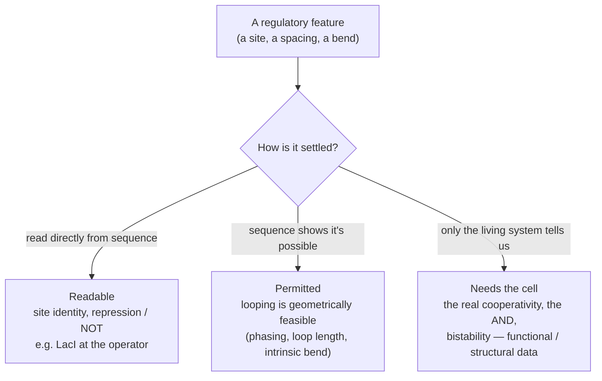
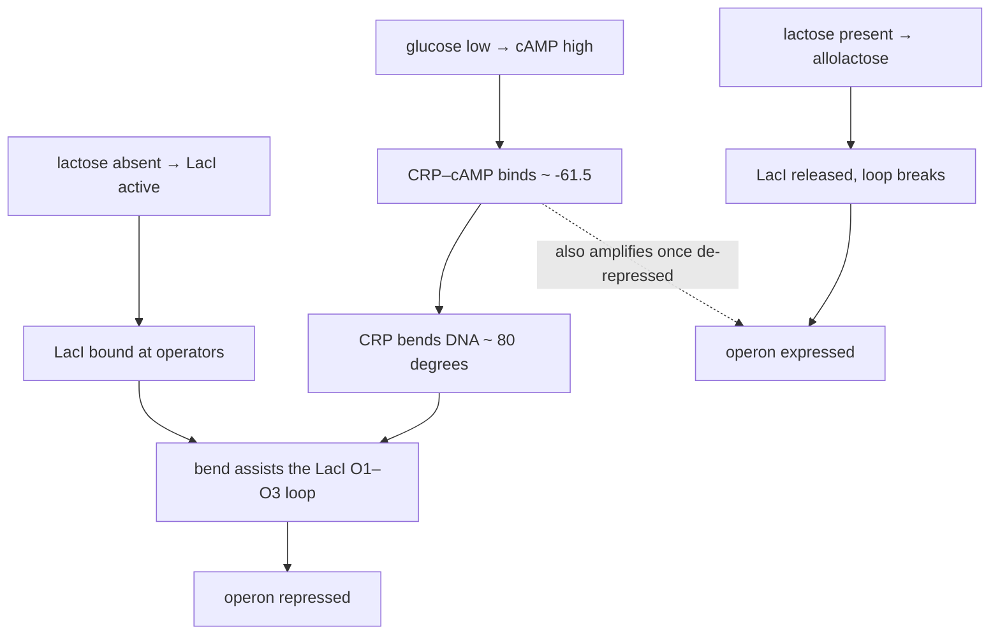

# Shared diagrams — GLMP / lac–ara collaboration

Two working pictures. The first is the method we're both using; the second is my current model of the mechanism, which I'd like you to red-pen.

## 1. The tiering method (our shared tool for ara)

For each regulatory feature, we sort it into one of three buckets by what kind of evidence settles it.

The whole ara task is: run each feature of the AraC switch through this, and tell me which bucket it lands in — and where you'd disagree with the boundaries.

## 2. My current model of the lac mechanism (please correct)

This is how I, as a non-biologist, have assembled the causal picture from the papers you pointed me to. I expect it's too clean in places — where is it wrong or oversimplified?

The part I'm least sure I've captured right is CRP's dual role — activator *and* enhancer of the repression loop — and how that reads under natural lactose versus IPTG.

---

*Note on sharing: these render as diagrams in GitHub and in the collaboration repo; if sending by email, export as images rather than pasting the code.*
