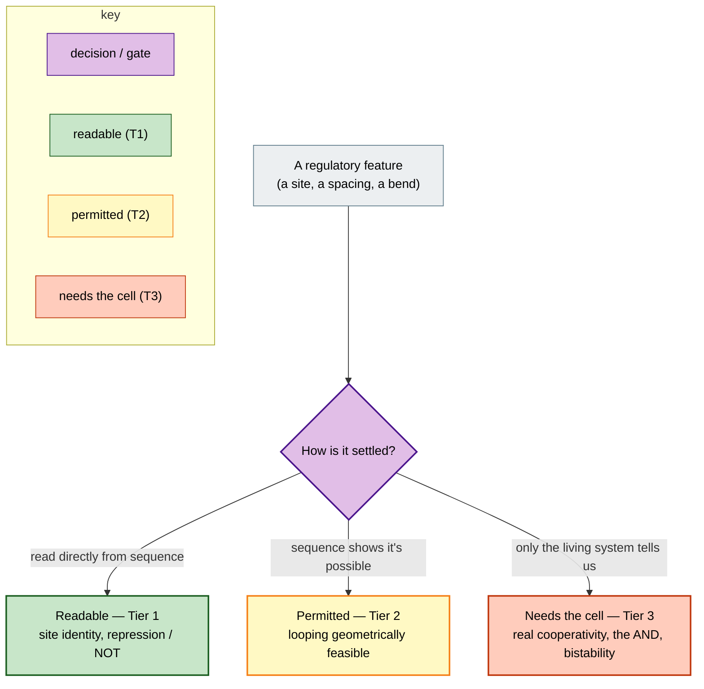
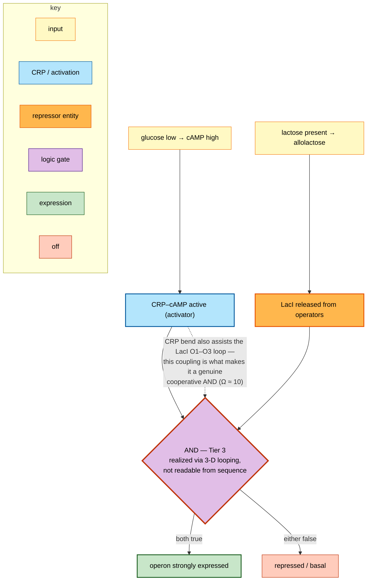
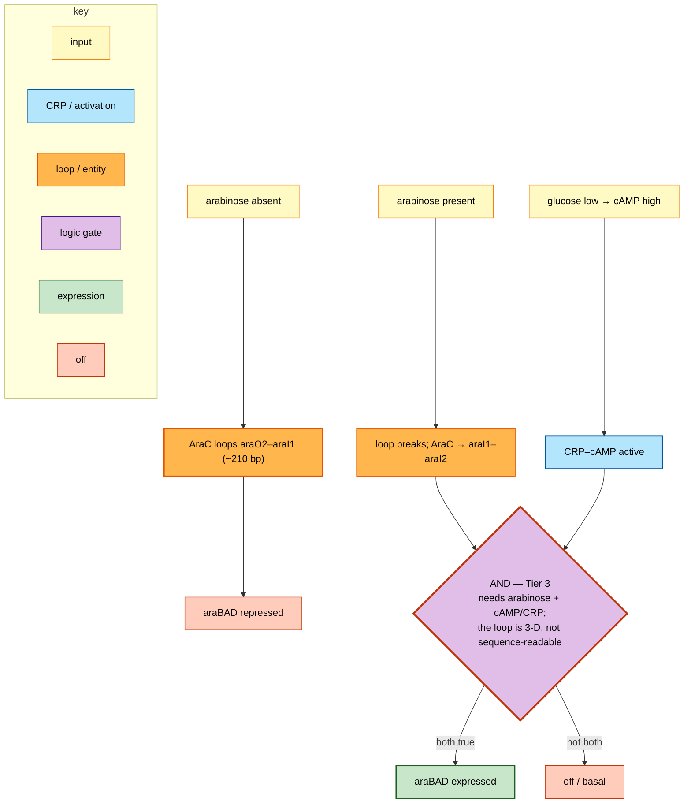
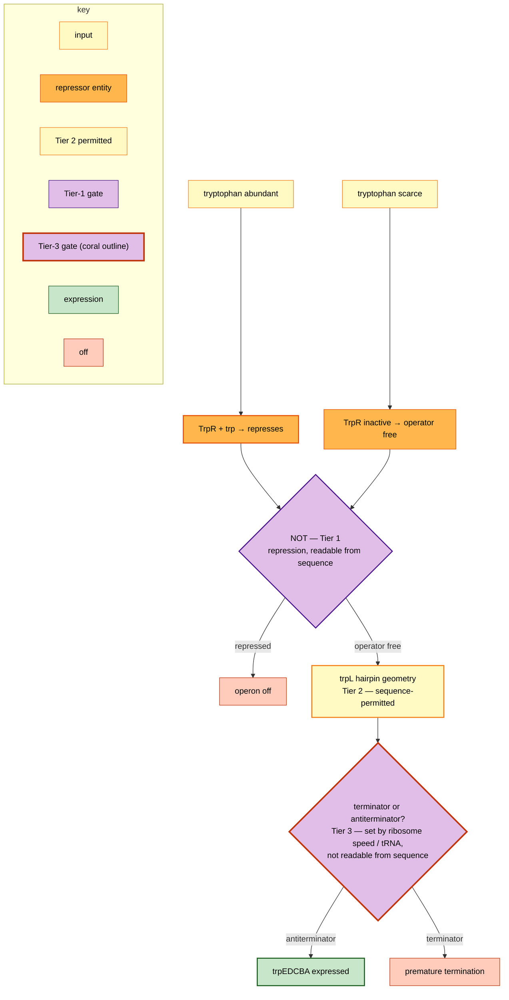

# Shared diagrams — GLMP / lac–ara–trp (for Prof. Lents)

Two layers, on purpose.

- **Layer 1 — simplified teaching views** (below): my distilled models, built to make *one* idea unmissable — where sequence-readable logic ends. These are my simplifications; treat them as "my model, please correct."
- **Layer 2 — canonical database entries**: the full, cited flowcharts (50–70 nodes each) with a built-in "Improve this process" form. These are the authoritative record.

Neither replaces the other: the teaching views give the idea in a glance; the canonical entries give the whole truth.

## Color legend

| Color | Meaning |
|---|---|
| 🟪 Purple diamond | logic gate / decision (AND, NOT). **A coral outline marks a Tier-3 gate** — real logic, not readable from sequence. |
| 🟩 Green | expression output — and **readable from sequence** (Tier 1) |
| 🟨 Yellow | input signal — and **permitted / geometrically possible** (Tier 2) |
| 🟥 Coral | repression / off — and **requires the living cell** (Tier 3) |
| 🟦 Blue | CRP / CAP activation |
| 🟧 Orange | gene → protein / regulator entity |

---

# Layer 1 — Simplified teaching views (my models — please correct)

## The tiering method (our shared tool)

## lac — Tier-3 AND via DNA looping

## ara — Tier-3 AND via the AraC loop switch

## trp — Tier-3 crossing via attenuation (a *different* mechanism)

trp's repression is a clean Tier-1 NOT. But its second layer, attenuation, crosses the same boundary a different way: the trpL hairpin *geometry* is sequence-permitted (Tier 2), while *which* hairpin forms — terminator vs antiterminator — is set by ribosome speed and tRNA charging (Tier 3). Two unrelated mechanisms, one boundary.

---

# Layer 2 — Canonical database entries (full models + feedback form)

Each is the complete, cited model with an "Improve this process" form. In each, the Tier-3 point currently lives in the *text* (the derived-logic line and the sequence-annotation table) — the *diagram* still shows a plain AND/decision node. Making that node **visually** Tier-3 (a distinct color or shape, as in the teaching views above) is a proposed edit I'd value your call on; the form (tap the node, add a note or PMID) is the channel for it.

- **lac** — https://storage.googleapis.com/regal-scholar-453620-r7-podcast-storage/glmp-v2/viewer/index.html?process=ecoli_lac_operon
- **ara** — https://storage.googleapis.com/regal-scholar-453620-r7-podcast-storage/glmp-v2/viewer/index.html?process=ecoli_ara_operon
- **trp** — https://storage.googleapis.com/regal-scholar-453620-r7-podcast-storage/glmp-v2/viewer/index.html?process=ecoli_trp_operon

*(trp link is `ecoli_trp_operon`, the regulatory operon with attenuation — not `ecoli_tryptophan_biosynthesis`, which is the metabolic pathway.)*

---

*Sharing note: the Mermaid teaching views render as diagrams in GitHub and the repo; if sending by email, export them as images. The canonical links open the live interactive viewer.*
