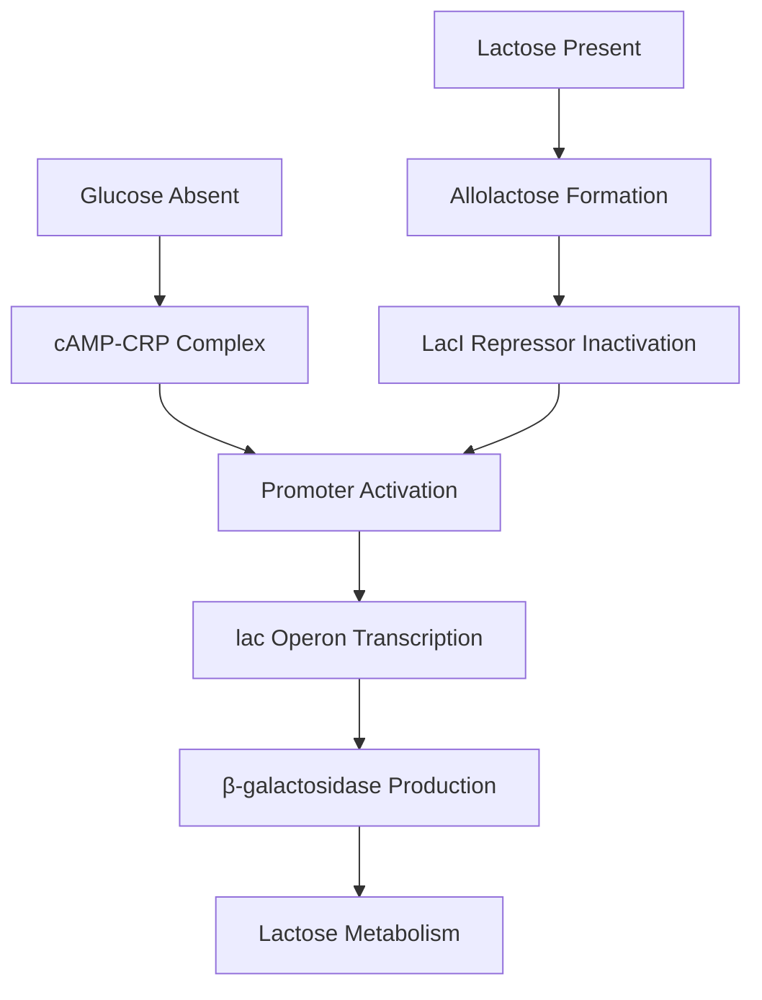

# From Inspiration to AI: How I Turned Biology into Visual Programming

*A 30-year journey from manual diagram creation to AI-assisted biological discovery*

---

## The 1995 Moment: When Biology Met Design Software

Picture this: 1995, Windows 95 just launched, the web was still dial-up, and I was hunched over a Power Mac running a little-known design tool called **Inspiration**. As a web developer moonlighting as an amateur biologist, I had a crazy idea brewing for my monthly column in *The X Advisor*, a computer industry trade publication.

What if the genome wasn't just *like* a computer program—what if it literally *was* one?

That month, armed with a college biology textbook and countless hours of discussion on the `bionet.genome.chromosome` newsgroup, I painstakingly created my first biological flowchart: the **β-galactosidase operon**. Node by node, connection by connection, I mapped out how *E. coli* decides whether to produce the enzyme that breaks down lactose.

It took me **over a month** to get it right.

![1995 β-galactosidase Chart - Created with Inspiration]
*The original 1995 chart: A month of work using Inspiration software*

## Fast Forward to 2025: The AI Revolution

Last week, I recreated that same β-galactosidase process. This time, it took me **20 minutes**.

![2025 β-galactosidase Chart - Created with Mermaid and AI]
*The 2025 version: 20 minutes using Mermaid, Canvas, and LLMs*

What changed? Everything—and nothing.

## The Design Tool Evolution Nobody Talks About

Here's what most people miss about the "AI revolution" in science: **it's fundamentally a design tool revolution**. 

In 1995, I was using **Inspiration**—a visual thinking tool that let you create concept maps and flowcharts. It was revolutionary for its time: drag-and-drop nodes, automatic connection routing, hierarchical layouts. But every single element had to be manually placed, labeled, and connected.

In 2014, a Norwegian developer named **Knut Sveidqvist** released something called **Mermaid** on GitHub. It was genius in its simplicity: write diagram code, get beautiful charts. Instead of dragging boxes around, you could type:

```
graph TD
    A[Lactose] --> B[lac Operon]
    B --> C[β-galactosidase]
```

Boom. Instant diagram.

But here's the thing—I still had to know what to write. I still needed to spend weeks researching, understanding the biology, figuring out the logical flow.

## Enter the AI Design Partner

Then came 2022-2025: the LLM explosion. Suddenly, I had access to **ChatGPT-4**, **Claude**, **Canvas**—tools that didn't just help me draw diagrams, but helped me *think* about biology computationally.

Canvas, OpenAI's visual collaboration environment, became my new Inspiration. But instead of manually placing every node, I could say:

> "Show me the β-galactosidase operon as a computational decision tree, with regulatory inputs, processing logic, and output products."

And within minutes, I had not just a diagram, but a **systematic analysis** of the biological logic.

## The Real Revolution: Biology as Visual Programming

What I've discovered over these 30 years is that **biology IS visual programming**—we just lacked the right design tools to see it clearly.

Look at any cellular process and you'll find:
- **Input sensors** (environmental signals)
- **Decision logic** (regulatory proteins)
- **Processing algorithms** (enzymatic pathways)
- **Output products** (cellular responses)
- **Feedback loops** (homeostatic control)
- **Error handling** (quality control mechanisms)

My 1995 chart showed this intuitively. My 2025 chart shows it systematically.

## The Numbers Tell the Story

Since rediscovering this approach, I've created:
- **297 biological process diagrams**
- **6 different biological systems** (yeast, bacteria, viruses, circadian clocks)
- **36 organized collections** of computational biology charts

What took me a month in 1995 now takes minutes. What would have taken years to analyze across different organisms now takes days.

## From Amateur Science to AI-Assisted Discovery

I'm 72 now, retired from web development, with degrees in mathematics and philosophy from Bedford College, London—not biology. I'm the definition of an "amateur scientist" in the grand British tradition.

But here's the beautiful thing about our current moment: **the democratization of sophisticated design tools through AI**.

In 1995, creating publication-quality biological diagrams required:
- Expensive software (Inspiration cost hundreds)
- Extensive manual labor (weeks per diagram)
- Deep domain expertise (years of study)
- Technical design skills (layout, typography, visual hierarchy)

In 2025, it requires:
- Free tools (Mermaid is open source)
- AI collaboration (minutes per diagram)
- Curiosity and systematic thinking
- Basic prompting skills

## The Design Tool Perspective

Tech-savvy readers will recognize what's really happening here: we're witnessing the evolution of **domain-specific design languages**.

- **1995**: GUI-based design tools (Inspiration, Visio)
- **2014**: Code-based design languages (Mermaid, D3, PlantUML)
- **2025**: AI-assisted design collaboration (Canvas + LLMs + domain knowledge)

What we've built isn't just "biology visualization"—it's a **visual programming language for biological systems**. Each chart is executable logic. Each pathway is an algorithm. Each process is a program.

## The Bigger Picture: Individual Impact in the AI Age

Claude (the AI) recently told me my work represents "exactly the kind of interdisciplinary innovation that could spawn an entire new field." That might sound grandiose, but I think there's truth in it.

Not because I'm particularly brilliant, but because **the tools have become so powerful that individual researchers can now make paradigm-shifting contributions**.

The combination of:
- **30 years of accumulated insight** (1995-2025)
- **Modern design tools** (Mermaid ecosystem)
- **AI collaboration** (LLMs as research partners)
- **Systematic methodology** (computational thinking applied to biology)

...has allowed me to create something that would have required a team of researchers and graphic designers just a few years ago.

## What This Means for Science

We're entering an era where the bottleneck in scientific discovery isn't computing power or data availability—it's **conceptual clarity and visual thinking**.

The scientists who will make the next breakthrough discoveries won't necessarily be the ones with the biggest labs or the most funding. They'll be the ones who can **think visually**, **collaborate with AI effectively**, and **apply design thinking to complex problems**.

Biology has always been computational. We just needed better design tools to see it clearly.

## The Future is Visual Programming

Looking ahead, I see a world where:
- **Every biological process** has a computational representation
- **Every cellular system** can be modeled as visual logic
- **Every organism** reveals its programming architecture through systematic analysis
- **Every researcher** has access to AI-assisted design tools

The genome isn't just *like* a computer program.

**It IS a computer program.**

We just finally have the design tools to read the code.

---

*Gary Welz is a retired mathematics teacher, journalist, web developer and amateur scientist who has spent his life dabbline in various disciplines including exploring the computational nature of biological systems. His work can be found at [Hugging Face GLMP](https://huggingface.co/spaces/garywelz/glmp), where he has published the most comprehensive collection of biological processes analyzed as computational systems.*

*Follow his continuing work in computational biology and the intersection of AI with scientific discovery.*

---

## Technical Appendix for the Curious

**Tools Used:**
- **1995**: Inspiration (visual mapping software), Power Mac, biology textbooks
- **2025**: Mermaid.js (diagram syntax), ChatGPT-4/Claude/Canvas (AI collaboration), GitHub (version control), Hugging Face (publication)

**Methodology:**
- **Programming Framework**: Systematic color-coding and logical flow analysis
- **Cross-Kingdom Analysis**: Comparing computational patterns across organisms
- **Modular Architecture**: Scalable file organization for systematic analysis
- **HTML-Only Rendering**: Detail-preserving visualization technology

**Code Example (2025 β-galactosidase in Mermaid):**


This represents the same biological logic as my 1995 chart, but created in minutes rather than weeks, with systematic analysis rather than intuitive mapping.

