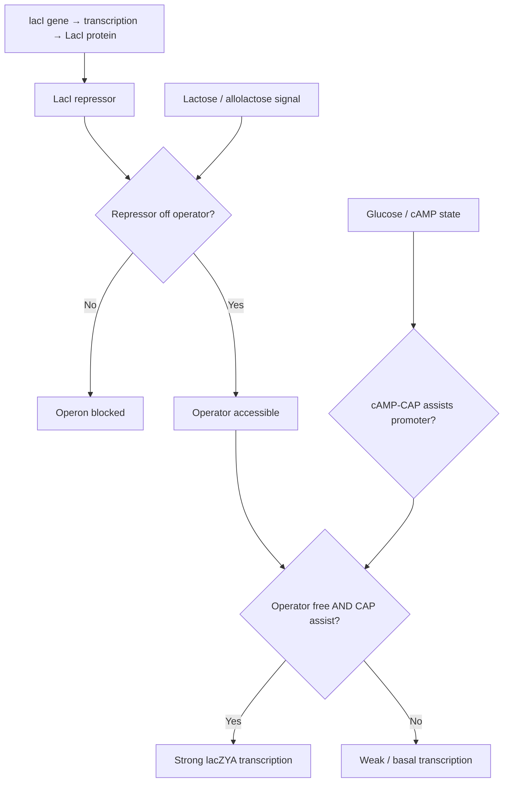

# GLMP — From Square One
*Genome Logic Modeling Project · Collaborator Briefing*

Gary Welz · gwelz@gc.cuny.edu · CUNY Graduate Center / New Media Lab · ORCID 0009-0005-7806-0892
[Methods paper (Zenodo)](https://doi.org/10.5281/zenodo.20831780) · [github.com/garywelz/glmp](https://github.com/garywelz/glmp)

---

## What this project is

We call DNA "the code of life," but usually just as a metaphor. GLMP takes the metaphor seriously and asks a concrete question: **can the logic of a gene — the rules that decide when it turns on and off — be read directly from the DNA sequence, the way you'd read a few lines of a program?**

Genes don't fire at random. A stretch of regulatory DNA behaves like a tiny circuit: *make this protein when a nutrient is present AND a second signal is absent.* Those are real logic gates — AND, OR, NOT — built out of molecules. GLMP reads those gates straight from the genome, draws each gene circuit as a flowchart, and then checks that reading against what biologists have actually established.

This is the *inverse* of synthetic biology. Work like Voigt et al. (Science 2016) compiles human-written logic *into* new DNA; GLMP reads the logic evolution has already written *into* natural regulatory DNA. Same grammar, opposite direction.

## Why it matters

The logic of gene regulation is how a cell makes decisions — how one fertilized egg becomes a nerve cell or a muscle cell, and how those decisions go wrong in disease. If we can reliably read and verify that logic at scale, we build a foundation for understanding how the instructions inside our cells work, and eventually for seeing where they break. It sits exactly where computer science meets biology and medicine.

## Where it stands

This is a working research program, not a proposal. It already draws logic-flowchart models for hundreds of gene circuits across organisms, runs a computational decoder that reads regulatory logic directly from DNA sequence, and is backed by a growing research knowledge base. Today the decoder reliably reads the most fundamental piece of that logic — the **"off switch,"** where a protein blocks a gene — in bacteria, checked against gold-standard reference data. It is deliberately careful: it claims only what the sequence actually supports, and treats a clearly marked limit as a finding rather than something to hide. The frontier from here — reading the **"on switches,"** handling more complex logic, and extending from bacteria toward human cells — is wide open.

## Where you come in

The project needs exactly the mix of skills in this room, and there is real work to own. There are two tracks:

- **Computational validation** — check the decoder's readings against curated biological databases. A concrete, self-contained job that turns programming skill into scientific evidence.
- **Biological judgment** — connect what the code says to what molecular biology knows. Neither current lead is a molecular biologist (Gary is a logician, Konstantinos a bioinformatician), so there is a genuine open seat for biological expertise.

The detailed asks are at the end of this briefing. Everything in between is how the project actually works.

---

## The core idea, and the first flowchart

The project began with a picture: a molecular regulatory process drawn as a logical circuit, before any decoder or database. The anchor example is the *lac* operon in *E. coli* — one of the most studied systems in molecular biology, and the worked example for everything that follows.

*Color key: orange = gene-expression source · purple = logic-gate decision · green = active transcription · red = repression (NOT) · blue = environmental input.*

The purple diamonds are logic gates; the orange node is the source of the repressor protein; the green node is the output. The whole regulatory logic of the lac operon is captured in one diagram — and this is what GLMP formalizes at scale. Note the flowchart is the *biology*: the cell really does compute "operator free AND CAP assist." What the decoder can read from *sequence alone* is a separate question, and an honest one — see "Where the decoder stands," below.

## The research process — five steps

Steps 3–5 are contingent on step 2 being answered affirmatively. That is not a weakness; it is how science works.

1. **LLMs generate flowcharts of molecular processes.** Large language models produce Mermaid logic-gate flowcharts for regulatory circuits across organisms, assigning gate types (AND, OR, NOT) and a complexity class (I–V). We have 217 processes in a structured catalog today, scaling toward 1,000+, with batch generation running nightly. *Status: active and scaling.*

2. **A qualified molecular biologist validates the flowcharts.** An expert reviews the flowcharts and annotations against the primary literature, confirming or flagging each logic-gate assignment. This is the pivotal open step — and an honest limitation of the team as constituted: neither Gary (a logician) nor Prof. Krampis (a bioinformatician) is a molecular biologist, so the definitive biological judgment must come from outside. A student can produce a valuable first-pass review as a learning exercise; the authoritative sign-off comes from a molecular biologist. Everything in steps 3–5 rests on this. *⚑ Pivotal step — the open question.*

3. **Computer-assisted methods extract the logic from DNA.** Taking the flowcharts as valid, we verify and extract the logical structure directly from DNA using motif scanning, custom binding-site matrices, and a logic parser that classifies circuits by DNA-level topology. For *E. coli* the decoder uses custom, RegulonDB-trained prokaryotic matrices; JASPAR is reserved for eukaryotic circuits (yeast, phage). *Status: active — pipeline built, first circuits decoded.*

4. **Publish and scale to advanced validation.** With steps 2–3 in hand, we write up results and advance to higher-level validation — cross-checking against genomic foundation models (e.g. Evo 2) and single-cell regulatory inference (e.g. RegVelo). *Status: methods paper in preparation.*

5. **At scale — proceed to the Big Picture Goals.** Once steps 1–4 hold across hundreds to thousands of circuits, the core theory is plausibly confirmed and we proceed to the larger goals — to be described once the foundation is established.

## The five-class framework

The flowcharts don't just record *which* logic gates a circuit uses; they place each circuit on a ladder of increasing regulatory complexity. The intent is a five-class scheme, from the simplest computable logic to the most open-ended:

- **Class I — Feed-forward logic.** Input flows to output through logic gates (NOT, AND, OR) with no loops. Fully determined by its inputs, and in principle fully predictable. Most classic bacterial operons live here.
- **Class II — Self-regulation / negative feedback.** A damping loop that holds a system near a set point — homeostasis and noise buffering.
- **Class III — Bistable switches.** Positive feedback or mutual repression creates two stable states; the circuit stays flipped after the signal is gone. The basis of cell-fate decisions.
- **Class IV — Oscillators.** Feedback with a built-in delay produces sustained rhythms rather than a fixed state — circadian clocks are the classic case.
- **Class V — Self-modifying circuits.** The circuit rewrites its own regulatory architecture, for instance through chromatin change. The most expressive tier, and the least predictable.

We are direct about the status of this scheme: **defining the class boundaries precisely — and settling how the logic we read from *sequence* relates to the *biological* complexity of the whole circuit — is active work, and one of the near-term tasks for this collaboration.** That is why the table below carries two separate columns, and why some entries read "I/II": they mark circuits whose classification sits on a boundary we are still drawing.

The *lac* operon is the sharp case. At the sequence level it reads as Class I feed-forward logic — a repressor (NOT) and, when present, an activator. Yet biologically it runs *dual control*: activation by CAP together with de-repression of LacI. Whether dual control of that kind should define its own place on the ladder — and how to decide such questions in general — is not a detail we mean to smooth over. It is close to the central research question, and we would rather state our tentative reads and work them out than reach for the tidier label. The full formal treatment is in Papers I–III; the practical outcome is what this collaboration is here to help establish.

## Where the decoder stands today

The decoder identifies transcription-factor binding sites in promoter sequences and infers logical relationships from their spatial arrangement. It has been exercised on five *E. coli* circuits and one yeast circuit (an exploratory first eukaryotic attempt).

| Circuit | Organism | DNA topology (from sequence) | Biological class (working) | Status |
| --- | --- | --- | --- | --- |
| lac operon | E. coli | Class I/II | Class II\* | Pending validation |
| ara operon | E. coli | Insufficient evidence† | Class III | Pending validation |
| trp operon | E. coli | Class I/II | Class II | Pending validation |
| GAL system | Yeast | Partial (Gal4 sites only) | Class III/IIIa | Two-layer — protein network |
| SOS regulon (recA) | E. coli | Class I/II | Class II | Pending validation |
| SOS regulon (lexA) | E. coli | Class I/II | Class II | Pending validation |

The decoder reads repression (NOT) reliably but cannot yet confirm a cooperative activation (AND) from sequence alone; for single-activator promoters like *lac*, spacing-based AND detection is structurally unreliable, so the honest DNA-topology label is **I/II**. Biological class II — CAP-dependent activation plus repression, the logic shown in the flowchart above — remains the biological ground truth the validation team is asked to confirm. Across all circuits the decoder currently makes **zero** AND calls, and says so rather than inventing one.

\* lac biological class is under review — Class II vs III is an open question the validation team is asked to weigh in on.
† AraC is absent from JASPAR (a prokaryote-specific TF); a custom matrix is in development.

## What we are asking from the collaboration

Two tracks, matched to background:

| Track | Task | Deliverable |
| --- | --- | --- |
| **Computation** | Cross-reference the decoder's predicted binding sites against RegulonDB gold-standard data; produce overlap statistics and a discrepancy report | Analysis script + validation report |
| **Biology** | Review the lac / ara / trp flowchart annotations against the primary literature and curated databases; confirm or flag each logic-gate assignment | Structured draft review, for a molecular biologist's sign-off |

Both tracks work from a single self-contained package — data files, decode outputs, RegulonDB reference data, a per-track task brief, and a shared report template — available for download with no credentials or database access required:

- Computation task brief: [task-brief-computation.md](https://storage.googleapis.com/regal-scholar-453620-r7-podcast-storage/validation/task-brief-computation.md)
- Biology task materials: [lac operon annotation review](https://github.com/garywelz/glmp/blob/main/collaborations/krampis-virtual-cell/lac-operon-annotation-review.md)
- Full validation package: [README](https://storage.googleapis.com/regal-scholar-453620-r7-podcast-storage/validation/README.md)

Contributions will be acknowledged in the methods paper in preparation, with co-authorship on the table depending on the significance of the contribution.

An external molecular biologist's judgment is required here, not optional: because neither Gary nor Prof. Krampis is a molecular biologist, the definitive call on each logic-gate assignment comes from outside the two of us — potentially sourced through the John Jay–Hunter network. A student's draft review is a valuable first pass and a learning exercise, complementary to that outside sign-off, not a substitute for it.

## Papers and further reading

**Start here (written for biologists):**
- [Synthesis paper](https://github.com/garywelz/glmp/blob/main/collaborations/krampis-virtual-cell/synthesis-biorxiv.md) — the framework brought together in one accessible overview.

**Methods (published):**
- [Methods paper](https://github.com/garywelz/glmp/blob/main/collaborations/krampis-virtual-cell/methods-mermaid-perturbation-design.md) — LLM-generated Mermaid flowcharts, curated databases, and the *lac* operon as a worked example. Zenodo: [10.5281/zenodo.20831780](https://doi.org/10.5281/zenodo.20831780).

**Full technical papers (reference only):**
- [Paper I — Foundational typology](https://github.com/garywelz/glmp/blob/main/collaborations/krampis-virtual-cell/paper-I-foundational-typology.md) — the typed-logic foundations and the circuit-class typology.
- [Paper II — Genome as computer](https://github.com/garywelz/glmp/blob/main/collaborations/krampis-virtual-cell/paper-II-genome-as-computer.md) — Boolean primitives mapped to molecular mechanisms, and the five-class complexity ladder.
- [Paper III — Empirical sequel](https://github.com/garywelz/glmp/blob/main/collaborations/krampis-virtual-cell/paper-III-empirical-sequel.md) — applying the framework to real circuits and data.

**Background (accessible):**
- [From Inspiration to AI: Biology as Visual Programming](https://medium.com/@garywelz_47126/from-inspiration-to-ai-biology-as-visual-programming-520ee523029a) (Medium)
- [Is the Genome Like a Computer Program?](https://www.researchgate.net/profile/Gary-Welz-2/publication/394255600_Is_the_Genome_Like_a_Computer_Program/links/688f898858199117bcaa10a3/Is-the-Genome-Like-a-Computer-Program.pdf) (ResearchGate)
- [Google Scholar profile](https://scholar.google.com/citations?view_op=list_works&hl=en&user=3wTcI6EAAAAJ)

## Infrastructure and resources

Methods paper: Zenodo 10.5281/zenodo.20831780 · GitHub: github.com/garywelz/glmp · Catalog: 217 processes (Firestore + GCS) · Knowledge base: more than 62,000 research papers, the largest share (about 46%) in biology · Decoder: FIMO with custom prokaryotic PWMs (E. coli) on a Jetson Nano · Live status: GLMP_STATUS.html.

Gary Welz · CUNY Graduate Center / New Media Lab · Genome Logic Modeling Project · gwelz@gc.cuny.edu · ORCID 0009-0005-7806-0892 · July 2026
